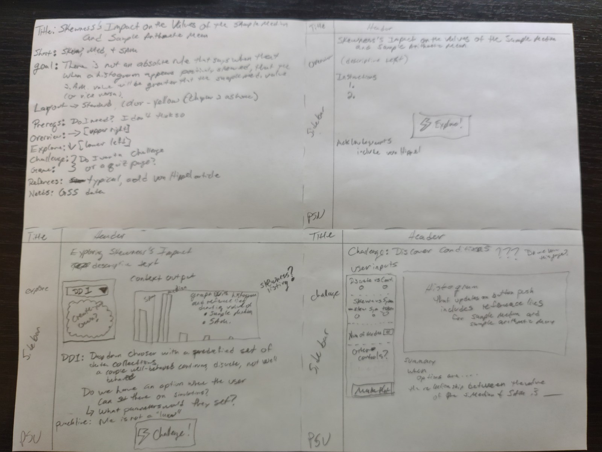
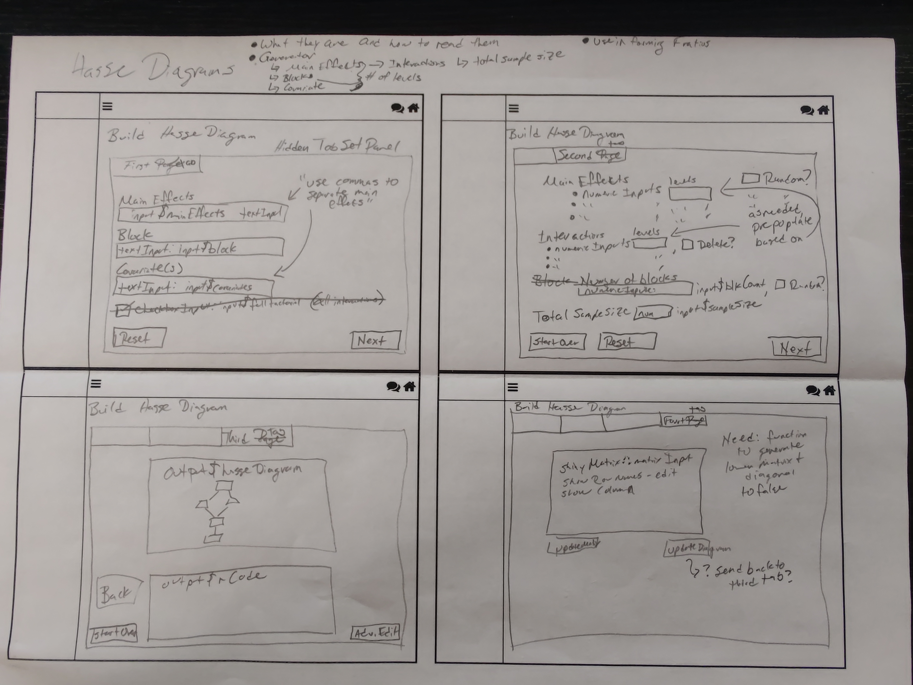
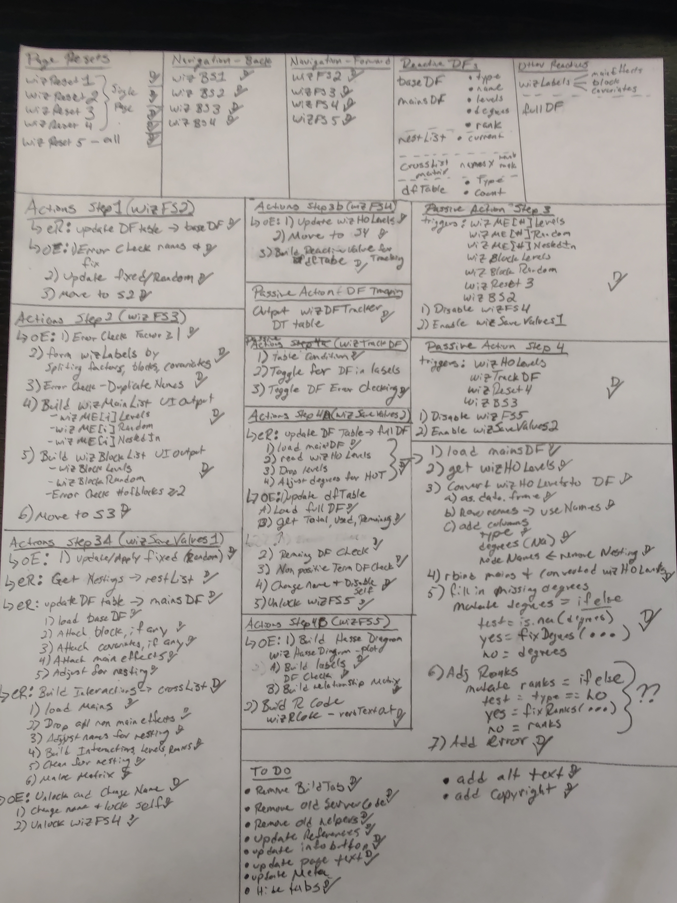

# (PART) Getting Started {-}

# Making an App {#makingApp}

Whether you're revising an existing Shiny app or making a brand new app, approaching app construction in a systematic way will help you tremendously. The following workflow is an abbreviated version of the two presented in [Chapter \@ref(workflow)](#workflow):

1. Read the Style Guide
2. Identify a topic
3. Sketch out your plans
4. Create a new repository on GitHub 
5. Begin writing the code
6. Edit and locally Test your code
7. Push your code to GitHub/Create a dev branch
8. Push your edits 
9. Larger scale testing
10. Pull Request
11. Additional tweaks

One important caution with this workflow is that a lot of the intricate decision making that goes into an app is invisible. Our goal with this chapter is to walk you through this process as Neil makes an app from scratch.

*Note:* While we've written the following steps from the perspective of making a new app, what we describe equally applies to revising existing apps. Thus, you'll want to keep in mind both new and existing apps as you read through the remaining steps.

## Step 1: Read the Style Guide {#step1}

This step is critical if you want to make an app that is easy to debug (vital when programming) and aligned with the expectations and standards that we have set for BOAST. Please take your time going through this Style Guide and keep an eye on it for updates. 

By routinely checking the Style Guide, you can 1) ensure that you're still adhering to it, 2) to stay up-to-date with the Guide, and 3) to see (and then use) any useful code chunks that are listed. Even as the authors of this guide, we're constantly looking things up in the guide. Thus, there is no shame in constantly referring to the Style Guide; after all, it is meant to be *the* Go-To Reference.

## Step 2: Identify a Topic {#step2}

This is one of the more challenging tasks for anyone: deciding what to make an app about. The notion of "picking a topic" is a bit misleading as not only should you pick a __topic__, but you also need to pick the __purpose__ of the app, and the __goals__. While all three go hand-in-hand with each other, the easiest decision of the three is purpose.

### Your App's Purpose {#step2a}

When we look across BOAST, we can categorize the apps into two major classes: apps whose purpose is to help students __learn__ an idea/concept and apps whose purpose is to help students __review__ an idea/concept. The [NHST Caveats App](https://psu-eberly.shinyapps.io/Significance_Testing_Caveats/) stands as a good example of an app whose purpose is to help students learn something. On the other hand, the [[Null] Hypothesis Testing Game (Tic-tac-toe)](https://psu-eberly.shinyapps.io/Hypothesis_Testing_Game/) and the [Matching Distributions](https://psu-eberly.shinyapps.io/Matching_Distributions/) are examples where the student is reviewing their understandings. There are some apps such as [ANCOVA](https://psu-eberly.shinyapps.io/ANCOVA/) that are dual purpose, having both learning elements and reviewing elements.

Generally speaking, apps whose purpose is __learning__ are going to have Explorations and possibly Challenges for Activity Tabs. Apps whose purpose is __reviewing__ will have just Games for Activity Tab(s).

By identifying early on the purpose of your App, you'll be able to better plan your app.

### The Topic {#step2b}

Here is where you'll decide what statistical idea/concept your App is going to be centered around. While you should be as specific as possible here, __apps for learning__ need to have much more specificity than __apps for reviewing__. Saying that you want your App "to deal with probability" is not going to be as useful as saying that you want your App "to help students recognize when probability is and is not appropriate for different contexts". 

Don't feel like you have to details down to the nanoscale from the start. As you continue developing the idea and talking with people, you'll add in more details.

You can identify potential topics through any of the following:

+ Think of a concept in a Stat class that you (or your peers) struggled with (or still do)
+ Think of a concept where you thought to yourself "I wish there was a way to visualize this"
+ Think of a concept where you went "How does this work?"
+ Did you see/hear about a new study and thought to yourself "what's going on?"
+ Did a media report make you do a double take?
+ Ever think to yourself "I wish I had more practice with [topic]."
+ And more

Again, this list is just a starting place to identify potential topics. Draw inspiration from your experiences, your curiosity. Bounce ideas off of each other and the faculty. 

*__Word of Caution #1__*: While it is okay to get ideas from other websites, please keep track of this. We need to give credit where credit is due. If you come across an app (whether in Shiny or some other program) somewhere and you think that it would be good to translate that into Shiny app for BOAST, we need to know about the original. 

*__Word of Caution #2__*: An unproductive place to begin is to say "Hey, I want to make a memory game" or "I saw this really cool animation and I want to make an app that does that." Both of these (especially the second) place the educational aspect of the app as a secondary focus. __This is not consistent with BOAST.__ All apps should place educational purposes and goals before anything else. Forcing a topic to make use of certain tool because that tool would be "cool" or "fun" does not further our goals.

### Goals {#step2c}

Now, we're sure that some people have already thought to themselves "hey, you've already had us identify purpose so isn't this the same?" To which we reply "No." We've used __purpose__ to refer an overarching aim of your App. Here, __goal__ refers to a much more contextualized aspect. While these goals will be less important for reviewing apps, you will need to identify specific learning goals for learning apps.

For this step, you're going to need to work with the faculty to identify the learning goals for your app. If you're drawing from a past experience in a course, look to see if there were learning objectives listed in the course materials. Those can be extremely useful starting places.

### Example

*The following is a somewhat stream-of-consciousness narrative of how Neil tackled this step. We'll place flags in parentheses.*

I would like to make an app that would help introductory students __(*identifies an intended audience*)__ wrestling with some of the concepts of descriptive/incisive statistics __(*Purpose: learning*)__. Some ideas that I have are:

+ Conceptualizing the two distinct uses of the *sample arithmetic mean*--mitigation of measurement errors of a single object vs. measuring how well a group of objects/beings performs.
+ Conceptualizing statistics as functions that measure attributes of collections.
+ Conceptualizing the relationship between the values of the *sample median* and *sample arithmetic mean* is not a competition, that is, one is not "better than" the other.
+ Avoid falling into the skewness trap for the ordering of the values of the *sample median* and *sample arithmetic mean*.

This last option feels like a fairly straightforward (and simple) app to create. Additionally, there's an [article by von Hippel on this issue](http://jse.amstat.org/v13n2/vonhippel.html) I can reference. __(*Topic: relationship between the values of *sample median *and* sample arithmetic mean *in the presence of skewness*)__

After using the app, a student should recognize that while for a many data collections that have skewness, the value of the *sample arithmetic mean* will be either greater (for positive skew) or less (for negative skew) than the value of the *sample median*, this is not an absolute rule. __(*Learning Goal*)__ In other words, just because a histogram shows positive skewness doesn't automatically mean that the value of the *sample arithmetic mean* is actually greater than the value of the *sample median*.

## Step 3: Sketch out plans {#step3}

In both workflows of [Chapter \@ref(workflow)](#workflow), there was the phrase "__on paper__". Step 3 is where you need to take this phrase seriously.

To assist you, use the following layout by copying into a Word program (you can fit four on a landscape oriented page) and printing OR by sketching your version on paper:

```{r blankSketchLayout, fig.cap="Blank layout for sketching your ideas", echo=FALSE, fig.align='center', warning=FALSE}
library(ggplot2)
library(emojifont)
ggplot(data = data.frame(x = rep(0, 50))) +
  geom_hline(mapping = aes(yintercept = 90), color = "black") +
  geom_vline(mapping = aes(xintercept = 50), color = "black") +
  scale_y_continuous(limits = c(0,100), expand = expansion(mult = 0, add = 0)) +
  scale_x_continuous(limits = c(0, 300), expand = expansion(mult = 0, add = 0)) +
  geom_text(mapping = aes(x = 56, y = 95, label = fontawesome("fa-bars")), family = "fontawesome-webfont", color = "black", size = 5) +
  geom_text(mapping = aes(x = 270, y = 95, label = fontawesome("fa-info")), family = "fontawesome-webfont", color = "black", size = 6) +
  geom_text(mapping = aes(x = 280, y = 95, label = fontawesome("fa-comments")), family = "fontawesome-webfont", color = "black", size = 6) +
  geom_text(mapping = aes(x = 292, y = 95, label = fontawesome("fa-home")), family = "fontawesome-webfont", color = "black", size = 6) +
  theme_void() +
  theme(
    panel.border = element_rect(color = "black", fill = NA, linewidth = 2)
  )

```

Figure \@ref(fig:blankSketchLayout) gives you a BOAST app canvas upon which you can sketch your ideas. You can copy this image into any number of programs for printing or digitally editing. In the examples below, you'll see a hand-drawn version of this layout.

We want to stress just how useful sketching your ideas is. Neil routinely makes use of sketches whenever he builds apps for BOAST (e.g., the [Hasse Diagram App](https://psu-eberly.shinyapps.io/Hasse_Diagrams/)), for helping students working on BOAST apps (e.g., the [Data Table Examples app](https://neilhatfield.shinyapps.io/dataTableExample/)), or for his own projects (e.g., a [Standards-Based Grading Progress Checker](https://psu-eberly.shinyapps.io/StandardsGrading/)). Further, making sketches allows you to better share your ideas and will give you a goal for what to aim for as you actually begin to code.

### Key Elements

There are several things that you'll want to be sure that you include in your sketch:

+ A Suggested Title
    - This might not be what you settle on, but you'll need to have this firmed up by the time you get to Step 4.
    - You'll want to have both a [Long/Formal] Name and a shortened name ready.
+ Goal(s) of the App
    - Carry this forward from Step 2 as a tangible reminder.
    - If you have several goals, you might consider denoting which pages go with which goals.
+ What will the user be doing?
    - Thinking about what you want the user to do.
    - Identify anything the user might click on, drag, or otherwise manipulate.
    - If there are going to be options, identify what those options should be.
    - Will there be different levels?
    - Will there be a Challenge page?
+ What will the user experience?
    - Think about the general layout (explore, game, etc.).
    - What outputs should the user be examining?
+ What are the relationships between elements?
    - Think about how each input impacts the outputs.
    - If you want the user to have a certain experience, does the coding allow for that experience to happen?
+ Other Elements
    - Are you going to reference any external images?
    - Are you going to import any data files? If so, which ones? Do you have them?
    - Is there an activity packet?

The format of your sketches is up to you. 

### Example, cont.

As I start thinking about what this app might look like, I'm going to use a sheet of paper in quarters to organize some thoughts. Figure \@ref(fig:planSketchFull) shows the entire sheet of paper. (Note: this was the genesis of Figure \@ref(fig:blankSketchLayout)) The quadrants move left to right, top to bottom.

```{r planSketchFull, fig.align='center', echo=FALSE, fig.cap="Picture of Neil's Plan for the Sample Median/Sample Arithmetic Mean App", fig.width=5, fig.height=3}

```

In the first quadrant (Figure \@ref(fig:planSketchInfo)), I've listed a title ("Skewness's Impact on the Values of the *Sample Median* and *Sample Arithmetic Mean*"), a possible short title ("Skew, Med, SAM") as well as a restatement of my goal. I've then listed general aspects about the layout of my app, including what skin/theme color (yellow) I would need to use. 

I've additionally identified that I need to include the von Hippel article in my Reference Page as well as locating a version of the General Social Survey (GSS).

```{r planSketchInfo, fig.align='center', echo=FALSE, fig.cap="First Quadrant: General Information", fig.width=5, fig.height=3}
knitr::include_graphics("images/planSketches/planSketch2-Info.jpg")
```

The second quadrant of my paper is the Overview Page sketch (Figure \@ref(fig:planSketchOverview). I don't have much information here.

```{r planSketchOverview, fig.align='center', echo=FALSE, fig.cap="Second Quadrant: Overview Page", fig.width=5, fig.height=3}
knitr::include_graphics("images/planSketches/planSketch3-Overview.jpg")
```

```{r planSketchExplore, fig.align='center', echo=FALSE, fig.cap="Third Quadrant: Exploration Page", fig.width=5, fig.height=3}
knitr::include_graphics("images/planSketches/planSketch4-Explore.jpg")
```

The next quadrant (Figure \@ref(fig:planSketchExplore)) is where I started detailing the first Activity Page of my app: the first Exploration. I'm imagining that in this exploration that the user would look through a variety of cases where the "rule" does and does not work. What I want the user to walk away from this page is that just because a histogram looks positively skewed does not imply that the value of the *sample arithmetic mean* is greater than the value of the *sample median*. 

I'm imagining a drop-down menu that would allow the user to move through a variety of data sets. Ideally, these data sets would be real data. The General Social Survey, has a variety of attributes that we could use, include several that demonstrate what I want. For example, the number of adults (18+ y.o.) living in a household is positively skewed but the value of the *sample median* is larger than than the value of the *sample arithmetic mean*. Which each choice of the user makes, the histogram on the right will update to show the appropriate data, plus reference lines for the values of the two statistics. I might want to add a numerical display as well. I also want there to be some context helping the user to understand each choice.

I've left as an open question whether to enable a user to import/create their own data set on this page. I'm currently leaning towards not allowing this. Additionally, I've marked something for a punchline but this will need more thought.

```{r planSketchChallenge, fig.align='center', echo=FALSE, fig.cap="Fourth Quadrant: Challenge Page", fig.width=5, fig.height=3}
knitr::include_graphics("images/planSketches/planSketch5-Challenge.jpg")
```

The fourth and final quadrant (Figure \@ref(fig:planSketchChallenge)) is an idea I'm still kicking around. This would depend on the specific audience and course goals for which users would go here. My idea is to extend the goal for the app to allow students to construct an understanding for what conditions might lead to \(Sample\;Median\left(\mathcal{X}\right)<SAM\left(\mathcal{X}\right)\), \(Sample\;Median\left(\mathcal{X}\right)=SAM\left(\mathcal{X}\right)\), and \(Sample\;Median\left(\mathcal{X}\right)>SAM\left(\mathcal{X}\right)\).

At this moment, I'm leaning towards marking the Challenge Page as being a future improvement/addition rather than being part of the initial version of the app.

### Share Your Plan

Once you have a sketch, you'll want to share this plan with others to get ideas for suggestions, modifications, etc. Different people might be able to point you to code snippets you can reuse from other apps. More importantly, they might be able to help you think about things that you glossed over/missed and/or thought about but didn't articulate. By sharing these plans, we'll make better apps.

This is also the point in time in which the faculty will say whether you can go ahead and move to Step 4.

## Step 4: Create Repository {#step4}

Here you'll want to reference Section \@ref(repo-naming) on GitHub Repo Naming. You'll need to make sure that there isn't already a repository that has that name. When you get a name figured out for the repository, you can go ahead and create the repo.

Be sure to use the App Template as the template for your new repository.

Make sure to set Git Ignore to `R`.

For the example, check out the [Rethinking Sample Median vs Sample Arithmetic Mean Repo](https://github.com/EducationShinyAppTeam/Rethinking_Sample_Median_vs_Sample_Arithmetic_Mean/tree/development) (Note: this is a private repo; you'll need to be signed into GitHub to view). The repo name is 50 characters long (including the underscores), gets at the goal of the app, and was not already in use.

## Steps 5-8: Write, Edit, Test, Debug {#steps5-8}

I've not had time to work on coding the *Skew, Med, SAM* app (if this app interests you, you're welcome to take it over). For the remainder of this chapter, I'm going to discuss my work on the Hasse Diagram app. I started with paper sketches for what I wanted and as I started coding to make the apps come to life, I needed to make changes. However, the paper sketches became an anchor that helped me stay focused on what I was doing.

For the Hasse Diagram app, I'm sharing two images so that you can get a sense of the changes that occurred during the process. Be sure to check out the [Hasse Diagram App](https://psu-eberly.shinyapps.io/Hasse_Diagrams/).

```{r hasseSketch, fig.align='center', echo=FALSE, fig.cap="Hasse Diagram App Sketches", fig.width=5, fig.height=3}

```

In addition to the sketches which help with designing the visual appearance, you can also sketch out important coding aspects:

```{r hasseNotes, fig.align='center', echo=FALSE, fig.cap="Hasse Diagram App Coding Notes", fig.width=3, fig.height=5, }

```

(Please pardon the fuzzy nature of the photograph in Figure \@ref(fig:hasseNotes).) Figure \@ref(fig:hasseNotes) is the "sketch" of important actions that need to happen in the Hasse Diagram app: from resetting a page to navigation, from tab specific actions to objects that persist across the various tabs. Ultimately, this sketch became a useful To Do list as I built the app. I must stress that you're seeing the final product in Figure \@ref(fig:hasseNotes). I built up this page as I went, I did not start out with this page filled out as you see here.

## Step 9: Larger Scale Testing {#step9}

Once you've built your app and you've done some initial debugging on your own machine, you then need to test your app on a larger scale. This is when you'll want to publish your app on a server for [Non-local Testing](#nonLocalTesting).

This is where you can get important feedback from people actually trying to use your app. This can help you improve the user interface as well as any behind the scenes coding that might be an issue. 

A common issue that occurs with Games is that when multiple people are playing the game, their game sessions might interact with each other. For example, one person might suddenly gain/lose points because of the actions of another player. This type of issue would only show up on servers when you have several people using the app at the same time. Make sure that during your testing, you try to have several people use the app at the same time.

## Steps 10-11: Pull Requests and Tweaks {#steps10-11}

Once you get to a certain point, you'll want to make a Pull Request on GitHub. This will trigger a review process for your code.

There are two parts to the Review Process: Appearance Review and Coding Review.

### Appearance Review (part of Large Scale Testing)

You'll need to share the link (URL) to your app with people so you can receive feedback in terms of testing and design. You'll want to attend to any feedback you get through this process. Faculty members will typically send you either an email with proposed changes or provide verbal feedback during a meeting.

### Coding Review

At least one other student team member will need to look through your code and make sure that 1) the code follows this Style Guide, 2) your app actually works, 3) any improvements that could still be made (including spelling and grammar). Each reviewer will need to leave their feedback as well as decision on GitHub. (The most common decision is "Request Changes".) 

Once you get their feedback, you'll need to do what you can to implement those changes. Once you've done so, push your updates and let the reviewer know. They will then need to perform a second review. If everything checks out, they will mark "Approve" as the decision.

Once your Pull Request has been approved by your peers, there is one last review: a quality control check by a faculty member (typically Neil). This check will look at your coding and the appearance. Feedback and a decision will be posted on GitHub. 

After all of the issues have been taken care of, Neil will merge your development branch into the main branch of the repo and will then deploy the app to the world. 

__CAUTION:__ if you ever see a "Merge" button, do not click on this button. Please let Neil (or another faculty member) be the ones who click this button.
