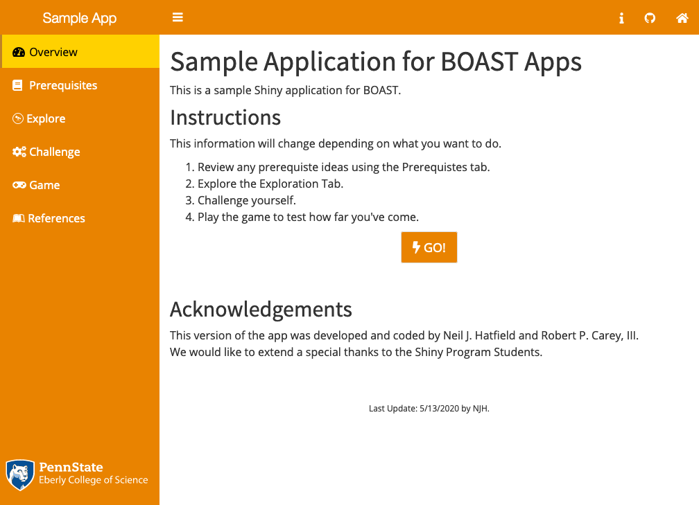
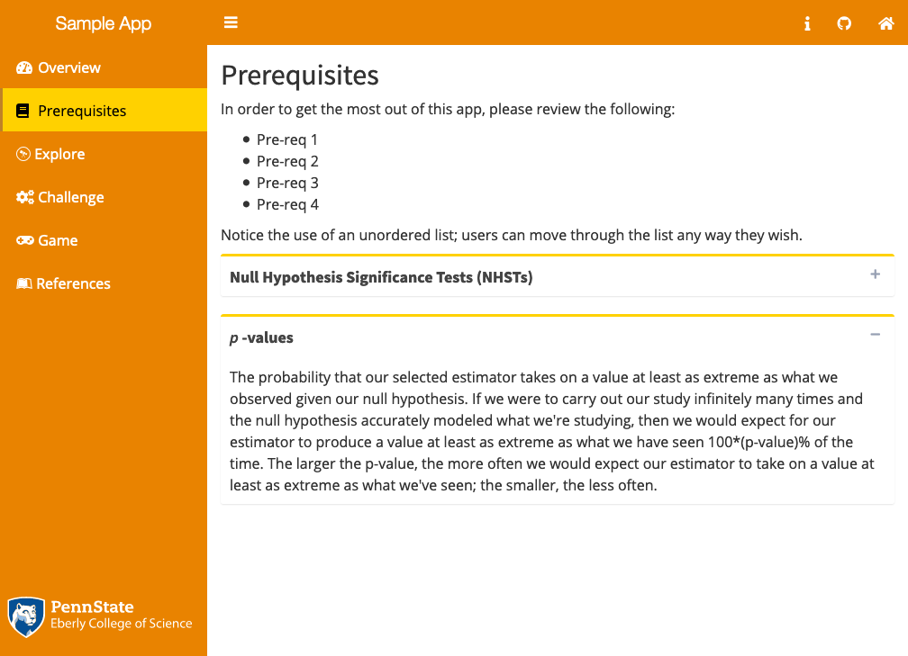

# Visual Appearance {#visualAppearance}

The second portion of this Style Guide deals with the Visual Appearance of each App. Visual Styling encompasses not only text styling but also color scheme usage, graphics (images, plots, tables), and the dashboard layout. For each App, there are 5 major components to the Visual Appearance that you will need to consider: PSU Branding, the Dashboard, Color, Text Styling, and Plots. 

One of the most important benefits of using the `boastApp` function from the `boastUtils` package is that is that much of the Visual Appearance will be automatically handled for you. However, you should still familiarize yourself with the Visual Appearance Style for our apps.

## PSU Branding {#logo}
Given that we are all associated with Pennsylvania State University, we need to include the Penn State logo in each App. Rather than sticking the logo at the top of the Overview page, we are going to place the logo at the bottom of the sidebar. This has the benefit of having the logo appear throughout the entire App AND making the logo be as unobtrusive as possible.

In your `ui.R` file (or your UI section of `app.R`), at the end of your `dashboardSidebar()` section, include the following:

```{r logoCode, echo=TRUE, eval=FALSE}
tags$div(class = "sidebar-logo",
         boastUtils::psu_eberly_logo("reversed"))
```

Here's how this code would look in context:

```{r psuLogo, echo=TRUE, eval=FALSE}
dashboardPage(
  skin = "blue",
  dashboardHeader(
    title = "title",
    # [omitted code]
  ),
  dashboardSidebar(
    width = 300,
    sidebarMenu(
      id = "tabs",
      # [omitted code],
      tags$div(
        class = "sidebar-logo",
        boastUtils::psu_eberly_logo("reversed")
        )
      ),
    dashboardBody(
    tags$head(
      tags$link(rel = "stylesheet", type = "text/css",
        href = "https://educationshinyappteam.github.io/Style_Guide/theme/boast.css"),
      tabItems(
       # [omitted code]
      )  )  )  )  )
```

This will ensure that the Penn State logo gets properly used.

## Dashboard {#dashboard}

All apps will make use of a Dashboard structure. This divides the visual appearance of each App into three main areas. 

+ Across the top of the App will be the Header 
+ along the left side of the App will be the navigation list (the Sidebar) where the various Tabs (pages) of your App will be listed
+ The last area is the Body; this is where all content will appear

### Dashboard Header
Each Dashboard Header contains only a couple of elements. The most important of these will be a [shortened] Title of your App. This will automatically be followed by the sidebar collapse/expand button. At the far right, you will then include a link to the home page of BOAST using the Home icon.  

Additional icons might be included to the left of the Home icon. However, these icons remain the same for all Tabs/pages of your App and are thus are not appropriate for Tab/page specific information.

There should not be any additional elements in the Dashboard Header. Any links for navigate in your App should appear in the Sidebar on the left edge.

### Sidebar and Body

The Sidebar (responsible for App navigation) and the Body are intimately related to one another. The Sidebar provides structure to your App as well as being the primary way that a user can move around the App. The Body is where all content (text, images, plots, buttons, etc.) exists for the user to read, view, and interact with.

To ensure a consistent experience across all apps, you need to make sure that your App has the following tabs/page, in the following order:

#### The Overview Tab
This Tab is __REQUIRED__ for all Apps. This is the main landing page of your App and should appear at the top of the sidepanel.

The icon for this Tab must be "dashboard".

The Overview Tab must contain __ALL__ of the following elements:

1.  “Title” (as Heading 1)
2.  A description of the app (as paragraph text under the title)
3.  “Instructions” (as Heading 2)
4.  General instructions for using the App (using an Ordered List environment)
5.  A button that will take the user to the next Tab/page.
6.  “Acknowledgements” (as Heading 2)
7.  A listing of acknowledgements including, coders, content writers, etc. (as a paragraph)
8.  Last Element: `div(class = "updated", "Last Update: mm/dd/yyyy by FL.")` with mm/dd/yyyy replaced with the date of the update you pushed to the server and FL replaced with your initials.

*Note*: There is no need to use boldface or colons with the section headings when you properly use Heading tags. Thus, "Instructions:" does not follow this Style Guide. Additionally, there should not be an "About" heading.
      
#### A Prerequisites Tab
If your App needs to ensure that the user has the base understandings necessary to interact with your App, you’ll need to create a prerequisites Tab. Otherwise, skip this Tab.

The icon for this Tab must be "book".

Use the word "Prerequisites" rather than "Pre-reqs", "Prereqs", or "Pre-requisites". 
      
####  Activity Tab(s)
This is the heart of your App and you are required to have at least one.

In the event you have multiple activities, each one will need a separate Tab. The order of these Tabs will depend upon the your goals for the App.

Each Tab should contain all information/instructions for the user to be able to interact with the activity without having to switch to other Tabs.

The icon you use depends on the type of activity:

+ Games will use the icon "gamepad".
+ Explorations will use the icon "wpexplorer".
+ Challenges will use the icon "gears".

#### References
The last Tab will be for your references. This Tab is __REQUIRED__ and is where you will place a reference list for all of the following items that you used in your app:

+ All `R` packages you used
+ Sources of any Code you used directly or drew heavily upon from other people
+ Pictures and/or other images
+ Data sets
+ Refer to the Documentation Section (\@ref(documentation)) of this Style Guide for more information.
      
The icon for this Tab must be "leanpub".

#### Last Element
The last element of the Sidebar will be the Penn State Logo. Please refer to the Section \@ref(logo).

### Tabs Inside the Body
There are two types of tabs in a Shiny app: there are the `tabItem` (i.e., the pages within an app and should appear in the Sidebar) and `tabPanel` (i.e., creating sub-pages or independent sections). In this section, we will discuss this later case.

Deciding on whether to use `tabPanel` is going to depend on several things:

1. Do you have two or more aspects that are related enough that they shouldn't be their own separate tabs/pages of your App?  
    a. If NO, then you shouldn't use `tabPanel`.  
    b. If YES, then continue.
2. Are any of your aspects something that would be better suited as a Challenge or Game tab?  
    a. If YES, move that aspect to a separate page. If you still have 2+ aspects, continue.  
    b. If NO, continue.  
3. Are the aspects independent enough that a person can skip a couple and still use the App successfully?  
    a. If NO, then you should re-consider your design.  
    b. If YES, then proceed with using `tabPanel` in you design.

When you go to make a set of tab panels you will need to first create a `tabsetPanel` which will wrap around all of the individual panels. Use `type = "tabs"`.

The tabs inside the body should automatically appear horizontally and along the top of the tab body (i.e., in the white space below the Dashboard Header). Any visual styling will be managed by the BOAST CSS file at a global level.

## Common Elements
In addition to the Dashboard elements of the apps, there are other elements that are common. This include things such as how inputs should be ordered, buttons, and hover text.

### Ordering Inputs
One of the most powerful aspects of Shiny apps is that the user interacts with them. Thus, we do need to consider not only the ways in which user interact (e.g., buttons, sliders, text entry, etc.) but also the order in which you want the user to manipulate the inputs. Coming up with a single declaration for how to order inputs in all cases is not necessarily feasible. However, we can set up a general guideline for how to make decisions on ordering your inputs.

Please use the following guidelines for determining the order of inputs in the User Interface (UI):

1. In general, if you want your user to do things in certain order, make your inputs appear in that order.  For example, If you want them to pick a data set, then an unusualness threshold/significance level, what attribute to test, and then set a parameter value, then your inputs should appear in that order.
2. Make use of how we read the English language, i.e., Top-to-Bottom and Left-to-Right to provide an implicit ordering for your user.
3. If a user needs to carry out steps in particular sequence for your App to run properly, then place your inputs inside of an Ordered List environment with explicit text on what they should do. For example,  
    1. Choose your data set: [dropdown]  
    2. Set your unusualness threshold/significance level  
       [slider]  
    3. Which attribute do you want to test: [dropdown]  
    4. What parameter value do you want to use: [numeric input]
4. If an input is going to reset other inputs you should either:  
    a. Warn the user before hand  
    b. Move the input to the top of the list  
    c. Program the input to not reset other inputs  
    d. Some combination of the above  
5. If the inputs are not dynamically linked to the output (e.g., plots automatically update with a change in the input's value), then you should include a button that says "Make Plot" at the end of the inputs.
   
### Buttons {#buttons}
Buttons are one way in which users interact with the apps. The two most common functions that are used are `shiny::actionButton` and `shinyBS::bsButton`. Both functions share many of the same features. Two ways in which they are different is that `shinyBS::bsButton` has an additional `style` argument while `shiny::actionButton` has a `width` argument that gives you fine grain size control.  There are three key styling aspects: shape/animation, color, and text & icon.

#### Shape/Animation
All shape aspects of buttons will be controlled by CSS. The standard shape will be rectangular (the default). Sizing will be controlled by CSS although setting `size = "large"` for the `bsButton` call may be done.

We have a number of apps where a button will change shape/size when a person hovers their cursor over it. This "animation" is to be discontinued. This is to say that buttons which change shape/size should be flagged as issues and resolved at the first opportunity.

At most, the button's color might change (e.g., lighten or darken), depending on the context.

#### Color

The coloring of the button will also be controlled by CSS in one of two ways.

The default way will be through the BOAST CSS. This will ensure that the selected color scheme for your App will be consistent.

The second way only applies to `bsButton` and the `style` argument. Here, this option references an external CSS file beyond BOAST. We see these most often in games. Use the following list to guide you in choosing which style:

+ `warning`: Good for when you want the user to proceed with caution; for example a submit button in a game.
+ `danger`: Good for when you want the user to think twice before clicking; for example, a reset game button.
+ `success`: Good for when you want to convey that the user can proceed safely; for example, a button that advances the user through the game
+ `info`: Good for when you want to give some additional information; for example, a button that triggers game instructions popping up, a button that gives a hint, or a button that might filter a question pool.

When in doubt, use the the `default` style option (or even omit this argument) for `bsButton` or use `actionButton`.

#### Text & Icon
The last styling element of a button is two-fold: the text that is in the button and the icon. 

Here are some guidelines for text of a button:

+ All buttons must have some text. 
+ Generally speaking, the text should be relatively brief and clear. 
  - Don't use "Go to the next page" when you could use "Next"
+ The text should make sense with the action of the button; for example,
  - "Reset" if the button resets something (a game, a plot, inputs)
  - "Submit" if the button triggers the app to grab and process input values
  - "Make Graph" if button causes a graph to be generated
  - "Show/Hide Graph" if a button makes a graph object appear/disappear
  - "Next" if a button moves the user along some path.
+ If the button references something like a particular tab (prerequisites, exploration, etc.), the text should reflect this.
  - "Explore!" for a button that takes a user to an Exploration tab.
  - "Prerequisites" for a button that takes a user to a Prerequisites tab.
  - "Challenge Yourself!" for a button takes a user to a Challenge tab.
  - "Play!" for a button that takes a user to Game tab.
+ If a button references an object like an activity packet or a download prompt the text should refer to that
  - "Activity Packet" for a button that would open up and/or download a packet for the user
  - "Download Data" for a button that would download a data file.
+ Clarity is essential. If there are multiple buttons on the page, make sure that you use clear text for what button does and/or references.

Here are guidelines for the inclusion of icons in a button:

+ Game buttons will NOT have any icons.
+ "Next" buttons will NOT have any icons.
+ A "Prerequisites" button will use the "book" icon
+ All other tab buttons (labels ending with "!") will use the "bolt" icon.
+ A download button will use the "cloud-download" icon.

## Colors

Your App needs to have a consistent color scheme throughout. The color scheme should be checked against colorblindness to meet [WCAG 2.1](https://www.w3.org/WAI/WCAG21/quickref/) Level AA. You can do so at the [Coloring for Colorblindness](https://davidmathlogic.com/colorblind/#%23000000-%23E69F00-%2356B4E9-%23009E73-%23F0E442-%230072B2-%23D55E00-%23CC79A7) website.

There are two major places where coloring comes into play: the user interface and plots you generate in `R`.

### Color in the User Interface {#colorUI}
Within BOAST, we use color themes to help provide consistency for the elements of each app and to denote different chapters. Part of the standardization process with the Style Guide seeks to bring this many fractured color themes together into a cohesive, centrally managed set. This helps reduce the programming burden from the students, who should focus on the R side of the programming, not the CSS side.

All aspects of color in the User Interface should be controlled through the CSS file(s). This includes all of the following:

+ Dashboard coloring (Header, Sidepanel, Body)
+ Text coloring
+ Coloring of Controls (including buttons, sliders, and other input fields)

By using CSS, especially through `boastApp`, you’ll be able to ensure that there is consistent coloring throughout your App.

#### Implementing a Color Theme
To activate a color theme is a simple process, especially if you are following this Style Guide and using the `boastUtils` package. (If you are in an App using ui.R and server.R, make sure that the boast.css call is in the ui.R file.)

In your App's code, go to where you first call the function `dashboardPage`. Then, as the first argument you'll type `skin = "[theme]"` before moving on the next argument, `dashboardHeader`.

You will replace `[theme]` with one of the following: `blue`, `green`, `purple`, `yellow`, `red` or `black`. The choice will be determined by the color assigned to that chapter. This is all you have to do.

If you are unsure what color to put, use `blue` as the default.

#### The Themes
There are six color themes that we've currently made. The names of the themes are a general indication of coloring, with one exception. The `black` theme is not black but rather an aqua/teal set. The themes are typically three colors (four for `blue`) and based upon the Penn State Palettes. Non-Penn State colors will be denoted with asterisks. 

All of the themes have been checked against 8 different form of color blindness.

##### Blue
The Blue Palette is our central palette and should be used by default. The Blue Palette looks like the following:
```{r bluePalette, fig.cap="The Blue Palette", fig.align='center', fig.width=6, fig.height=2, echo=FALSE}
ggplot2::ggplot() +
  ggplot2::geom_rect(
    mapping = ggplot2::aes(
      xmin = 0, xmax = 2,
      ymin = 0, ymax = 2),
    fill = "#1E407C"
  ) +
  ggplot2::annotate(geom = "text", x = 1, y = 1.25,
                    label = "Primary Color",
                    color = "white") +
  ggplot2::annotate(geom = "text", x = 1, y = 0.75,
                    label = "Beaver Blue",
                    color = "white") +
  ggplot2::geom_rect(
    mapping = ggplot2::aes(
      xmin = 2, xmax = 4,
      ymin = 0, ymax = 2),
    fill = "#009CDE"
  ) +
  ggplot2::annotate(geom = "text", x = 3, y = 1.25,
                    label = "Secondary Color",
                    color = "black") +
  ggplot2::annotate(geom = "text", x = 3, y = 0.75,
                    label = "PA Sky",
                    color = "black") +
  ggplot2::geom_rect(
    mapping = ggplot2::aes(
      xmin = -2, xmax = 0,
      ymin = 0, ymax = 2),
    fill = "#001E44"
  ) +
  ggplot2::annotate(geom = "text", x = -1, y = 1.25,
                    label = "Dark Accent",
                    color = "white") +
  ggplot2::annotate(geom = "text", x = -1, y = 0.75,
                    label = "Nittany Navy",
                    color = "white") +
  ggplot2::geom_rect(
    mapping = ggplot2::aes(
      xmin = 4, xmax = 6,
      ymin = 0, ymax = 2),
    fill = "#96BEE6"
  ) +
  ggplot2::annotate(geom = "text", x = 5, y = 1.25,
                    label = "Light Accent",
                    color = "black") +
  ggplot2::annotate(geom = "text", x = 5, y = 0.75,
                    label = "Pugh Blue",
                    color = "black") +
  ggplot2::theme_void()

```

Here is what the Blue Palette looks like in action:

```{r blueAction1, fig.align='center', fig.width=6, fig.height=4, echo=FALSE, fig.cap="Overview Page Using the Blue Palette"}
knitr::include_graphics("images/blueOverview.png")
```

```{r blueAction2, fig.align='center', fig.width=6, fig.height=4, echo=FALSE, fig.cap="Collapsible Boxes Using the Blue Palette"}
knitr::include_graphics("images/blueCollapse.png")
```

```{r blueAction3, fig.align='center', echo=FALSE, fig.cap="Sliders Using the Blue Palette"}

knitr::include_graphics("images/blueSliders.png", dpi=NA)
```

##### Green
The Green Palette looks like the following:
```{r greenPalette, fig.cap="The Green Palette", fig.align='center', fig.width=6, fig.height=2, echo=FALSE}
ggplot2::ggplot() +
  ggplot2::geom_rect(
    mapping = ggplot2::aes(
      xmin = 0, xmax = 2,
      ymin = 0, ymax = 2),
    fill = "#008755"
  ) +
  ggplot2::annotate(geom = "text", x = 1, y = 1.25,
                    label = "Primary Color",
                    color = "white") +
  ggplot2::annotate(geom = "text", x = 1, y = 0.75,
                    label = "Green Opportunity",
                    color = "white") +
  ggplot2::geom_rect(
    mapping = ggplot2::aes(
      xmin = 2, xmax = 4,
      ymin = 0, ymax = 2),
    fill = "#99CC00"
  ) +
  ggplot2::annotate(geom = "text", x = 3, y = 1.25,
                    label = "Secondary Color",
                    color = "black") +
  ggplot2::annotate(geom = "text", x = 3, y = 0.75,
                    label = "Future's Calling",
                    color = "black") +
  ggplot2::geom_rect(
    mapping = ggplot2::aes(
      xmin = -2, xmax = 0,
      ymin = 0, ymax = 2),
    fill = "#4A7729"
  ) +
  ggplot2::annotate(geom = "text", x = -1, y = 1.25,
                    label = "Dark Accent",
                    color = "white") +
  ggplot2::annotate(geom = "text", x = -1, y = 0.75,
                    label = "Penn's Forest",
                    color = "white") +
  ggplot2::theme_void()

```

Here is what the Green Palette looks like in action:

```{r greenAction1, fig.align='center', fig.width=6, fig.height=4, echo=FALSE, fig.cap="Overview Page Using the Green Palette"}
knitr::include_graphics("images/greenOverview.png")
```

```{r greenAction2, fig.align='center', fig.width=6, fig.height=4, echo=FALSE, fig.cap="Collapsible Boxes Using the Green Palette"}
knitr::include_graphics("images/greenCollapse.png")
```

```{r greenAction3, fig.align='center', echo=FALSE, fig.cap="Sliders Using the Green Palette"}

knitr::include_graphics("images/greenSliders.png", dpi= NA)
```

##### Purple
The Purple Palette looks like the following:
```{r purplePalette, fig.cap="The Purple Palette", fig.align='center', fig.width=6, fig.height=2, echo=FALSE}
ggplot2::ggplot() +
  ggplot2::geom_rect(
    mapping = ggplot2::aes(
      xmin = 0, xmax = 2,
      ymin = 0, ymax = 2),
    fill = "#491D70"
  ) +
  ggplot2::annotate(geom = "text", x = 1, y = 1.25,
                    label = "Primary Color",
                    color = "white") +
  ggplot2::annotate(geom = "text", x = 1, y = 0.75,
                    label = "Perpetual Wonder",
                    color = "white") +
  ggplot2::geom_rect(
    mapping = ggplot2::aes(
      xmin = 2, xmax = 4,
      ymin = 0, ymax = 2),
    fill = "#AC8DCE"
  ) +
  ggplot2::annotate(geom = "text", x = 3, y = 1.25,
                    label = "Secondary Color",
                    color = "black") +
  ggplot2::annotate(geom = "text", x = 3, y = 0.75,
                    label = "Stately Atherton",
                    color = "black") +
  ggplot2::geom_rect(
    mapping = ggplot2::aes(
      xmin = -2, xmax = 0,
      ymin = 0, ymax = 2),
    fill = "#000321"
  ) +
  ggplot2::annotate(geom = "text", x = -1, y = 1.25,
                    label = "Dark Accent",
                    color = "white") +
  ggplot2::annotate(geom = "text", x = -1, y = 0.75,
                    label = "Endless Potential",
                    color = "white") +
  ggplot2::theme_void()

```

Here is what the Purple Palette looks like in action:

```{r purpleAction1, fig.align='center', fig.width=6, fig.height=4, echo=FALSE, fig.cap="Overview Page Using the Purple Palette"}
knitr::include_graphics("images/purpleOverview.png")
```

```{r purpleAction2, fig.align='center', fig.width=6, fig.height=4, echo=FALSE, fig.cap="Collapsible Boxes Using the Purple Palette"}
knitr::include_graphics("images/purpleCollapse.png")
```

```{r purpleAction3, fig.align='center', echo=FALSE, fig.cap="Sliders Using the Purple Palette"}

knitr::include_graphics("images/purpleSliders.png", dpi= NA)
```

##### Black
The "Black" Palette is not pegged to the color black, but rather teal/aqua colors. However, to call the theme in the Shiny dashboard, the user must use the value `black` for the the `skin` argument. Here's what the "Black" Palette looks like:
```{r blackPalette, fig.cap="The 'Black' Palette", fig.align='center', fig.width=6, fig.height=2, echo=FALSE}
ggplot2::ggplot() +
  ggplot2::geom_rect(
    mapping = ggplot2::aes(
      xmin = 0, xmax = 2,
      ymin = 0, ymax = 2),
    fill = "#3EA39E"
  ) +
  ggplot2::annotate(geom = "text", x = 1, y = 1.25,
                    label = "Primary Color",
                    color = "white") +
  ggplot2::annotate(geom = "text", x = 1, y = 0.75,
                    label = "Creek",
                    color = "white") +
  ggplot2::geom_rect(
    mapping = ggplot2::aes(
      xmin = 2, xmax = 4,
      ymin = 0, ymax = 2),
    fill = "#69C9CB"
  ) +
  ggplot2::annotate(geom = "text", x = 3, y = 1.25,
                    label = "Secondary Color",
                    color = "black") +
  ggplot2::annotate(geom = "text", x = 3, y = 0.75,
                    label = "Teal*",
                    color = "black") +
  ggplot2::geom_rect(
    mapping = ggplot2::aes(
      xmin = -2, xmax = 0,
      ymin = 0, ymax = 2),
    fill = "#314D64"
  ) +
  ggplot2::annotate(geom = "text", x = -1, y = 1.25,
                    label = "Dark Accent",
                    color = "white") +
  ggplot2::annotate(geom = "text", x = -1, y = 0.75,
                    label = "Slate",
                    color = "white") +
  ggplot2::theme_void()

```

Here is what the "Black" Palette looks like in action:

```{r blackAction1, fig.align='center', fig.width=6, fig.height=4, echo=FALSE, fig.cap="Overview Page Using the 'Black' Palette"}
knitr::include_graphics("images/blackOverview.png")
```

```{r blackAction2, fig.align='center', fig.width=6, fig.height=4, echo=FALSE, fig.cap="Collapsible Boxes Using the 'Black' Palette"}
knitr::include_graphics("images/blackCollapse.png")
```

```{r blackAction3, fig.align='center', echo=FALSE, fig.cap="Sliders Using the 'Black' Palette"}

knitr::include_graphics("images/blackSliders.png", dpi= NA)
```

##### Yellow
The Yellow Palette is still under consideration. The current set looks like the following:
```{r yellowPalette, fig.cap="The Yellow Palette", fig.align='center', fig.width=6, fig.height=2, echo=FALSE}
ggplot2::ggplot() +
  ggplot2::geom_rect(
    mapping = ggplot2::aes(
      xmin = 0, xmax = 2,
      ymin = 0, ymax = 2),
    fill = "#E98300"
  ) +
  ggplot2::annotate(geom = "text", x = 1, y = 1.25,
                    label = "Primary Color",
                    color = "white") +
  ggplot2::annotate(geom = "text", x = 1, y = 0.75,
                    label = "Invent Orange",
                    color = "white") +
  ggplot2::geom_rect(
    mapping = ggplot2::aes(
      xmin = 2, xmax = 4,
      ymin = 0, ymax = 2),
    fill = "#FFD100"
  ) +
  ggplot2::annotate(geom = "text", x = 3, y = 1.25,
                    label = "Secondary Color",
                    color = "black") +
  ggplot2::annotate(geom = "text", x = 3, y = 0.75,
                    label = "Bright Keystone",
                    color = "black") +
  ggplot2::geom_rect(
    mapping = ggplot2::aes(
      xmin = -2, xmax = 0,
      ymin = 0, ymax = 2),
    fill = "#BF8226"
  ) +
  ggplot2::annotate(geom = "text", x = -1, y = 1.25,
                    label = "Dark Accent",
                    color = "white") +
  ggplot2::annotate(geom = "text", x = -1, y = 0.75,
                    label = "Lion's Roar",
                    color = "white") +
  ggplot2::theme_void()

```

Here is what the Yellow Palette looks like in action:

```{r yellowAction1, fig.align='center', fig.width=6, fig.height=4, echo=FALSE, fig.cap="Overview Page Using the Yellow Palette"}

```

```{r yellowAction2, fig.align='center', fig.width=6, fig.height=4, echo=FALSE, fig.cap="Collapsible Boxes Using the Yellow Palette"}

```

```{r yellowAction3, fig.align='center', echo=FALSE, fig.cap="Sliders Using the Yellow Palette"}

knitr::include_graphics("images/yellowSliders.png", dpi= NA)
```

##### Red
The Red Palette is still under construction. Here's the current set:
```{r redPalette, fig.cap="The Red Palette", fig.align='center', fig.width=6, fig.height=2, echo=FALSE}
ggplot2::ggplot() +
  ggplot2::geom_rect(
    mapping = ggplot2::aes(
      xmin = 0, xmax = 2,
      ymin = 0, ymax = 2),
    fill = "#BC204B"
  ) +
  ggplot2::annotate(geom = "text", x = 1, y = 1.25,
                    label = "Primary Color",
                    color = "white") +
  ggplot2::annotate(geom = "text", x = 1, y = 0.75,
                    label = "Original 1887",
                    color = "white") +
  ggplot2::geom_rect(
    mapping = ggplot2::aes(
      xmin = 2, xmax = 4,
      ymin = 0, ymax = 2),
    fill = "#F2665E"
  ) +
  ggplot2::annotate(geom = "text", x = 3, y = 1.25,
                    label = "Secondary Color",
                    color = "black") +
  ggplot2::annotate(geom = "text", x = 3, y = 0.75,
                    label = "Dawn of Discovery",
                    color = "black") +
  ggplot2::geom_rect(
    mapping = ggplot2::aes(
      xmin = -2, xmax = 0,
      ymin = 0, ymax = 2),
    fill = "#6A3028"
  ) +
  ggplot2::annotate(geom = "text", x = -1, y = 1.25,
                    label = "Dark Accent",
                    color = "white") +
  ggplot2::annotate(geom = "text", x = -1, y = 0.75,
                    label = "Land Grant",
                    color = "white") +
  ggplot2::theme_void()

```

Here is what the Red Palette looks like in action:

```{r redAction1, fig.align='center', fig.width=6, fig.height=4, echo=FALSE, fig.cap="Overview Page Using the Red Palette"}
knitr::include_graphics("images/redOverview.png")
```

```{r redAction2, fig.align='center', fig.width=6, fig.height=4, echo=FALSE, fig.cap="Collapsible Boxes Using the Red Palette"}
knitr::include_graphics("images/redCollapse.png")
```

```{r redAction3, fig.align='center', echo=FALSE, fig.cap="Sliders Using the Red Palette"}

knitr::include_graphics("images/redSliders.png", dpi= NA)
```

### Color and Plots in `R`

In `R` you can set color theme which you use in `ggplot2`. Here are two custom color palettes that you can use in your App. Additionally, the package `viridis` provides several additional color palettes which are improvements upon the default color scheme.

```{r customPalettes, echo=TRUE, eval=FALSE}
# boastPalette is based on the Wong color blind set found at the above website.
boastPalette <- c("#0072B2","#D55E00","#009E73","#CE77A8",
    "#000000","#E69F00","#999999","#56B4E9","#CC79A7")

# psuPalette is based on Penn State's three official color palettes
# and checked at the above webite.
psuPalette <- c("#1E407C","#BC204B","#3EA39E","#E98300",
    "#999999","#AC8DCE","#F2665E","#99CC00")

# Both palettes get used in the order of what is listed.
```

To use these palettes (or ones from `viridis`) with a `ggplot2` object, you'll need to doe the following

```{r examplePalette, echo=TRUE, eval=FALSE}
# You will need to first add whichever palette line from above to your code
boastPalette <- c("#0072B2","#D55E00","#009E73","#CE77A8",
    "#000000","#E69F00","#999999","#56B4E9","#CC79A7")

# Create ggplot2 object
g1 <- ggplot2::ggplot(data = df, 
                aes(x = x, y = y, color = grp, fill = grp))
# Add your layers
g1 + ggplot2::geom_points()
# Tell R to use your chosen palette
g1 + ggplot2::scale_color_manual(values=boastPalette)  # If you use "color" in aes
g1 + ggplot2::scale_fill_manual(values=boastPalette)  # If you use "fill" in aes
```

If you have more groups than eight/nine colors listed in two palettes, consider reworking your examples as you could overwhelm the user with too many colors. (This also applies to using different shapes to plot points.)

## Text Styling {#styleText}

Text styling refers the non-content aspects of the text on the page. This means things such as the use of italics, boldface, alignment, as well as font size and color.

You should let the centralized CSS file do the heavy lifting for text styling. (Again, using `boastApp` will help you.) However, for this to work properly, you will need to tag content appropriately. (See the HTML section: \@ref(html))

If you run into a situation where some element needs additionl styling, __talk to Neil or Bob for help__. You might have come across an element that needs to get added the central CSS file or a bug.

### Headings
Use the Heading Tags for the short fragments that define the structure of your App. If you find yourself enclosing a complete sentence in Heading tag, you ARE NOT using headings correctly. Notice how the headings in this Style Guide aren’t complete sentences; your App should mimic this. Full sentences appear as regular paragraph text (i.e., enclosed in `p()`) and not be a Heading.

### Paragraph Text
If you enclose text that gives instructions or other information to your App’s users in `p()` or `li()` (the later should be wrapped in either `tags$ol()` or `tags$ul()`), your App will understand how to style that text correctly. The central CSS file contains controls that set the base font size much larger than Shiny does natively as well as making text sizing dynamic. (This is important for making our apps mobile device friendly.) Again, using `boastApp` makes this process easier.

If you want to make a certain word or phrase italic, you will need to wrap that text in `tags$em()`. Similarly, if you want do the same with boldface, you’ll use `tags$strong()`.

For example, this code:

```{r paraStyle1, echo=TRUE, eval=FALSE}
p(
  "When dealing with the ",
  tags$em("t"),
  "-distribution, we only have one parameter, the ",
  tags$strong("degrees of freedom"),
  "that we need to input."
)
```

Becomes:  

> When dealing with the *t*-distribution, we only have one parameter, the __degrees of freedom__ that we need to input.

Use italics (emphasis), and boldface (strong) sparingly.

### Mathematics

For the most part, any mathematics you need displayed should be done using [MathJax](https://www.mathjax.org/). Default to using inline typesetting with the `\\(` and `\\)` delimiters. If you need to use display style, you can use `\\[` and `\\]`. For the vast majority of mathematics, you’ll wrap both inline and display style mathematics inside of a paragraph environment (`p()`).

If you’re writing mathematics directly in your app, remember you’ll need to escape the LaTeX commands by putting an extra backslash (\\) in front; e.g., `\frac{3}{4}` would need to be `\\frac{3}{4}`.

If you’re reading in mathematical text from an external CSV file, you do not need the extra backslash in the CSV file.

__Note:__ Double dollar sign delimiters are generally not recommended for displaying math as they can lead to unintended results. See: [Writing Mathematics for MathJax](https://docs.mathjax.org/en/latest/basic/mathematics.html).

### [Game] Question Text

The text used as a question in a game should NOT be wrapped in a Heading tag; wrap the text in a paragraph tag.

### Label Text (Buttons, Sliders, Other Inputs and Alerts)

By using the central CSS file, any text you included in/on buttons, dropdown menus, sliders, radio buttons, choices, and other inputs as well as alert messages and popups/rollovers, will automatically be styled correctly.

Do not use heading tags, the paragraph tag, italics/emphasis, or boldface/strong with input labels.

You may use these tags with popups/rollovers.

### Feedback and Hint Text

Again, let the central CSS file handle the styling of this type of text.

### Text in `R` Plots

Unfortunately, any text in `R` plots does not get controlled by CSS. This means that you’ll have to play around with the settings. Using the `ggplot2` package to make your plots (or other packages based upon the ggplot framework) will allow you to use the `theme` aspect to control text in your App.

Here is an example for how to do this:

```{r plotText1, echo=TRUE, eval=FALSE}
# Create a ggplot2 object
g1 <- ggplot2::ggplot(data=df, aes(x=x, y=y, color=grp)) 
# Add your layers, for example
g1 + ggplot2::geom_point()
# Use theme to control text size
g1 + ggplot2::theme(
  plot.caption = element_text(size = 18),
  text = element_text(size = 18)
  )
```

You will need to play around with the settings to find the appropriate value; text size 18 appears to work out well in many cases.

__Note:__ The text in your plot might not behave well for dynamic resizing on different mobile devices.


## Graphics
One of the most powerful tools we have in Statistics and Data Science is graphics. This includes images/pictures, graphs/plots, and tables. You will want to make sure that all graphical elements are appropriately sized in the Body. If there is text in a static image/picture, you'll need to make sure that the text is legible on a variety of screen sizes.

We've already discussed both issues of color and text size in plots. For additional considerations, please refer to the following readings (ordered from most important to least):  

  - [Tufte-Fundamental Principles of Analytical Design](https://www.dropbox.com/s/hb52991v09p8q91/Tufte%20-%202006%20-%20The%20Fundamental%20principles%20of%20analytical%20design.pdf?dl=0)
  - [Tufte-Chartjunk](https://www.dropbox.com/s/z8yrf4eqph6c2h4/Tufte%20-%202001%20-%20Chartjunk%20Vibrations%2C%20grids%2C%20and%20ducks.pdf?dl=0)  
  - [Kosslyn-Looking with the Eye and Mind](https://www.dropbox.com/s/62uegsribwdjtze/Kosslyn%20-%202006%20-%20Looking%20with%20the%20eye%20and%20mind.pdf?dl=0)

Remember, we always want to be modeling excellent graphing behaviors.

> All photographs can be fortified with words. --Dorothea Lange

> A picture is worth a thousand words...but which ones. --Unknown

Both of these quotations highlight that you need to include some text with your plots to help the user construct their understanding of what you're trying to show them.

### Axes and Scales
`R`'s default axes are terrible. They often do not fully cover the data and the have gaps between the axes. All this impedes the user's construction of meaning. Thus, you'll want to take control and stipulate the axes and scales to optimize what users get out of the plot. If you are providing multiple plots that the user is supposed to compare, make sure that they all use the same scaling and axes.

To force `ggplot2` to place (0, 0) in the lower-left corner and to control the scales, you will need to include the following:

```{r axesControl1, echo=TRUE, eval=FALSE}
# Create the ggplot2 object
g1 <- ggplot2::ggplot(...)
# Add your layer
g1 + ggplot2::geom_point()
# Control axes and scale
## Multplicative Scaling of the Horizontal (x) Axis
## Additive Scaling of the Vertical (y) Axis
g1 + ggplot2::scale_x_continuous(expand = expansion(mult = c(1,2), add = 0)) + 
  scale_y_continuous(expand = expansion(mult = 0, add = c(0,0.05))) 
```

### Tables
Use tables as infrequently as possible. If you absolutely must include a table, you will need to decide what the role of your table is. This is an Accessibility issue that you __MUST__ pre-plan for. Screen readers will poorly communicate tables if you fail to set the role appropriately. __Talk to Neil and Bob__ before using a table. 

### Alt Text
Any graphical element you include in your App __MUST__ have an alternative (assistive) text description ("alt text"). This provides a short description of what is in the image or plot for users who are visual impaired. (Tables, when properly formated will handle this automatically.)

## Miscellaneous

Consider adding a loading bar to show the process for intense computations; this will help the user understand that your App is processing and not frozen/broken.
