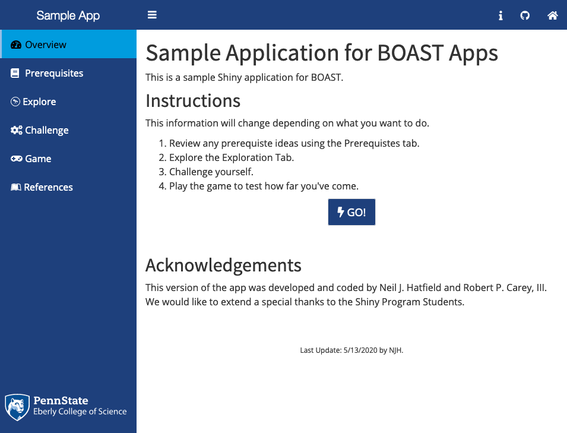
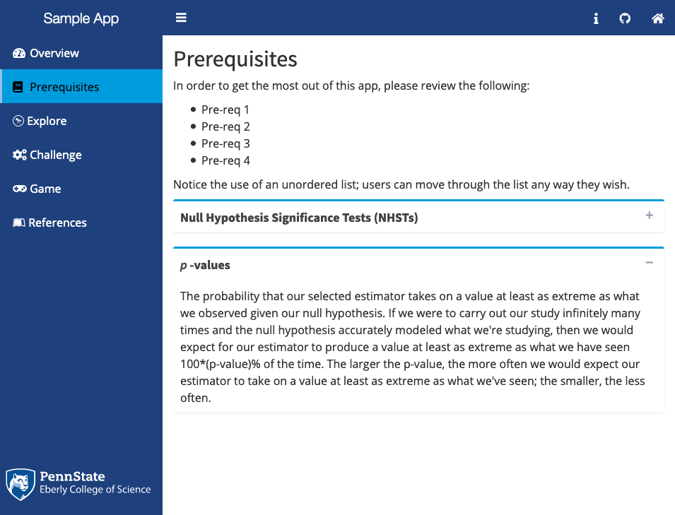
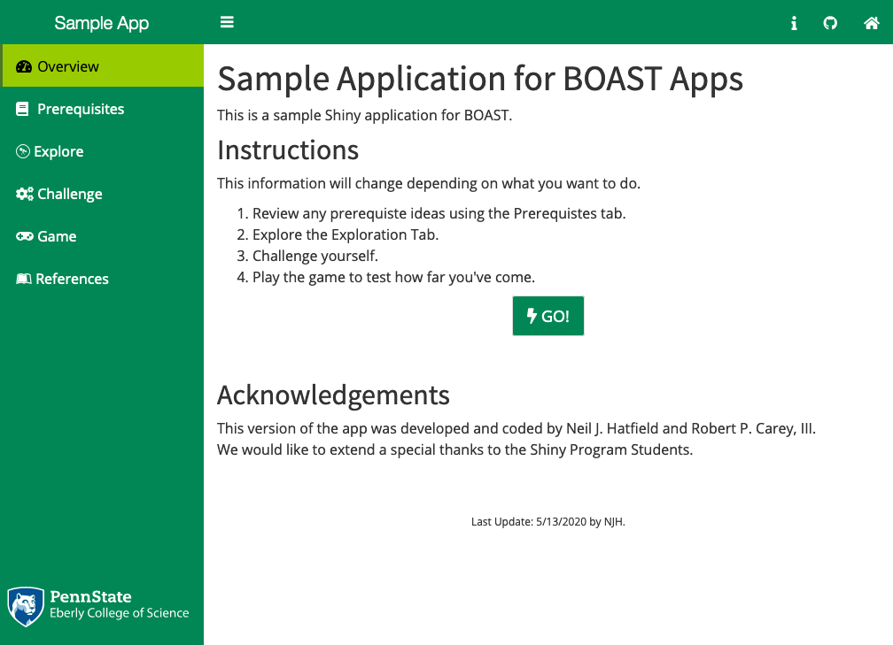
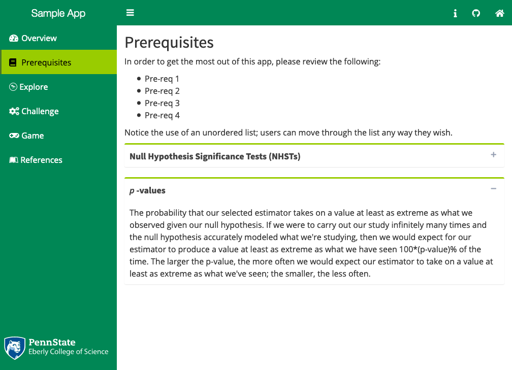
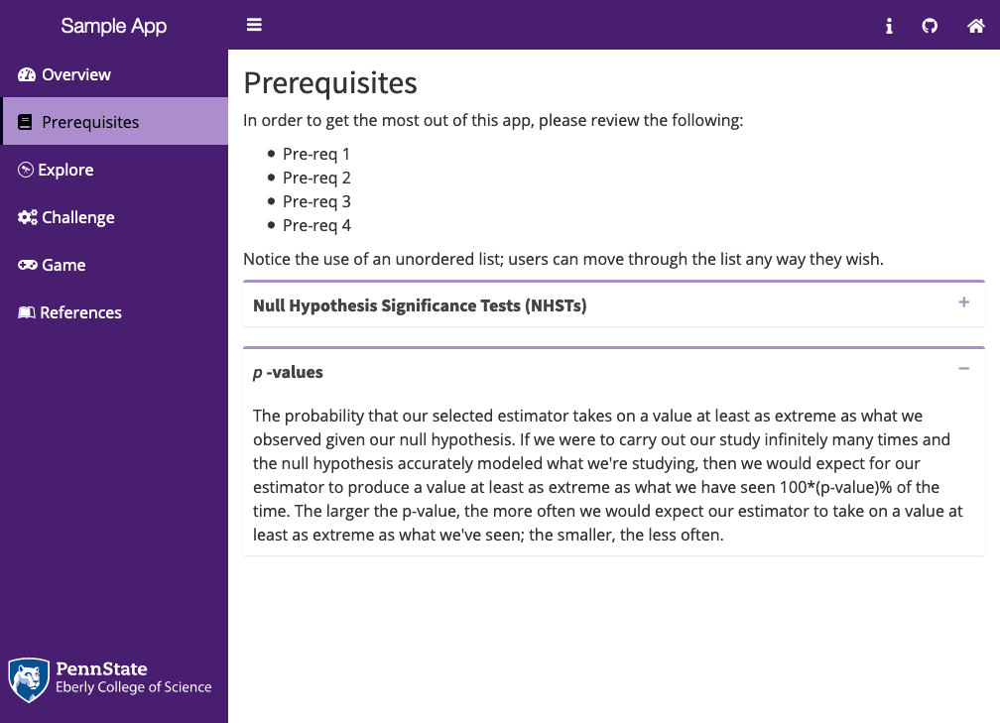
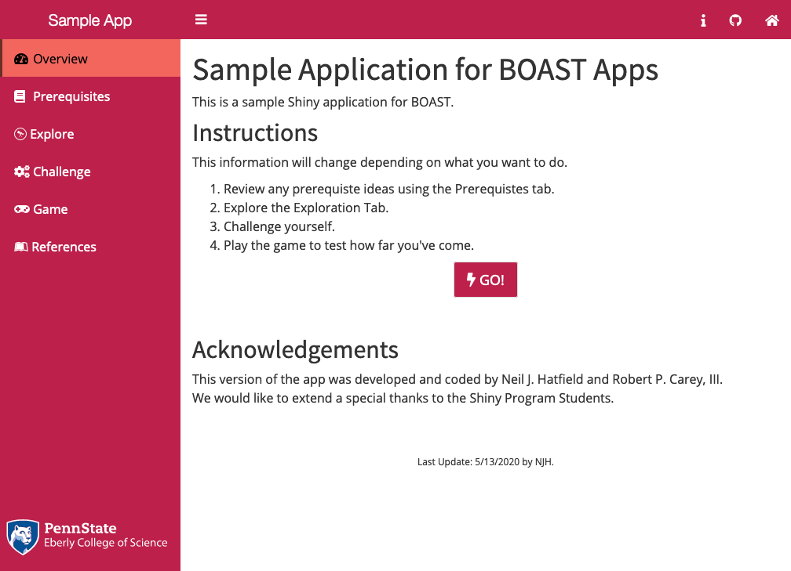
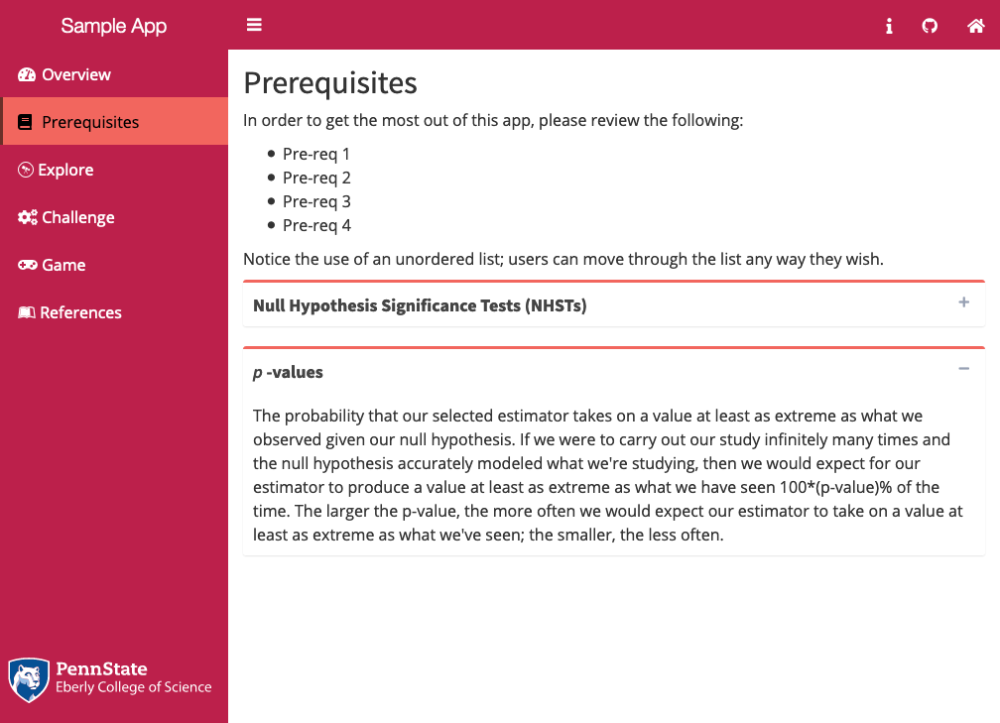
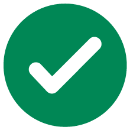

# (PART) Visual Appearance {-}

# App Layout {#layout}

When considering the Visual Appearance of your App, there are two major areas of consideration: the [Layout](#layout) and what we refer to as [Design Styling](#designStyle). Each of these will be handled in turn. Keep in mind that these two aspects are inter-related and have significant cross-over.

In this chapter, we will be focusing on the layout aspect of how your App looks. That is to say, we're going to talk about the standards/guidelines that cut across all of our apps so that they look like they belong together. 

A good number of the elements of the layout will have a direct consequence on your coding. For instance, in the section on [Organizing Your Code](#orgCode), you saw that the UI definition needed to come before the Server definition. This section defines additional organizational structure to your code as it pertains to the layout of your App.

As a reminder, one of the most important benefits of using the `boastApp` function from the `boastUtils` package is that is that certain aspects of Visual Appearance will be automatically handled for you. However, you still need to do adhere to this Style Guide.

## Dashboard {#dashboard}

All apps will make use of a Dashboard structure. This divides the visual appearance of each App into three main areas. 

+ Across the top of the App will be the Header 
+ Along the left side of the App will be the navigation list (the Sidebar) where the various Tabs (pages) of your App will be listed
+ The last area is the Body; this is where all content will appear

Several of the older apps will have outdated UI calls including, but not limited to: `shinyUI` and `navbarPage`. These functions should no longer be used; apps that use them need to be updated to become compliant with this Style Guide. 

### Creating the Dashboard

Creating the overarching Dashboard layout in your App is actually quit easy:

```{r makeDashboard1, echo=TRUE, eval=FALSE}
# Required package
library(shinydashboard)

# For app.R files
# [code omitted]
ui <- list(
  dashboardPage(
    skin = "blue",
    # [code omitted]
  )
)

# For ui.R files
dashboardPage(
  skin = "blue",
  # [code omitted]
)
```

The `dashboardPage` function will wrap around the rest of your UI element, thereby establishing the overarching structure. Three of this function's arguments (`header`, `sidebar`, and `body`) will be covered in following sections. We do not need to worry about the `title` argument as this will be controlled by the Dashboard Header. 

The one argument that you need to explicitly set for the `dashboardPage` is the `skin` argument. This argument sets the overall color theme for your App. While this is something that is more an aspect of Design Style, your only opportunity to set this value is here with the Layout. 

### Color in the User Interface {#colorUI}

Within BOAST, we use color themes to help provide consistency for the elements of each app and to denote different chapters. Part of the standardization process of this Style Guide seeks to bring the many fractured color themes together into a cohesive, centrally managed set. This helps reduce the programming burden on the students, who should focus on the R side of the programming, not the CSS side.

All aspects of color in the User Interface should be controlled through the CSS file(s). This includes all of the following:

+ Dashboard coloring (Header, Sidepanel, Body)
+ Text coloring
+ Coloring of Controls (including buttons, sliders, and other input fields)

By using CSS, especially through `boastApp`, you’ll be able to ensure that there is consistent coloring throughout your App.

#### Implementing a Color Theme

To activate a color theme is a simple process, especially if you are following this Style Guide and using the `boastUtils` package. (If you are in an App using ui.R and server.R, make sure that the boast.css call is in the ui.R file. See [Section \@ref(textStyle)](#textStyle).)

In your App's code, go to where you first call the function `dashboardPage`. Then, as the first argument you'll type `skin = "[theme]"` before moving on the next argument, `dashboardHeader`.

You will replace `[theme]` with one of the following: `blue`, `green`, `purple`, `yellow`, `red` or `black`. The choice will be determined by the color assigned to that chapter. This is all you have to do.

If you are unsure what color to put, use `blue` as the default.

#### The Themes

There are six color themes that we've currently made. The names of the themes are a general indication of coloring, with one exception. The `black` theme is not black but rather an aqua/teal set. The themes are typically three colors (four for `blue`) and based upon the Penn State Palettes. Non-Penn State colors will be denoted with asterisks. 

All of the themes have been checked against 8 different forms of color blindness.

##### Blue

The Blue Palette is our central palette and should be used by default. The Blue Palette looks like the following:
```{r bluePalette, fig.cap="The Blue Palette", fig.align='center', fig.width=6, fig.height=2, echo=FALSE}
ggplot2::ggplot() +
  ggplot2::geom_rect(
    mapping = ggplot2::aes(
      xmin = 0, xmax = 2,
      ymin = 0, ymax = 2),
    fill = "#1E407C"
  ) +
  ggplot2::annotate(geom = "text", x = 1, y = 1.25,
                    label = "Primary Color",
                    color = "white") +
  ggplot2::annotate(geom = "text", x = 1, y = 0.75,
                    label = "Beaver Blue",
                    color = "white") +
  ggplot2::geom_rect(
    mapping = ggplot2::aes(
      xmin = 2, xmax = 4,
      ymin = 0, ymax = 2),
    fill = "#009CDE"
  ) +
  ggplot2::annotate(geom = "text", x = 3, y = 1.25,
                    label = "Secondary Color",
                    color = "black") +
  ggplot2::annotate(geom = "text", x = 3, y = 0.75,
                    label = "PA Sky",
                    color = "black") +
  ggplot2::geom_rect(
    mapping = ggplot2::aes(
      xmin = -2, xmax = 0,
      ymin = 0, ymax = 2),
    fill = "#001E44"
  ) +
  ggplot2::annotate(geom = "text", x = -1, y = 1.25,
                    label = "Dark Accent",
                    color = "white") +
  ggplot2::annotate(geom = "text", x = -1, y = 0.75,
                    label = "Nittany Navy",
                    color = "white") +
  ggplot2::geom_rect(
    mapping = ggplot2::aes(
      xmin = 4, xmax = 6,
      ymin = 0, ymax = 2),
    fill = "#96BEE6"
  ) +
  ggplot2::annotate(geom = "text", x = 5, y = 1.25,
                    label = "Light Accent",
                    color = "black") +
  ggplot2::annotate(geom = "text", x = 5, y = 0.75,
                    label = "Pugh Blue",
                    color = "black") +
  ggplot2::theme_void()

```

Here is what the Blue Palette looks like in action:

```{r blueAction1, fig.align='center', fig.width=6, fig.height=4, echo=FALSE, fig.cap="Overview Page Using the Blue Palette"}

```

```{r blueAction2, fig.align='center', fig.width=6, fig.height=4, echo=FALSE, fig.cap="Collapsible Boxes Using the Blue Palette"}

```

```{r blueAction3, fig.align='center', echo=FALSE, fig.cap="Sliders Using the Blue Palette"}

knitr::include_graphics("images/colorThemes/blueSliders.png", dpi=NA)
```

##### Green

The Green Palette looks like the following:
```{r greenPalette, fig.cap="The Green Palette", fig.align='center', fig.width=6, fig.height=2, echo=FALSE}
ggplot2::ggplot() +
  ggplot2::geom_rect(
    mapping = ggplot2::aes(
      xmin = 0, xmax = 2,
      ymin = 0, ymax = 2),
    fill = "#008755"
  ) +
  ggplot2::annotate(geom = "text", x = 1, y = 1.25,
                    label = "Primary Color",
                    color = "white") +
  ggplot2::annotate(geom = "text", x = 1, y = 0.75,
                    label = "Green Opportunity",
                    color = "white") +
  ggplot2::geom_rect(
    mapping = ggplot2::aes(
      xmin = 2, xmax = 4,
      ymin = 0, ymax = 2),
    fill = "#99CC00"
  ) +
  ggplot2::annotate(geom = "text", x = 3, y = 1.25,
                    label = "Secondary Color",
                    color = "black") +
  ggplot2::annotate(geom = "text", x = 3, y = 0.75,
                    label = "Future's Calling",
                    color = "black") +
  ggplot2::geom_rect(
    mapping = ggplot2::aes(
      xmin = -2, xmax = 0,
      ymin = 0, ymax = 2),
    fill = "#4A7729"
  ) +
  ggplot2::annotate(geom = "text", x = -1, y = 1.25,
                    label = "Dark Accent",
                    color = "white") +
  ggplot2::annotate(geom = "text", x = -1, y = 0.75,
                    label = "Penn's Forest",
                    color = "white") +
  ggplot2::theme_void()

```

Here is what the Green Palette looks like in action:

```{r greenAction1, fig.align='center', fig.width=6, fig.height=4, echo=FALSE, fig.cap="Overview Page Using the Green Palette"}

```

```{r greenAction2, fig.align='center', fig.width=6, fig.height=4, echo=FALSE, fig.cap="Collapsible Boxes Using the Green Palette"}

```

```{r greenAction3, fig.align='center', echo=FALSE, fig.cap="Sliders Using the Green Palette"}

knitr::include_graphics("images/colorThemes/greenSliders.png", dpi= NA)
```

##### Purple

The Purple Palette looks like the following:
```{r purplePalette, fig.cap="The Purple Palette", fig.align='center', fig.width=6, fig.height=2, echo=FALSE}
ggplot2::ggplot() +
  ggplot2::geom_rect(
    mapping = ggplot2::aes(
      xmin = 0, xmax = 2,
      ymin = 0, ymax = 2),
    fill = "#491D70"
  ) +
  ggplot2::annotate(geom = "text", x = 1, y = 1.25,
                    label = "Primary Color",
                    color = "white") +
  ggplot2::annotate(geom = "text", x = 1, y = 0.75,
                    label = "Perpetual Wonder",
                    color = "white") +
  ggplot2::geom_rect(
    mapping = ggplot2::aes(
      xmin = 2, xmax = 4,
      ymin = 0, ymax = 2),
    fill = "#AC8DCE"
  ) +
  ggplot2::annotate(geom = "text", x = 3, y = 1.25,
                    label = "Secondary Color",
                    color = "black") +
  ggplot2::annotate(geom = "text", x = 3, y = 0.75,
                    label = "Stately Atherton",
                    color = "black") +
  ggplot2::geom_rect(
    mapping = ggplot2::aes(
      xmin = -2, xmax = 0,
      ymin = 0, ymax = 2),
    fill = "#000321"
  ) +
  ggplot2::annotate(geom = "text", x = -1, y = 1.25,
                    label = "Dark Accent",
                    color = "white") +
  ggplot2::annotate(geom = "text", x = -1, y = 0.75,
                    label = "Endless Potential",
                    color = "white") +
  ggplot2::theme_void()

```

Here is what the Purple Palette looks like in action:

```{r purpleAction1, fig.align='center', fig.width=6, fig.height=4, echo=FALSE, fig.cap="Overview Page Using the Purple Palette"}
knitr::include_graphics("images/colorThemes/purpleOverview.png")
```

```{r purpleAction2, fig.align='center', fig.width=6, fig.height=4, echo=FALSE, fig.cap="Collapsible Boxes Using the Purple Palette"}

```

```{r purpleAction3, fig.align='center', echo=FALSE, fig.cap="Sliders Using the Purple Palette"}

knitr::include_graphics("images/colorThemes/purpleSliders.png", dpi= NA)
```

##### Black

The "Black" Palette is not pegged to the color black, but rather teal/aqua colors. However, to call the theme in the Shiny dashboard, the user must use the value `black` for the the `skin` argument. Here's what the "Black" Palette looks like:
```{r blackPalette, fig.cap="The 'Black' Palette", fig.align='center', fig.width=6, fig.height=2, echo=FALSE}
ggplot2::ggplot() +
  ggplot2::geom_rect(
    mapping = ggplot2::aes(
      xmin = 0, xmax = 2,
      ymin = 0, ymax = 2),
    fill = "#3EA39E"
  ) +
  ggplot2::annotate(geom = "text", x = 1, y = 1.25,
                    label = "Primary Color",
                    color = "white") +
  ggplot2::annotate(geom = "text", x = 1, y = 0.75,
                    label = "Creek",
                    color = "white") +
  ggplot2::geom_rect(
    mapping = ggplot2::aes(
      xmin = 2, xmax = 4,
      ymin = 0, ymax = 2),
    fill = "#69C9CB"
  ) +
  ggplot2::annotate(geom = "text", x = 3, y = 1.25,
                    label = "Secondary Color",
                    color = "black") +
  ggplot2::annotate(geom = "text", x = 3, y = 0.75,
                    label = "Teal*",
                    color = "black") +
  ggplot2::geom_rect(
    mapping = ggplot2::aes(
      xmin = -2, xmax = 0,
      ymin = 0, ymax = 2),
    fill = "#314D64"
  ) +
  ggplot2::annotate(geom = "text", x = -1, y = 1.25,
                    label = "Dark Accent",
                    color = "white") +
  ggplot2::annotate(geom = "text", x = -1, y = 0.75,
                    label = "Slate",
                    color = "white") +
  ggplot2::theme_void()

```

Here is what the "Black" Palette looks like in action:

```{r blackAction1, fig.align='center', fig.width=6, fig.height=4, echo=FALSE, fig.cap="Overview Page Using the 'Black' Palette"}
knitr::include_graphics("images/colorThemes/blackOverview.png")
```

```{r blackAction2, fig.align='center', fig.width=6, fig.height=4, echo=FALSE, fig.cap="Collapsible Boxes Using the 'Black' Palette"}
knitr::include_graphics("images/colorThemes/blackCollapse.png")
```

```{r blackAction3, fig.align='center', echo=FALSE, fig.cap="Sliders Using the 'Black' Palette"}

knitr::include_graphics("images/colorThemes/blackSliders.png", dpi= NA)
```

##### Yellow

The Yellow Palette is still under consideration. The current set looks like the following:
```{r yellowPalette, fig.cap="The Yellow Palette", fig.align='center', fig.width=6, fig.height=2, echo=FALSE}
ggplot2::ggplot() +
  ggplot2::geom_rect(
    mapping = ggplot2::aes(
      xmin = 0, xmax = 2,
      ymin = 0, ymax = 2),
    fill = "#E98300"
  ) +
  ggplot2::annotate(geom = "text", x = 1, y = 1.25,
                    label = "Primary Color",
                    color = "white") +
  ggplot2::annotate(geom = "text", x = 1, y = 0.75,
                    label = "Invent Orange",
                    color = "white") +
  ggplot2::geom_rect(
    mapping = ggplot2::aes(
      xmin = 2, xmax = 4,
      ymin = 0, ymax = 2),
    fill = "#FFD100"
  ) +
  ggplot2::annotate(geom = "text", x = 3, y = 1.25,
                    label = "Secondary Color",
                    color = "black") +
  ggplot2::annotate(geom = "text", x = 3, y = 0.75,
                    label = "Bright Keystone",
                    color = "black") +
  ggplot2::geom_rect(
    mapping = ggplot2::aes(
      xmin = -2, xmax = 0,
      ymin = 0, ymax = 2),
    fill = "#BF8226"
  ) +
  ggplot2::annotate(geom = "text", x = -1, y = 1.25,
                    label = "Dark Accent",
                    color = "white") +
  ggplot2::annotate(geom = "text", x = -1, y = 0.75,
                    label = "Lion's Roar",
                    color = "white") +
  ggplot2::theme_void()

```

Here is what the Yellow Palette looks like in action:

```{r yellowAction1, fig.align='center', fig.width=6, fig.height=4, echo=FALSE, fig.cap="Overview Page Using the Yellow Palette"}
knitr::include_graphics("images/colorThemes/yellowOverview.png")
```

```{r yellowAction2, fig.align='center', fig.width=6, fig.height=4, echo=FALSE, fig.cap="Collapsible Boxes Using the Yellow Palette"}
knitr::include_graphics("images/colorThemes/yellowCollapse.png")
```

```{r yellowAction3, fig.align='center', echo=FALSE, fig.cap="Sliders Using the Yellow Palette"}

knitr::include_graphics("images/colorThemes/yellowSliders.png", dpi= NA)
```

##### Red

The Red Palette is still under construction. Here's the current set:
```{r redPalette, fig.cap="The Red Palette", fig.align='center', fig.width=6, fig.height=2, echo=FALSE}
ggplot2::ggplot() +
  ggplot2::geom_rect(
    mapping = ggplot2::aes(
      xmin = 0, xmax = 2,
      ymin = 0, ymax = 2),
    fill = "#BC204B"
  ) +
  ggplot2::annotate(geom = "text", x = 1, y = 1.25,
                    label = "Primary Color",
                    color = "white") +
  ggplot2::annotate(geom = "text", x = 1, y = 0.75,
                    label = "Original 1887",
                    color = "white") +
  ggplot2::geom_rect(
    mapping = ggplot2::aes(
      xmin = 2, xmax = 4,
      ymin = 0, ymax = 2),
    fill = "#F2665E"
  ) +
  ggplot2::annotate(geom = "text", x = 3, y = 1.25,
                    label = "Secondary Color",
                    color = "black") +
  ggplot2::annotate(geom = "text", x = 3, y = 0.75,
                    label = "Dawn of Discovery",
                    color = "black") +
  ggplot2::geom_rect(
    mapping = ggplot2::aes(
      xmin = -2, xmax = 0,
      ymin = 0, ymax = 2),
    fill = "#6A3028"
  ) +
  ggplot2::annotate(geom = "text", x = -1, y = 1.25,
                    label = "Dark Accent",
                    color = "white") +
  ggplot2::annotate(geom = "text", x = -1, y = 0.75,
                    label = "Land Grant",
                    color = "white") +
  ggplot2::theme_void()

```

Here is what the Red Palette looks like in action:

```{r redAction1, fig.align='center', fig.width=6, fig.height=4, echo=FALSE, fig.cap="Overview Page Using the Red Palette"}

```

```{r redAction2, fig.align='center', fig.width=6, fig.height=4, echo=FALSE, fig.cap="Collapsible Boxes Using the Red Palette"}

```

```{r redAction3, fig.align='center', echo=FALSE, fig.cap="Sliders Using the Red Palette"}

knitr::include_graphics("images/colorThemes/redSliders.png", dpi= NA)
```

### Current Chapter Color Assignments {#chapterColor}

Here are the current (05/27/2020) color theme assignments for chapters:

+ Chapter 1: Data Gathering RED
+ Chapter 2: Data Description YELLOW
+ Chapter 3: Basic Probability BLUE
+ Chapter 4: Statistical Inference PURPLE
+ Chapter 5: Probability BLUE
+ Chapter 6: Regression "BLACK"
+ Chapter 7: ANOVA "BLACK"
+ Chapter 8: Time Series PURPLE
+ Chapter 9: Sampling RED
+ Chapter 10: Categorical Data YELLOW
+ Chapter 11: Data Science GREEN
+ Chapter 12: Stochastic Processes BLUE
+ Chapter 13: Biology GREEN

## Dashboard Header {#header}

Each Dashboard Header contains only a couple of elements. The most important of these will be a [shortened] Title of your App. This will automatically be followed by the sidebar collapse/expand button. At the far right, you will then include a link to the home page of BOAST using the Home icon.  

Additional icons might be included to the left of the Home icon. However, these icons remain the same for all Tabs/pages of your App and are thus are not appropriate for Tab/page specific information.

There should not be any additional elements in the Dashboard Header. Any links for navigate in your App should appear in the Sidebar on the left edge.

The width of the Title component of the Header should be 250; `titleWidth = 250`.

### Creating the Dashboard Header

You will use the same structure regardless if you are using `app.R` or `ui.R`.
```{r makeHeader1, echo=TRUE, eval=FALSE}
# [omitted code]
dashboardHeader(
      title = "Sample App", # You may use a shortened form of the title here
      titleWidth = "250",
      # the following is OPTIONAL
      tags$li(class = "dropdown", actionLink("info", icon("info"))),
      # You will see the following commented code in the Sample App; 
      # you may delete this from your app
      # tags$li(class = "dropdown",
      #         tags$a(href='https://github.com/EducationShinyAppTeam/BOAST',
      #                icon("github"))),
      # the following is REQUIRED and must be last.
      tags$li(class = "dropdown",
              tags$a(href='https://shinyapps.science.psu.edu/', icon("home")))
)
# [omitted code]
```

A couple of things to notice: 

+ The `dashboardHeader` acts as a list environment, so it is safe to use `tags$li` here even though there isn't a `tags$ol` or `tags$ul`.
+ There are not a lot of elements to the Header. We only add additional elements here if it is something static (i.e., un-changing) that is necessary for all pages of your App.
+ You will need to set `class = "dropdown"` for each element after the `title` and `titleWidth`.
+ The `info` icon is optional; if you use this keep in mind two things:
    - You will need to define what the link does in the `server` definition.
    - This link's action remains the same for all tabs of your app. Thus, you should not use this to store or be the main conveyance of critical information/instructions for using a particular tab of your App.
+ The last element of the Header (i.e., the rightmost) will always be the home icon which takes the user to the BOAST home page.

### What's Needed in the Server Definition

If you just have a bare bones Header (i.e., title and home button), you do not need to add anything special to your server definition.

If you do have something, for example, an Info button. You will need to add some additional code to your server definition. The code you add will depend upon the element. In general, for alert messages, we recommend that you use `shinyWidgets::sendSweetAlert`. Here's a generic example of what could be used for the Info button.

```{r infoServer, echo=TRUE, eval=FALSE}
# Required Packages
library(shinyWidgets)

# Move to your server definition
# Either look for server <- function(input, output, session) or open the server.R file.

# [omitted code]

observeEvent(input$info, { # Replace "info" with the appropriate id
  shinyWidgets::sendSweetAlert(
    session = session, # This should stay as is
    title = "App Information",
    text = paste("[Message you want to give to the student]",
                 "Use paste with multiple lines to",
                 "improve code reability."),
    type = "info" # This option will depend upon the nature of your message
  )
})

```

The `type` argument will take one of several options. use the one that best aligns with your purposes.

+ `info`: If you are just conveying some general information to your user, you'll use this value. This is the value that we will use in the vast majority of cases.
+ `error`: Use this if your message tells the user that have committed some action that causes your App to fail.
+ `question`: Use with an alert where you are asking the user to respond to a question.
+ `warning`: If you want to give your user the opportunity to stop from doing something destructive (e.g., deleting data values), this would be appropriate.
+ `success`: Use this if your message let's the user know that something worked correctly.

*Note: these buttons/links will throw an error when using the WAVE tool. This is expected at this time.*

## Dashboard Sidebar {#sidebar}

The Sidebar is the main navigational tool for your users. Thus, if you want your user to access a certain tab/page, you must be sure to include this in the Sidebar. The only exception is if you are creating a series of levels inside the same Exploration, Challenge, or Game. These are referred to as [Tabs Inside the Body](#innerTabs) and are covered in their own section.

The Sidebar should have a width of 250, (`width = 250`).

For full descriptions of each type of Tab, please refer to the [Dashboard Body Section](#body).

### Creating the Dashboard Sidebar
This code will be the same regardless if you use `app.R` or `ui.R`.
```{r makeSidebar1, echo=TRUE, eval=FALSE}
# [omitted code]
dashboardSidebar(
  width = 250,
  sidebarMenu(
    id = "tabs",
    # Overivew is REQUIRED
    menuItem("Overview", tabName = "Overview", icon = icon("dashboard")),
    # Prerequisites is optional
    menuItem("Prerequisites", tabName = "Prerequisites", icon = icon("book")),
    # At least one of the next three is REQUIRED
    menuItem("Explore", tabName = "Explore", icon = icon("wpexplorer")),
    menuItem("Challenge", tabName = "Challenge", icon = icon("gears")),
    menuItem("Game", tabName = "Game", icon = icon("gamepad")),
    # References is REQUIRED
    menuItem("References", tabName = "References", icon = icon("leanpub"))
  ),
  # PSU Logo is REQUIRED and to be last
  tags$div(
    class = "sidebar-logo",
    boastUtils::psu_eberly_logo("reversed")
  )
)
# [omitted code]
```

Notice that after setting the `width` of the Sidebar, you will need to call the `sidebarMenu` function. This will create the appropriate structure for your Sidebar.

### Sidebar Order
To ensure consistency across all apps, the Sidebar needs to have the following order:

1. The Overview Tab should always come first.
2. If used, a Prerequisites Tab will come second.
3. An Activity Tab (Explore, Challenge, or Game) will come next.
4. If there are multiple Activity Tabs, then
    a. Order by Concept so that Tabs dealing with the same idea are together,
    b. Then order by Explore, Challenge, then Game
    c. If a Game Tab covers multiple Explore/Challenge Tabs, place after the last of the Explore/Challenge Tabs
    d. For a set of Activity Tabs of the same type (e.g., three Explore Tabs), the order will be up to you and the learning goals for your App
5. The References Tab will always come after the Activity Tabs and be the last element of the `sidebarMenu`.
6. The PSU Logo will always be the last element of the Sidebar, and outside of the `sidebarMenu` call. Please refer to the [Section \@ref(logo)](#logo).

*Note: this order will also dictate how you should organize your code in the [Dashboard Body](#body).*

### Sidebar Names
There are three Tabs whose names are fixed (i.e., you can not change): the Overview, Prerequisites, and References. The Activity Tabs will be named in the following manner:

+ If there is only one Activity Tab of each type, you may use the names Explore, Challenge, and Game.
+ If there are multiple Tabs of each type, you will need to rename each tab as appropriate. For example,
    - In the [NHST Caveats App](https://psu-eberly.shinyapps.io/Significance_Testing_Caveats/), there are three Explore tabs: the Multiple Testing Caution, the Large Sample Caution, and the Small Sample Caution.
    - In the [One-way ANOVA App](https://psu-eberly.shinyapps.io/OneWay_ANOVA/) there are two Games: a Matching Game and a Fill in the Blank game.

### Sidebar Icons
Each type of Tab that appears in the Sidebar must use a specific icon:

+ Overview -- tachometer-alt (formerly called dashboard), `r fontawesome::fa(name = "fas fa-tachometer-alt", height = "25px")` 
+ Prerequisites -- book, `r fontawesome::fa(name = "fas fa-book", height = "25px")`
+ Explore Tabs -- wpexplorer, `r fontawesome::fa(name = "fab fa-wpexplorer", height = "25px")`
+ Challenge Tabs -- cogs (formerly called gears), `r fontawesome::fa(name = "fas fa-cogs", height = "25px")`  
+ Game Tabs -- gamepad, `r fontawesome::fa(name = "fas fa-gamepad", height = "25px")`
+ References -- leanpub, `r fontawesome::fa(name = "fab fa-leanpub", height = "25px")`

If you come across any of these types of tabs that have a different icon or a missing icon, please create an issue in GitHub and/or fix.

If there is a type of tab that does fit these, please talk to Neil to see about what we need to add.

### Submenus
Given the nature of our Apps, there is __NO__ reason for having submenus. If you come across an app that has submenus or you believe that a submenu is necessary, then that is a good sign that you are looking at a "bloated" app. These apps need to be marked for review to investigate breaking the app in to two or more apps.

### What's Needed in the Server Definition

If you have followed the above specifications, you do not need to add anything special to your server definition.

## Dashboard Body {#body}

The Dashboard Body is where all content (text, images, plots, buttons, etc.) exists for the user to read, view, and interact with. Thus, this is the most important part of the layout of your App.

The order in which your code the Tabs in the Dashboard body needs to mirror the order of the tabs in the Sidebar. Thus, the first `tabItem` in the `dashboardBody` should be the Overview; the last, the References.

The Dashboard Body will begin with the following code in the UI section:

```{r makeBody1, echo=TRUE, eval=FALSE}
# [code omitted]
dashboardBody(
  tabItems(
    tabItem(
      tabName = "Overview", # needs to match the names you used in the Sidebar
      withMathJax(), # if you need to display mathematics, include this line
      # [code for the tab]
    ),
    # repeat tabItem chunk for each subsequent tab
  )
)
# [code omitted]
```

The following subsections explain the purposes of each type of Tab.

### The Overview Tab

This Tab is __REQUIRED__ for all Apps. This is the main landing page of your App and should appear at the top of the Sidebar. The icon for this Tab must be "dashboard".

The Overview Tab must contain __ALL__ of the following elements:

1.  “Long/Formal App Title” (as Heading 1; this will be the __only__ instance of Heading 1 in your App)
2.  A description of the app (as paragraph text under the title)
3.  “Instructions” (as Heading 2)
4.  General instructions for using the App (using an Ordered List environment)
5.  A button that will take the user to the next Tab/page (see [Section \@ref(buttons)](#buttons) on buttons)
6.  “Acknowledgements” (as Heading 2)
7.  A listing of acknowledgements including, coders, content writers, etc. (as a paragraph)
8.  Last Element: `div(class = "updated", "Last Update: mm/dd/yyyy by FL.")` with mm/dd/yyyy replaced with the date of the update you pushed to the server and FL replaced with your initials.

The purpose of the Overview Tab is the act like the front/home page of any newspaper, magazine, or website. Set the stage for what the user will be doing.

#### Creating the Overview Tab
Here's an example of making an Overview Tab
```{r makeOverview1, echo=TRUE, eval=FALSE}
# Required Package
library(shinyBS)

# In the UI Section
# Inside the Dashboard Body

tabItem(
  tabName = "Overview",
  withMathJax(),
  h1("Sample Application for BOAST Apps"), # This should be the full name.
  p("This is a sample Shiny application for BOAST."),
  p("While not a proper app for helping students learn some statistical concept,
    this app functions as an example for a variety of features."),
  h2("Instructions"),
  p("This information will change depending on what you want to do."),
  tags$ol(
    tags$li("Review any prerequiste ideas using the Prerequistes tab."),
    tags$li("Explore the Exploration Tab."),
    tags$li("Challenge yourself."),
    tags$li("Play the game to test how far you've come.")
    ),
  ##### Go Button--location and text will depend on your goals
  div(
    style = "text-align: center",
    bsButton(
      inputId = "explore1",
      label = "Explore!", # Notice there are NO spaces between the letters
      size = "large",
      icon = icon("bolt"),
      style = "default"
      )
    ),
  ##### Create two lines of space
  br(),
  br(),
  h2("Acknowledgements"),
  p("This version of the app was developed and coded by Neil J. Hatfield and Robert P.
    Carey, III.",
    br(),
    "We would like to extend a special thanks to the Shiny Program Students.",
    #### Create three lines of space
    br(),
    br(),
    br(),
    div(class = "updated", "Last Update: 5/13/2020 by NJH.")
  )
)
```

A few things to notice:

+ If you need a new line but not a new paragraph, you use the `br()` tag. 
+ The label for the button needs to be in-line with [Section \@ref(buttons)](#buttons).
+ There should __NOT__ be any spaces between letters of a button label. This is a violation of Accessibility as this destroys the label. While we might read "G (space) O" as the word "go", a screen reader reads out "gee" (pause) "oh" to the user.
+ There is no need to use boldface or colons with the section headings when you properly use Heading tags. Thus, "Instructions:" does not follow this Style Guide.
+ There should not be an "About" heading. The text between the Title of your App and the Instructions head serves as the description.

#### What's Needed in the Server Defintion

At bare minimum you will need to have one element in your server definition: the action for your button. If you have multiple buttons, you might need to have several more code chunks. 

Here is a generic example for the button on the Overview Tab that moves the user to the appropriate next Tab:

```{r movementButton1, echo=TRUE, eval=FALSE}
## Define what each button does; repeat this style of coding for each button

# In your server section
# [code omitted]
observeEvent(
  eventExpr = input$expore1, #append the button's inputId to input$ as the event expression
  handlerExpr = { # This is the action portion of your button and must be in { }
  updateTabItems(session, # This how you allow the user to move Tabs
                 inputId = "tabs", # the id of your Sidebar
                 selected = "Explore" # Name of Tab to go to
                 ) 
})
```

In the rare cases where you're having a button in the Overview Tab do something other than move to a new tab, you'll change the `handlerExpr` to do that other action. 

#### Buttons that Go to Activity Packets

An exception to the above is if the button is to allow the user to download/open up an activity file. In these cases, you'll not place any code in the server definition. Rather, you'll change the nature of the button. Specifically, you'll not use `bsButton` but `actionButton`:

```{r actionButton1, echo=TRUE, eval=FALSE}
# In the UI Section
actionButton(
  inputId = "ap1",
  label = "Activity Packet",
  icon = icon("cloud-download"),
  onclick = "window.open('../../ActivityPackets/Caveats/')"
)
```

Notice that the `onclick` argument is what creates the action for button and references a relative path to a particular file. In this case a R Markdown file that lives the in directory called. (The actual file name isn't listed to ensure that the processed/rendered version of the RMD is what the users see.)

### A Prerequisites Tab

If your App needs to ensure that the user has the base understandings necessary to interact with your App, you’ll need to create a prerequisites Tab. Otherwise, skip this Tab.

The icon for this Tab must be "book".

Use the word "Prerequisites" rather than "Pre-reqs", "Prereqs", or "Pre-requisites". 

#### Types of Prerequisites
There are two different types of prerequisites: technical/conceptual and contextual. Both of these go into the Prerequisites tab.

Technical/Conceptual Prerequisites cover ideas that the user needs in order to fully engage with your App's statistical goal. For instance, if your App is about ANCOVA, the ideas of ANOVA and building a linear model would be good candidates for technical/conceptual prerequisites.

Contextual Prerequisites cover ideas that which are beneficial for the user to understand a context you're using. For example, if you are referencing an astragalus, you should include a brief explanation and/or picture of an astragalus. 

Keep in mind that Contextual Prerequisites are different than context which should be part of the Activity Tab. If the information is necessary to interpret sliders/graphs and is *specific*, then you should include this information in the Activity Tab. If the information helps the user say "Oh, that's what they mean by [blank]", that is good sign of something to put in the Prerequisites Tab.

#### Text Links in Prerequisites (and Beyond)
In as many instances as possible, we would like to provide the user with a link to Online Notes of a World Campus Statistics course. 

*Note: what appears here is applicable any time you want to link to an webpage that is beyond BOAST.*

The link that you provide must take the user to the appropriate location. Do not send the user to the home page for a course; rather, take them to the relevant page. To do this, you'll need to explore the [Department of Statistics STAT ONLINE](https://online.stat.psu.edu/statprogram/) page and look through the courses. 

You will create these links in-line, not as a button. Thus, they must be part of a paragraph block (i.e., inside a `p()` with other text) or as part of list item (i.e., inside a `li()`).

Your link must include descriptive text. Using "Click Here" is __not__ descriptive. Rather say where the link will take the user. If you look through the links that we've included in this Style Guide, we've been modeling this. This descriptive text not only helps all users anticipate where they are going but also improves the accessibility of the links. (Plus, have you ever tried to click a small link on your phone?)

Once you find the appropriate page, you'll need to copy the URL for your link. There are some instances where we might be able to find an existing anchor (look for two inter-locking rings to appear when you place your cursor over a title) or make a request for adding an anchor. These are especially useful if what you want to link to is only part of the page.

*Note: not all requests for anchors may be fulfilled and not all course notes have anchors.

The styling of the link will be managed by the BOAST CSS file.

Here's are two examples of how you would code a text link:
```{r textLinkEx1, echo=TRUE, eval=FALSE}
# [omitted code]
# Working in the UI section

# Example 1: in a paragraph
p("While not critical, you might wish to refresh your understanding on some of the basic shapes
  of graphs in statistics. A good resource for this would be the ", # Notice the ending space
  tags$a(
    herf = "https://online.stat.psu.edu/stat100/lesson/3/3.2#graphshapes", #the URL
    "STAT 100 Table of Graph Shapes" # the descriptive text for the link
    ),
  ". Feel free to check that resource out." 
  # Notice the ending punctuation for the prior sentence is not part of the link.
)

# Example 2: in a list item
tags$ul(
  tags$li("Review the ", # Notice the ending space
    tags$a(
      herf = "https://online.stat.psu.edu/stat100/lesson/3/3.2#graphshapes", #the URL
      "STAT 100 Table of Graph Shapes" # the descriptive text for the link
      )
    # List items don't necessarily need ending punctuation. 
    #Be consistent; either all items do or none.
  ) 
)
# [omitted code]
```

#### Creating a Prerequisites Tab
Here's an example of the code needed to create the Prerequisites Tab in the UI:

```{r makePrereq1, echo=TRUE, eval=FALSE}
# [code omitted]
tabItem(
  tabName = "Prerequisites",
  withMathJax(), # this line only need if you display mathematics
  h2("Prerequisites"),
  p("In order to get the most out of this app, please review the following:"),
  tags$ul(
    tags$li("Pre-req 1"),
    tags$li("Pre-req 2"),
    tags$li("Pre-req 3"),
    tags$li("Pre-req 4")
    ),
    p("Notice the use of an unordered list; users can move through the list any way they wish."),
  p("A second style of doing prerequisites is with collapsible boxes:"),
  box(
    title = strong("Null Hypothesis Significance Tests (NHSTs)"),
    status = "primary",
    collapsible = TRUE,
    collapsed = TRUE,
    width = '100%',
    "In the Confirmatory Data Analysis tradition, null hypothesis significance tests serve as a
    critical tool to confirm that a particular theoretical model describes our data and to make a
    generalization from our sample to the broader population (i.e., make an inference). The null
    hypothesis often reflects the simpler of two models (e.g., 'no statistical difference',
    'there is an additive difference of 1', etc.) that we will use to build a sampling
    distribution for our chosen estimator. These methods let us test whether our sample data are
    consistent with this simple model (null hypothesis)."
  ),
  box(
    title = strong(tags$em("p"), "-values"),
    status = "primary",
    collapsible = TRUE,
    collapsed = FALSE,
    width = '100%',
    "The probability that our selected estimator takes on a value at least as extreme as what we
    observed given our null hypothesis. If we were to carry out our study infinitely many times
    and the null hypothesis accurately modeled what we're studying, then we would anticipate our
    estimator to produce a value at least as extreme as what we have seen 100*(p-value)% of the
    time. The larger the p-value, the more often we would expect our estimator to take on a value
    at least as extreme as what we've seen; the smaller, the less often."
  )
),
# [code omitted]
```

For more information on collapsible boxes, see [Section \@ref(collapsible)](#collapsible).

#### What's Needed in the Server Definition

Generally speaking, the purpose of the Prerequisites Tab is to convey key background information for the user to double check they understand before moving into the heart of your App. Thus, this tab contains static text and images. You do no need to have anything in the server definition for the Prerequisites Tab.

###  Activity Tab(s)

The heart of your App is the one or more tabs where users interact with the App beyond simple navigation. These are the Activity Tabs. Some apps will have a single activity, others several; deciding on how many is part of the design process.

Currently, we have three types of Activity Tabs in BOAST:

+ Exploration/Explore Tabs, `r fontawesome::fa(name = "fab fa-wpexplorer", height = "25px")`
    - These tabs center around the user exploring the target concept.
    - These tabs will generally have more text on the page here than other types of Activity Tabs.
    - There are often guiding questions meant to help the user engage in productive explorations.
    - The goal is not to assess the user's understanding, but to support their construction of productive meanings for the concept.
+ Challenge Tabs, `r fontawesome::fa(name = "fas fa-cogs", height = "25px")`
    - These tabs center around a user challenging themselves by testing out their understanding of a concept.
    - While there might still be a fair amount of text on the page, there will be less than an Exploration Tab.
    - Questions here will be in-between a guiding question and an assessment question. 
    - The goal is to provide the user an opportunity to test and refine their understandings.
+ Game Tabs, `r fontawesome::fa(name = "fas fa-gamepad", height = "25px")`
    - These tabs center around the user review a concept (or several) in a game like format.
    - These generally have the least amount of non-question text on the page (i.e., instructions).
    - The goal is to provide an opportunity for a student to review and practice one or more concepts.

#### General Layout for Activity Tabs

While there are some differences between the different types of Activity Tabs, there is one firm constant for all of them:

__Each Tab should contain all information/instructions for the user to be able to interact with the activity without having to switch to other Tabs.__

There is nothing worse for the user than getting to an Activity Tab and not knowing what they are supposed to do. The Instructions on the Overview are for using the *entire* App, not any one particular page. Thus, you need to have specific page instructions somewhere on the page.

Keep in mind that this is beneficial to all users, but especially those who are using assistive technology such as screen readers. If you put your instructions on a separate tab, you are now requiring that your user memorize those instructions. This is already cognitively demanding for sighted individuals, but for users with vision impairments, even more so.

In addition, we will adopt a 3-part layout:

+ Across the top will be any general information the user needs to interact with your App as well as an context information.
+ To the left and wrapped in a well panel will be the inputs/controls that the user will need to manipulate.
+ To the right and NOT in a well panel will be the outputs (graphs, images, R output)

There will be some cases where this general layout does not necessarily work. For instance, Tic-Tac-Toe games will not follow this layout. 

#### UI and Server Definitions

At this time, we do not have any examples of creating these tabs for this Style Guide. Rather, we encourage you to look at the many examples in the [Book of Apps for Statistics Teaching](https://sites.psu.edu/shinyapps/) as well as the [GitHub Repository for BOAST](https://github.com/EducationShinyAppTeam).

Keep in mind that of all tabs in your App, these tabs will demand the most for the UI and the Server.

### References {#refTab}

The last Tab will be for your references. This Tab is __REQUIRED__ and is where you will place a reference list for all of the following items that you used in your app:

+ All `R` packages you used
+ Sources of any Code you used directly or drew heavily upon from other people
+ Pictures and/or other images
+ Data sets
+ Refer to the [Chapter \@ref(documentation)](#documentation) [on Documentation](#documentation) of this Style Guide for more information.

The icon for this Tab must be "leanpub", `r fontawesome::fa(name = "fab fa-leanpub", height = "25px")`.

We will additionally place licensing information for your App at the bottom of the Reference page. We have created a function in `boastUtils` (version ≥ 0.1.6.1) that will automatically put the correct information on the page.

#### Creating a References Tab

Creating a References Tab mimics both the Overview and Prerequisites Tab structure and is done in the UI section:

```{r makeRef, echo=TRUE, eval=FALSE}
# In the UI Section
# [code omitted]
tabItem(
  tabName = "References",
  withMathJax(), # Rarely, if ever, will you need MathJax in the references
  h2("References"),
  p( # Each reference is in its own paragraph
    class = "hangingindent", # you must set this class argument
    "Bailey, E. (2015), shinyBS: Twitter bootstrap components for shiny, R package. Available
    from https://CRAN.R-project.org/package=shinyBS"
    ),
  p(
    class = "hangingindent",
    "Carey, R. (2019), boastUtils: BOAST Utilities, R Package. Available from
    https://github.com/EducationShinyAppTeam/boastUtils"
    ),
  p(
    class = "hangingindent",
    "Chang, W. and Borges Ribeio, B. (2018), shinydashboard: Create dashboards with 'Shiny', R
    Package. Available from https://CRAN.R-project.org/package=shinydashboard"
    ),
  p(
    class = "hangingindent",
    "Chang, W., Cheng, J., Allaire, J., Xie, Y., and McPherson, J. (2019),  shiny: Web 
    application framework for R, R Package. Available from 
    https://CRAN.R-project.org/package=shiny"
  ),
  p(
    class = "hangingindent",
    "Hatfield, N. J. (2019), Caveats of NHST, Shiny Web App. Available from
    https://github.com/EducationShinyAppTeam/Significance_Testing_Caveats/tree/PedagogicalUpdate1"
  ),
  p(
    class = "hangingindent",
    "Wickham, H. (2016), ggplot2: Elegant graphics for data analysis, R Package, New York:
    Springer-Verlag. Available from https://ggplot2.tidyverse.org"
  ),
  br(), # Three blank spaces
  br(),
  br(),
  boastUtils::copyrightInfo()
)
# [code omitted]
```

#### What's Needed in the Server Definition

You do not need to place anything in the server definition for the References Tab.

### Tabs Inside the Body {#innerTabs}

There are two types of tabs in a Shiny app: there are the `tabItem` (i.e., the pages within an app and should appear in the Sidebar) and `tabPanel` (i.e., creating sub-pages or independent sections). In this section, we will discuss this later case.

Deciding on whether to use `tabPanel` is going to depend on several things:

1. Do you have two or more aspects that are related enough that they shouldn't be their own separate tabs/pages of your App?  
    a. If NO, then you shouldn't use `tabPanel`.  
    b. If YES, then continue.
2. Are any of your aspects something that would be better suited as a Challenge or Game tab?  
    a. If YES, move that aspect to a separate page. If you still have 2+ aspects, continue.  
    b. If NO, continue.  
3. Are the aspects independent enough that a person can skip a couple and still use the App successfully?  
    a. If NO, then you should re-consider your design.  
    b. If YES, then proceed with using `tabPanel` in you design.

When you go to make a set of tab panels you will need to first create a `tabsetPanel` which will wrap around all of the individual panels. Use `type = "tabs"`.

The tabs inside the body should automatically appear horizontally and along the top of the tab body (i.e., in the white space below the Dashboard Header). Any visual styling will be managed by the BOAST CSS file at a global level.

## Common Elements
In addition to the Dashboard elements of the apps, there are other elements that are common. This include things such as how inputs should be ordered, buttons, correct/incorrect indicators, and animation buttons.

For information about popovers, rollovers, hover text, or tool tips, please see [Section \@ref(popovers)](#popovers).

### Ordering Inputs
One of the most powerful aspects of Shiny apps is that the user interacts with them. Thus, we need to consider not only the ways in which user interact (e.g., buttons, sliders, text entry, etc.) but also the order in which you want the user to manipulate the inputs. Coming up with a single declaration for how to order inputs in all cases is not necessarily feasible. However, we can set up a general guideline for how to make decisions on ordering your inputs.

Please use the following guidelines for determining the order of inputs in the User Interface (UI):

1. In general, if you want your user to do things in certain order, make your inputs appear in that order.  For example, If you want them to pick a data set, then an unusualness threshold/significance level, what attribute to test, and then set a parameter value, then your inputs should appear in that order.
2. Make use of how we read the English language, i.e., Top-to-Bottom and Left-to-Right to provide an implicit ordering for your user.
3. If a user needs to carry out steps in particular sequence for your App to run properly, then place your inputs inside of an Ordered List environment with explicit text on what they should do. For example,  
    1. Choose your data set: [dropdown]  
    2. Set your unusualness threshold/significance level  
       [slider]  
    3. Which attribute do you want to test: [dropdown]  
    4. What parameter value do you want to use: [numeric input]
4. If an input is going to reset other inputs you should either:  
    a. Warn the user before hand  
    b. Move the input to the top of the list  
    c. Program the input to not reset other inputs, or  
    d. Some combination of the above  
5. If the inputs are not dynamically linked to the output (e.g., plots automatically update with a change in the input's value), then you should include a button that says "Make Plot" at the end of the inputs.
   
### Buttons {#buttons}
Buttons are one way in which users interact with the apps. The two most common button functions that we use are `shiny::actionButton` and `shinyBS::bsButton`. Both functions share many of the same features. Two ways in which they are different is that `shinyBS::bsButton` has an additional `style` argument while `shiny::actionButton` has a `width` argument that gives you fine grain size control (`bsButton` just has a qualitative size option). 

There are three key styling aspects to every button: shape/animation, color, and text & icon.

#### Shape/Animation
All shape aspects of buttons will be controlled by CSS. The standard shape will be rectangular (the default). Sizing will be controlled by CSS although setting `size = "large"` for the `bsButton` call may be done.

We have a number of apps where a button will change shape/size when a person hovers their cursor over it. This "animation" is to be discontinued. This is to say that buttons which change shape/size should be flagged as issues and resolved at the first opportunity.

At most, the button's color might change (i.e., lighten or darken only), depending on the context.

#### Color

The coloring of the button will also be controlled by CSS in one of two ways.

The default way will be through the BOAST CSS. This will ensure that the selected color scheme for your App will be consistent.

The second way only applies to `bsButton` and the `style` argument. Here, this option references an external CSS file beyond BOAST. We see these most often in Game Activity Tabs. Use the following list to guide you in choosing which style is appropriate:

+ `warning`: Good for when you want the user to proceed with caution; for example a submit button in a game.
+ `danger`: Good for when you want the user to think twice before clicking; for example, a reset game button.
+ `success`: Good for when you want to convey that the user can proceed safely; for example, a button that advances the user through the game
+ `info`: Good for when you want to give some additional information; for example, a button that triggers game instructions popping up, a button that gives a hint, or a button that might filter a question pool.

When in doubt, use the the `default` style option (or even omit this argument) for `bsButton` or use `actionButton`.

#### Text & Icon
The last styling element of a button is two-fold: the text that is in the button and the icon. 

Here are some guidelines for text of a button:

+ All buttons must have some text. 
+ Generally speaking, the text should be relatively brief and clear. 
  - Don't use "Go to the next page" when you could use "Next"
+ The text should make sense with the action of the button; for example,
  - "Reset" if the button resets something (a game, a plot, inputs)
  - "Submit" if the button triggers the app to grab and process input values
  - "Make Graph" if button causes a graph to be generated
  - "Show/Hide Graph" if a button makes a graph object appear/disappear
  - "Next" if a button moves the user along some path.
+ If the button references something like a particular tab (prerequisites, exploration, etc.), the text should reflect this.
  - "Explore!" for a button that takes a user to an Exploration tab.
  - "Prerequisites" for a button that takes a user to a Prerequisites tab.
  - "Challenge Yourself!" for a button takes a user to a Challenge tab.
  - "Play!" for a button that takes a user to Game tab.
+ If a button references an object like an activity packet or a download prompt the text should refer to that
  - "Activity Packet" for a button that would open up and/or download a packet for the user
  - "Download Data" for a button that would download a data file.
+ Clarity is essential. If there are multiple buttons on the page, make sure that you use clear text for what button does and/or references.

Here are guidelines for the inclusion of icons in a button:

+ Game buttons will NOT have any icons.
+ Direction Buttons (e.g., "Next" or "Previous") will NOT have any icons. Rather make the button text "<< Previous" or "Next >>"
+ A "Prerequisites" button will use the "book" icon, `r fontawesome::fa(name = "fas fa-book", height = "25px")`
+ All other tab buttons (labels ending with "!") will use the "bolt" icon, `r fontawesome::fa(name = "fas fa-bolt", height = "25px")`
+ A download button will use the "cloud-download-alt" icon, `r fontawesome::fa(name = "fas fa-cloud-download-alt", height = "25px")`

### Correct/Incorrect Marks
In games, you can give the user a visual cue as to whether they are correct or incorrect through the use of two images:

```{r marks, fig.align='center', echo=FALSE, fig.cap="Correct, Partially Correct, and Incorrect Marks", fig.show='hold'}

knitr::include_graphics("images/scoringMarks/part-right-08.png")
knitr::include_graphics("images/scoringMarks/wrong-09.png")

```

You can save these two images by right-clicking on them and selecting "Save Image As...". You will need to put them in the `www` folder/directory of your App.

Their placement in your App will depend upon what makes the most sense.

Be sure that you add [alternative text](#altText) to these images; see [Section \@ref(altText)](#altText). Do not use "right" for alt text; use "correct".

### Animation Buttons
One feature of slider inputs is the option to include a Play/Pause button that allows the user to create an animation of your plot. Enabling this option can be quite useful if allowing the user to move through the whole set of slider values is desirable. 

To enable this, you'll need to make use of the `animate` argument:

```{r animateEx1, echo=TRUE, eval=FALSE}
#[code omitted]
sliderInput(
  inputId = "mtcAlpha",
  label = "Set your threshold level, \\(\\alpha_{UT}\\):",
  min = 0.01,
  max = 0.25,
  value = 0.1,
  step = 0.01,
  animate = animationOptions(
    interval = 1000, loop = TRUE))
#[code omitted]
```

You can set `animate=TRUE`, `animate=FALSE` or invoke the `animationOptions` function as we've done in the example and recommend. This will force you to make some important decisions: namely, how long the slider should wait between each movement (`interval`, in milliseconds) and should the animation start over once the slider reaches the maximum (`loop`). 

The `interval` is going to the most challenging value to figure out. This timer *__ignores__* everything else; that is, it doesn't wait to see whether your plot has updated. Remember, the more complicated the process that generates your plot is, the longer your App will need to render the plot. Thus, you can quickly get into a case where the slider has advanced several times while your App is still trying to render the first update. While `renderCachePlot` can help speed things up, keep in mind that you still might need to play around with the `interval` value to ensure smooth functionality.  

Make sure when you're testing an animated slider to vary all of the parameters involved in the graph. This will help ensure that you test adequately.

The styling of the play/pause button will be controlled by the BOAST CSS file.

### Progress Bar

Consider adding a loading bar to show the process for intense computations; this will help the user understand that your App is processing and not frozen/broken.

### Collapsible Boxes {#collapsible}

One technique that we can make use of to cut down on the amount of visible text on a page is through the use of collapsible boxes. Collapsible boxes are preferred than other methods in that 1) the content remains on the page and thereby accessible, and 2) the user retains control for when to show/hide this information. 

Two great places to consider using collapsible boxes include the Prerequisites Tab and __static__ Context Information across the top of an Activity Tab.

*Note: if the context information changes (e.g., can be switched due to user actions), then collapsible boxes should __NOT__ be used. The context in these cases should __always__ remain visible.*

#### Creating Collapsible Boxes

To create a Collapsible Box, you'll need to work in th UI section of your code:

```{r makeCollapsibe, echo=TRUE, eval=FALSE}
# [code omitted]
box(
  title = strong("Title for the Box"), # Use the strong tag
  # Give either the title of the review concept or "Context"
  status = "primary", # Leave as primary
  collapsible = TRUE, # This allows collapsing
  collapsed = FALSE, # Initial value
  # If the only collapsible item, use FALSE
  # If there are multiple, the first one is FALSE, others can be set to TRUE.
  width = '100%', # use this setting
  "The text that will 'disappear' goes here."
),
# [code omitted]
```

Given the static nature of the information in a collapsible box, you should not need to add anything to the server definition.

The styling of Collapsible Boxes is controlled by the central CSS file. If you use the above code as your template, the coloring will automatically match your App's assigned color theme.

### Well Panels

Well panels are visual styling that we use to help offset user controls (i.e., inputs) from both context and graphs (i.e., outputs). 

To place something inside of a well panel, all you need to do is wrap that object in the `wellPanel` function. However, the placement of the `wellPanel` call matters. 

If you wrap each individual element in `wellPanel` you'll get a separate well panel for each call. If you place `wellPanel` too high up in your code, you'll end up putting everything into the well panel.

```{r wellPanel1, echo=TRUE, eval=FALSE}
# In the UI Section
# [code omitted]
# Inside a tabItem
fluidRow( # this allows you to create dynamic columns for responsive design (mobile friendly)
  column( # this is one of those columns
    width = 4, # the initial grid width; all columns must add to 12
    wellPanel( # Placing the wellPanel call here will wrap around all controls
      h3("Controls"),
      sliderInput(
        inputId = "mtcAlpha",
        label = "Set your threshold level, \\(\\alpha_{UT}\\):",
        min = 0.01,
        max = 0.25,
        value = 0.1,
        step = 0.01,
        animate = animationOptions(interval = 1000, loop = TRUE)
        ),
      br(), # creating vertical space between sliders
      sliderInput(
        inputId = "mtcTests",
        label = "Set the number of hypothesis tests conducted:",
        min = 0,
        max = 500,
        value = 5,
        step = 5
        )
      ) # this closes the wellPanel
    ), # this closes the first column
  column(
    width = 8,
    h3("Plot"),
    plotOutput("pplotMTC"),
    bsPopover(
      id = "pplotMTC",
      title = "Investigate!",
      content = "What happens to the number of statistically significant tests when you
      increase the number of tests?",
      placement = "top"
      )
    ) # closes second column
  ), #closes the fluid row
```
