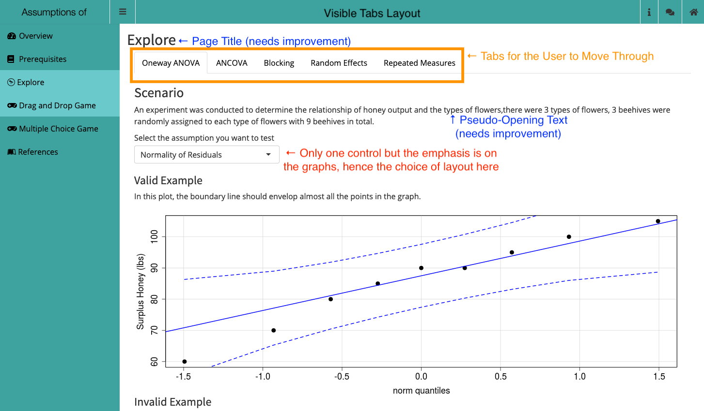
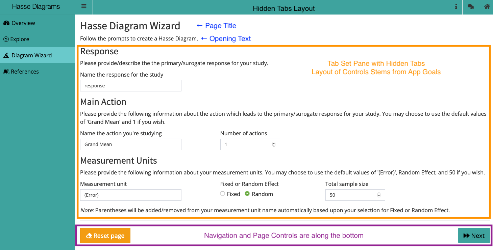

# (PART) Style Guide-App Layout {-}

# App Layout {#layout -}

When considering the Visual appearance of your app, there are two major areas of consideration: the [App Layout](#layout) and what we refer to as [Design Styling](#designStyle). Each of these will be handled in turn. Keep in mind that these two aspects are inter-related and have significant cross-over.

In this part of the Style Guide, we'll focus on the App Layout. The App Layout refers to all of our standards/guidelines for how you organize different elements of the user interface that are common to all of the BOAST apps. This ensures that all of the apps look like they belong together.

There are two main components to app Layout: the [User Interface Structure](#uiStructure) and [Common Elements](#commonElements). Each of these will be their own chapter.

# User Interface Structure {#uiStructure}

In this chapter, we will be focusing on the layout aspect of how your app looks.

A good number of the elements of the layout will have a direct consequence on your coding. For instance, in the section on [the `app.R` file](#appR), you saw that the UI definition comes before the Server definition. This section defines additional organizational structure to your code as it pertains to the layout of your app.

As a reminder, one of the most important benefits of using the `boastapp` function from the `boastUtils` package is that is that certain aspects of Visual appearance will be automatically handled for you. However, you still need to adhere to this Style Guide.

## Dashboard {#dashboard}

All apps will make use of a Dashboard structure. This divides the visual appearance of each app into three main areas. 

+ Across the top of the app will be the Header. 
+ Along the left side of the app will be the navigation list (the Sidebar) where you will list the various Pages of your app.
+ The last area is the Body; this is where all content will appear.

Several of the older apps will have outdated UI calls including, but not limited to, `shinyUI`, `navbarPage`, and/or `fluidPage`. __These functions should no longer be used__; apps that use them need to be updated to become compliant with this Style Guide. 

### Creating the Dashboard

Creating the overarching Dashboard layout in your app is straightforward:

```{r makeDashboard1, echo=TRUE, eval=FALSE}
# Required package
library(shinydashboard)

# [code omitted]
ui <- list(
  dashboardPage(
    skin = "blue",
    # [code omitted]
  )
)

```

The `dashboardPage` function will wrap around the rest of your UI element, thereby establishing the overarching structure. Three of this function's arguments (`header`, `sidebar`, and `body`) will be covered in following sections. We do not need to worry about the `title` argument as this will be controlled by the Dashboard Header. 

The one argument that you must explicitly set for the `dashboardPage` is the `skin` argument. This argument sets the overall color theme for your app. While this is something that is more an aspect of Design Style, your only opportunity to set this value is here with the Layout. 

### Color in the User Interface {#colorUI}

Within BOAST, we use color themes to help provide consistency for the elements of each app and to denote different chapters. Part of the standardization process of this Style Guide seeks to bring the many fractured color themes together into a cohesive, centrally managed set. This helps reduce the programming burden on the students, who should focus on the R side of the programming, not the CSS side.

All aspects of color in the User Interface should be controlled through the CSS file(s). This includes all of the following:

+ Dashboard coloring (Header, Sidepanel, Body)
+ Text coloring
+ Coloring of Controls (including buttons, sliders, and other input fields)

By using CSS, especially through `boastapp`, you’ll be able to ensure that there is consistent coloring throughout your app.

#### Implementing a Color Theme

To activate a color theme is a simple process, especially if you are following this Style Guide and using the `boastUtils` package. 

In your app's code, go to where you first call the function `dashboardPage`. Then, as the first argument you'll type `skin = "[theme]"` before moving on the next argument, `dashboardHeader`.

You will replace `[theme]` with one of the following: `blue`, `green`, `purple`, `yellow`, `red` or `black`. The choice will be determined by the color assigned to that chapter. This is all you have to do. If you are unsure what color to put, use `blue` as the default.

#### The Themes

We currently have six color themes. The names of the themes are a general indication of coloring, with one exception. The `black` theme is not black but rather an aqua/teal set. The themes are typically three or four colors based upon the Penn State Palettes. Non-Penn State colors will be denoted with asterisks. 

All of the themes have been checked against 8 different forms of color blindness.

##### Blue

The Blue Palette is our central palette and should be used by default. The Blue Palette looks like the following:
```{r bluePalette, fig.cap="The Blue Palette", fig.align='center', fig.width=6, fig.height=2, echo=FALSE}
ggplot2::ggplot() +
  ggplot2::geom_rect(
    mapping = ggplot2::aes(
      xmin = 0, xmax = 2,
      ymin = 0, ymax = 2),
    fill = "#1E407C"
  ) +
  ggplot2::annotate(geom = "text", x = 1, y = 1.25,
                    label = "Primary Color",
                    color = "white") +
  ggplot2::annotate(geom = "text", x = 1, y = 0.75,
                    label = "Beaver Blue",
                    color = "white") +
  ggplot2::geom_rect(
    mapping = ggplot2::aes(
      xmin = 2, xmax = 4,
      ymin = 0, ymax = 2),
    fill = "#009CDE"
  ) +
  ggplot2::annotate(geom = "text", x = 3, y = 1.25,
                    label = "Secondary Color",
                    color = "black") +
  ggplot2::annotate(geom = "text", x = 3, y = 0.75,
                    label = "PA Sky",
                    color = "black") +
  ggplot2::geom_rect(
    mapping = ggplot2::aes(
      xmin = -2, xmax = 0,
      ymin = 0, ymax = 2),
    fill = "#001E44"
  ) +
  ggplot2::annotate(geom = "text", x = -1, y = 1.25,
                    label = "Dark Accent",
                    color = "white") +
  ggplot2::annotate(geom = "text", x = -1, y = 0.75,
                    label = "Nittany Navy",
                    color = "white") +
  ggplot2::geom_rect(
    mapping = ggplot2::aes(
      xmin = 4, xmax = 6,
      ymin = 0, ymax = 2),
    fill = "#96BEE6"
  ) +
  ggplot2::annotate(geom = "text", x = 5, y = 1.25,
                    label = "Light Accent",
                    color = "black") +
  ggplot2::annotate(geom = "text", x = 5, y = 0.75,
                    label = "Pugh Blue",
                    color = "black") +
  ggplot2::theme_void()

```

Here is what the Blue Palette looks like in action:

```{r blueAction1, fig.align='center', fig.width=6, fig.height=4, echo=FALSE, fig.cap="Overview Page Using the Blue Palette"}
knitr::include_graphics("images/colorThemes/blueOverview.png")
```

```{r blueAction2, fig.align='center', fig.width=6, fig.height=4, echo=FALSE, fig.cap="Collapsible Boxes Using the Blue Palette"}
knitr::include_graphics("images/colorThemes/blueCollapse.png")
```

```{r blueAction3, fig.align='center', echo=FALSE, fig.cap="Sliders Using the Blue Palette"}

knitr::include_graphics("images/colorThemes/blueSliders.png", dpi=NA)
```

##### Green

The Green Palette looks like the following:
```{r greenPalette, fig.cap="The Green Palette", fig.align='center', fig.width=6, fig.height=2, echo=FALSE}
ggplot2::ggplot() +
  ggplot2::geom_rect(
    mapping = ggplot2::aes(
      xmin = 0, xmax = 2,
      ymin = 0, ymax = 2),
    fill = "#008755"
  ) +
  ggplot2::annotate(geom = "text", x = 1, y = 1.25,
                    label = "Primary Color",
                    color = "white") +
  ggplot2::annotate(geom = "text", x = 1, y = 0.75,
                    label = "Green Opportunity",
                    color = "white") +
  ggplot2::geom_rect(
    mapping = ggplot2::aes(
      xmin = 2, xmax = 4,
      ymin = 0, ymax = 2),
    fill = "#99CC00"
  ) +
  ggplot2::annotate(geom = "text", x = 3, y = 1.25,
                    label = "Secondary Color",
                    color = "black") +
  ggplot2::annotate(geom = "text", x = 3, y = 0.75,
                    label = "Future's Calling",
                    color = "black") +
  ggplot2::geom_rect(
    mapping = ggplot2::aes(
      xmin = -2, xmax = 0,
      ymin = 0, ymax = 2),
    fill = "#4A7729"
  ) +
  ggplot2::annotate(geom = "text", x = -1, y = 1.25,
                    label = "Dark Accent",
                    color = "white") +
  ggplot2::annotate(geom = "text", x = -1, y = 0.75,
                    label = "Penn's Forest",
                    color = "white") +
  ggplot2::theme_void()

```

Here is what the Green Palette looks like in action:

```{r greenAction1, fig.align='center', fig.width=6, fig.height=4, echo=FALSE, fig.cap="Overview Page Using the Green Palette"}
knitr::include_graphics("images/colorThemes/greenOverview.png")
```

```{r greenAction2, fig.align='center', fig.width=6, fig.height=4, echo=FALSE, fig.cap="Collapsible Boxes Using the Green Palette"}
knitr::include_graphics("images/colorThemes/greenCollapse.png")
```

```{r greenAction3, fig.align='center', echo=FALSE, fig.cap="Sliders Using the Green Palette"}

knitr::include_graphics("images/colorThemes/greenSliders.png", dpi= NA)
```

##### Purple

The Purple Palette looks like the following:
```{r purplePalette, fig.cap="The Purple Palette", fig.align='center', fig.width=6, fig.height=2, echo=FALSE}
ggplot2::ggplot() +
  ggplot2::geom_rect(
    mapping = ggplot2::aes(
      xmin = 0, xmax = 2,
      ymin = 0, ymax = 2),
    fill = "#491D70"
  ) +
  ggplot2::annotate(geom = "text", x = 1, y = 1.25,
                    label = "Primary Color",
                    color = "white") +
  ggplot2::annotate(geom = "text", x = 1, y = 0.75,
                    label = "Perpetual Wonder",
                    color = "white") +
  ggplot2::geom_rect(
    mapping = ggplot2::aes(
      xmin = 2, xmax = 4,
      ymin = 0, ymax = 2),
    fill = "#AC8DCE"
  ) +
  ggplot2::annotate(geom = "text", x = 3, y = 1.25,
                    label = "Secondary Color",
                    color = "black") +
  ggplot2::annotate(geom = "text", x = 3, y = 0.75,
                    label = "Stately Atherton",
                    color = "black") +
  ggplot2::geom_rect(
    mapping = ggplot2::aes(
      xmin = -2, xmax = 0,
      ymin = 0, ymax = 2),
    fill = "#000321"
  ) +
  ggplot2::annotate(geom = "text", x = -1, y = 1.25,
                    label = "Dark Accent",
                    color = "white") +
  ggplot2::annotate(geom = "text", x = -1, y = 0.75,
                    label = "Endless Potential",
                    color = "white") +
  ggplot2::theme_void()

```

Here is what the Purple Palette looks like in action:

```{r purpleAction1, fig.align='center', fig.width=6, fig.height=4, echo=FALSE, fig.cap="Overview Page Using the Purple Palette"}
knitr::include_graphics("images/colorThemes/purpleOverview.png")
```

```{r purpleAction2, fig.align='center', fig.width=6, fig.height=4, echo=FALSE, fig.cap="Collapsible Boxes Using the Purple Palette"}
knitr::include_graphics("images/colorThemes/purpleCollapse.png")
```

```{r purpleAction3, fig.align='center', echo=FALSE, fig.cap="Sliders Using the Purple Palette"}

knitr::include_graphics("images/colorThemes/purpleSliders.png", dpi= NA)
```

##### Black

The "Black" Palette is not pegged to the color black, but rather teal/aqua colors. However, to call the theme in the Shiny dashboard, the user must use the value `black` for the the `skin` argument. Here's what the "Black" Palette looks like:
```{r blackPalette, fig.cap="The 'Black' Palette", fig.align='center', fig.width=6, fig.height=2, echo=FALSE}
ggplot2::ggplot() +
  ggplot2::geom_rect(
    mapping = ggplot2::aes(
      xmin = 0, xmax = 2,
      ymin = 0, ymax = 2),
    fill = "#3EA39E"
  ) +
  ggplot2::annotate(geom = "text", x = 1, y = 1.25,
                    label = "Primary Color",
                    color = "white") +
  ggplot2::annotate(geom = "text", x = 1, y = 0.75,
                    label = "Creek",
                    color = "white") +
  ggplot2::geom_rect(
    mapping = ggplot2::aes(
      xmin = 2, xmax = 4,
      ymin = 0, ymax = 2),
    fill = "#69C9CB"
  ) +
  ggplot2::annotate(geom = "text", x = 3, y = 1.25,
                    label = "Secondary Color",
                    color = "black") +
  ggplot2::annotate(geom = "text", x = 3, y = 0.75,
                    label = "Teal*",
                    color = "black") +
  ggplot2::geom_rect(
    mapping = ggplot2::aes(
      xmin = -2, xmax = 0,
      ymin = 0, ymax = 2),
    fill = "#314D64"
  ) +
  ggplot2::annotate(geom = "text", x = -1, y = 1.25,
                    label = "Dark Accent",
                    color = "white") +
  ggplot2::annotate(geom = "text", x = -1, y = 0.75,
                    label = "Slate",
                    color = "white") +
  ggplot2::theme_void()

```

Here is what the "Black" Palette looks like in action:

```{r blackAction1, fig.align='center', fig.width=6, fig.height=4, echo=FALSE, fig.cap="Overview Page Using the 'Black' Palette"}
knitr::include_graphics("images/colorThemes/blackOverview.png")
```

```{r blackAction2, fig.align='center', fig.width=6, fig.height=4, echo=FALSE, fig.cap="Collapsible Boxes Using the 'Black' Palette"}
knitr::include_graphics("images/colorThemes/blackCollapse.png")
```

```{r blackAction3, fig.align='center', echo=FALSE, fig.cap="Sliders Using the 'Black' Palette"}

knitr::include_graphics("images/colorThemes/blackSliders.png", dpi= NA)
```

##### Yellow

The Yellow Palette looks like the following:
```{r yellowPalette, fig.cap="The Yellow Palette", fig.align='center', fig.width=6, fig.height=2, echo=FALSE}
ggplot2::ggplot() +
  ggplot2::geom_rect(
    mapping = ggplot2::aes(
      xmin = 0, xmax = 2,
      ymin = 0, ymax = 2),
    fill = "#E98300"
  ) +
  ggplot2::annotate(geom = "text", x = 1, y = 1.25,
                    label = "Primary Color",
                    color = "white") +
  ggplot2::annotate(geom = "text", x = 1, y = 0.75,
                    label = "Invent Orange",
                    color = "white") +
  ggplot2::geom_rect(
    mapping = ggplot2::aes(
      xmin = 2, xmax = 4,
      ymin = 0, ymax = 2),
    fill = "#FFD100"
  ) +
  ggplot2::annotate(geom = "text", x = 3, y = 1.25,
                    label = "Secondary Color",
                    color = "black") +
  ggplot2::annotate(geom = "text", x = 3, y = 0.75,
                    label = "Bright Keystone",
                    color = "black") +
  ggplot2::geom_rect(
    mapping = ggplot2::aes(
      xmin = -2, xmax = 0,
      ymin = 0, ymax = 2),
    fill = "#BF8226"
  ) +
  ggplot2::annotate(geom = "text", x = -1, y = 1.25,
                    label = "Dark Accent",
                    color = "white") +
  ggplot2::annotate(geom = "text", x = -1, y = 0.75,
                    label = "Lion's Roar",
                    color = "white") +
  ggplot2::theme_void()

```

Here is what the Yellow Palette looks like in action:

```{r yellowAction1, fig.align='center', fig.width=6, fig.height=4, echo=FALSE, fig.cap="Overview Page Using the Yellow Palette"}
knitr::include_graphics("images/colorThemes/yellowOverview.png")
```

```{r yellowAction2, fig.align='center', fig.width=6, fig.height=4, echo=FALSE, fig.cap="Collapsible Boxes Using the Yellow Palette"}
knitr::include_graphics("images/colorThemes/yellowCollapse.png")
```

```{r yellowAction3, fig.align='center', echo=FALSE, fig.cap="Sliders Using the Yellow Palette"}

knitr::include_graphics("images/colorThemes/yellowSliders.png", dpi= NA)
```

##### Red

The Red Palette looks like the following:
```{r redPalette, fig.cap="The Red Palette", fig.align='center', fig.width=6, fig.height=2, echo=FALSE}
ggplot2::ggplot() +
  ggplot2::geom_rect(
    mapping = ggplot2::aes(
      xmin = 0, xmax = 2,
      ymin = 0, ymax = 2),
    fill = "#BC204B"
  ) +
  ggplot2::annotate(geom = "text", x = 1, y = 1.25,
                    label = "Primary Color",
                    color = "white") +
  ggplot2::annotate(geom = "text", x = 1, y = 0.75,
                    label = "Original 1887",
                    color = "white") +
  ggplot2::geom_rect(
    mapping = ggplot2::aes(
      xmin = 2, xmax = 4,
      ymin = 0, ymax = 2),
    fill = "#F2665E"
  ) +
  ggplot2::annotate(geom = "text", x = 3, y = 1.25,
                    label = "Secondary Color",
                    color = "black") +
  ggplot2::annotate(geom = "text", x = 3, y = 0.75,
                    label = "Dawn of Discovery",
                    color = "black") +
  ggplot2::geom_rect(
    mapping = ggplot2::aes(
      xmin = -2, xmax = 0,
      ymin = 0, ymax = 2),
    fill = "#6A3028"
  ) +
  ggplot2::annotate(geom = "text", x = -1, y = 1.25,
                    label = "Dark Accent",
                    color = "white") +
  ggplot2::annotate(geom = "text", x = -1, y = 0.75,
                    label = "Land Grant",
                    color = "white") +
  ggplot2::theme_void()

```

Here is what the Red Palette looks like in action:

```{r redAction1, fig.align='center', fig.width=6, fig.height=4, echo=FALSE, fig.cap="Overview Page Using the Red Palette"}
knitr::include_graphics("images/colorThemes/redOverview.png")
```

```{r redAction2, fig.align='center', fig.width=6, fig.height=4, echo=FALSE, fig.cap="Collapsible Boxes Using the Red Palette"}
knitr::include_graphics("images/colorThemes/redCollapse.png")
```

```{r redAction3, fig.align='center', echo=FALSE, fig.cap="Sliders Using the Red Palette"}

knitr::include_graphics("images/colorThemes/redSliders.png", dpi= NA)
```

### Current Chapter Color Assignments {#chapterColor}

Here are the current (05/27/2020) color theme assignments for chapters:

+ Chapter 1: Data Gathering RED
+ Chapter 2: Data Description YELLOW
+ Chapter 3: Basic Probability BLUE
+ Chapter 4: Statistical Inference PURPLE
+ Chapter 5: Probability BLUE
+ Chapter 6: Regression "BLACK"
+ Chapter 7: ANOVA "BLACK"
+ Chapter 8: Time Series PURPLE
+ Chapter 9: Sampling RED
+ Chapter 10: Categorical Data YELLOW
+ Chapter 11: Data Science GREEN
+ Chapter 12: Stochastic Processes BLUE
+ Chapter 13: Biology GREEN

## Dashboard Header {#header}

Each Dashboard Header contains only a couple of elements. The most important of these will be a short title of your app. This will automatically be followed by the sidebar collapse/expand button. At the far right, you will then include a link to the home page of BOAST using the Home icon with a link to a user survey back towards the center. 

Additional icons might be included to the left of the Home and Survey icons. However, these icons remain the same for all Tabs/pages of your app and are thus are not appropriate for Tab/page specific information.

There should not be any additional elements in the Dashboard Header. Any links for navigate in your app should appear in the Sidebar on the left edge.

The width of the Title component of the Header should be 250; `titleWidth = 250`.

### Creating the Dashboard Header

You will use the same structure regardless if you are using `app.R` or `ui.R`.
```{r makeHeader1, echo=TRUE, eval=FALSE}
# [omitted code]
dashboardHeader(
      title = "app Template", # Use a shortened form of the title here
      titleWidth = 250,
      tags$li(class = "dropdown", actionLink("info", icon("info"))), # Optional
      # The next two are required
      tags$li(
        class = "dropdown",
        boastUtils::surveyLink(name = "app_Template") # Replace app_Template with the repo name for your app 
      ),
      tags$li(
        class = "dropdown",
        tags$a(href = 'https://shinyapps.science.psu.edu/',
               icon("house")
        )
      )
    )
)
# [omitted code]
```

A couple of things to notice: 

+ The `dashboardHeader` acts as a list environment, so it is safe to use `tags$li` here even though there isn't a `tags$ol` or `tags$ul`.
+ There are not a lot of elements to the Header. We only add additional elements here if it is something static (i.e., un-changing) that is necessary for all pages of your app.
+ You will need to set `class = "dropdown"` for each element after the `title` and `titleWidth`.
+ The `info` icon has become a standard part of our apps
    - You will need to define what the link does in the `server` definition.
    - This link's action remains the same for all tabs of your app. Thus, you should not use this to store or be the main conveyance of critical information/instructions for using a particular tab of your app.
+ The second to last element of the Header will always be the Survey link icon. This will take the user to a Qualtrics survey where they can provide us with feedback.
    - You'll need to use the `boastUtils::surveyLink` function here.
+ The last element of the Header (i.e., the rightmost) will always be the home icon which takes the user to the BOAST home page.

### What's Needed in the Server Definition

If you have the basic header, then the only thing that you'll need to be sure to add in your app's server definition, is code for the info button. For this we use the `sendSweetAlert` function from the `shinyWidgets` package. Here's a generic example of what could be used for the Info button.

```{r infoServer, echo=TRUE, eval=FALSE}
# Required Packages
library(shinyWidgets)

# [omitted code]

server <- function(input, output, session) {
  ## Set up Info button ----
  observeEvent(
    eventExpr = input$info,
    handlerExpr = { 
      sendSweetAlert(
        session = session, # This should stay as is
        type = "info", # This option will depend upon the nature of your message
        title = "app Information",
        text = paste("[Message you want to give to the student]",
                     "Use paste with multiple lines to",
                     "improve code reability.")
      )
    }
  )
}

```

The `type` argument will take one of several options. use the one that best aligns with your purposes.

+ `info`: If you are just conveying some general information to your user, you'll use this value. This is the value that we will use in the vast majority of cases.
+ `error`: Use this if your message tells the user that have committed some action that causes your app to fail.
+ `question`: Use with an alert where you are asking the user to respond to a question.
+ `warning`: If you want to give your user the opportunity to stop from doing something destructive (e.g., deleting data values), this would be appropriate.
+ `success`: Use this if your message let's the user know that something worked correctly.

*Note: these buttons/links will throw an error (Empty Link text) when using the WAVE tool. This is expected at this time.*

## Dashboard Sidebar {#sidebar}

The Sidebar is the main navigational tool for your users. Thus, if you want your user to access a certain tab/page, you must be sure to include this in the Sidebar. The only exception is if you are creating a series of levels inside the same Explore, Challenge, or Game. We refer to these as [Tab Sets or Inner Tabs](#innerTabs) and are covered in their own section.

The Sidebar should have a width of 250, (`width = 250`).

For full descriptions of each type of Page, please refer to the [Dashboard Body Section](#body).

### Creating the Dashboard Sidebar

You'll need to use the following code as a template for creating the Sidebar. You will need to customize this to match your app's goals and design.

```{r makeSidebar1, echo=TRUE, eval=FALSE}
# [omitted code]
dashboardSidebar(
  width = 250,
  sidebarMenu(
    id = "pages", # Use "pages" to name the menu
    # Overview is REQUIRED
    menuItem("Overview", tabName = "overview", icon = icon("gauge-high")),
    # A prerequisites page is standard
    menuItem("Prerequisites", tabName = "prerequisites", icon = icon("book")),
    # An Example page is optional but should always be accompanied by another page
    menuItem("Example", tabname = "example", icon = icon("book-open-reader")),
    # At least one of the next four is REQUIRED
    menuItem("Explore", tabName = "explore", icon = icon("wpexplorer")),
    menuItem("Challenge", tabName = "challenge", icon = icon("gears")),
    menuItem("Game", tabName = "game", icon = icon("gamepad")),
    menuItem("Wizard", tabName = "wizard", icon = icon("hat-wizard")),
    # References is REQUIRED
    menuItem("References", tabName = "References", icon = icon("leanpub"))
  ),
  # The sidebar must end with the following code, exactly
  tags$div(
    class = "sidebar-logo",
    boastUtils::sidebarFooter()
  )
)
# [omitted code]
```

Notice that after setting the `width` of the Sidebar, you will need to call the `sidebarMenu` function. This will create the appropriate structure for your Sidebar.

### Sidebar Order
To ensure consistency across all apps, the Sidebar needs to have the following order:

1. The Overview page should always come first.
2. The Prerequisites page will come second.
3. Example pages, if present, should come before their associated activity pages.
4. An Activity pages (Explore, Challenge, Game, Wizard, etc.) will come next.
5. If there are multiple Activity pages, then
    a. Order by Concept so that pages dealing with the same idea are together,
    b. Then order by Explore, Challenge, then Game
    c. Wizard pages are typically stand alone pages and will come after the other type of Activity pages.
    d. If a Game covers multiple Explore/Challenge pages, place after the last of the related Explore/Challenge pages.
    e. For a set of Activity pages of the same type (e.g., three Explore pages), the order will be up to you and the learning goals for your app. (Be sure to give them unique names for `tabName`.)
6. The References page will always come after the Activity page and be the last element of the `sidebarMenu`.
7. The last element of the Sidebar will always be the PSU Logo. To ensure that this element is consistent across all apps, we use a special function, `boastUtils::sidebarFooter`. You will need to copy the above code, including the `div` and use that exactly in your app. You'll place this code after (outside of) the `sidebarMenu` call but still inside the `dashboardSidebar` call. Please refer to the [Section \@ref(logo)](#logo).

*Note: this order will also dictate how you should organize your code in the [Dashboard Body](#body).*

### Sidebar Names

There are two names for each `menuItem`: the visually displayed name (the quoted name that appears as the first argument) and the `tabName`. 

There are three pages whose names are fixed (i.e., you can not change): the Overview, Prerequisites, and References. (You should also only have one of each of these pages.) The display names should be `"Overview"`, `"Prerequisites"`, and `"References"`. For their `tabName` values, you can use lower-case versions and/or shortened versions (e.g., `tabName = "prereqs"`).

The rest of the pages should be named according to the following conventions:

+ __Only One Page of Any Type__: when you only have one Activity page of a particular type (e.g., one Explore, one Challenge), you can use the type of activity as the name. That is, you can call the pages "Explore", "Challenge", etc.
+ __Multiple Pages of the Same Type__: when you have several pages that are all the same Activity type, you need to give each page an appropriate name. For example,
    - In the [NHST Caveats app](https://psu-eberly.shinyapps.io/Significance_Testing_Caveats/), there are three Explore pages: the Multiple Testing Caution, the Large Sample Caution, and the Small Sample Caution.
    - In the [One-way ANOVA app](https://psu-eberly.shinyapps.io/OneWay_ANOVA/) there are two Game pages: a Matching Game and a Fill in the Blank game.
+ __Clarity Matters__: The names of the pages need to be meaningful to others. Thus, you will need to ensure that
    - You don't use a name that is so long it doesn't get displayed properly.
    - You don't use a name that is confusing; the user should be able to anticipate where they are headed when they click on the link.
    - Related to the last, you don't set the user up to anticipate going to one activity but wind up at a different activity.

Keep in mind that `tabName` values should be unique for every page. If you need to create a button that moves a person to a particular page, you will use that page's value of `tabName`.

### Sidebar Icons

For each type of Page in BOAST apps, we use a specific icon in the sidebar menu. This helps establish a common theme across all of the apps so that users can have some instant familiarity as they interact with new apps.

In each `menuItem` call, you'll want to use the following code `icon = icon("iconName")` to ensure that the appropriate icon is used. The listing of what you'll use in place of `iconName` appears in the following table. Note: you'll want to make sure that you keep the quotation marks when you code.

| Page Type | `iconName` | Icon |
|:----------|:---------:|:----:|
| Overview | `"gauge-high"` | `r fontawesome::fa(name = "gauge-high", height = "25px")` |
| Prerequisites | `"book"` | `r fontawesome::fa(name = "book", height = "25px")` |
| Example | `"book-open-reader"` | `r fontawesome::fa(name = "book-open-reader", height = "25px")` |
| Explore | `"wpexplorer"` | `r fontawesome::fa(name = "wpexplorer", height = "25px")` |
| Challenge | `"gears"` | `r fontawesome::fa(name = "gears", height = "25px")` |
| Game | `"gamepad"` | `r fontawesome::fa(name = "gamepad", height = "25px")` |
| Wizard | `"hat-wizard"` | `r fontawesome::fa(name = "hat-wizard", height = "25px")` |
| References | `"leanpub"` | `r fontawesome::fa(name = "fab fa-leanpub", height = "25px")` |

If you come across any of these types of pages that have a different icon or a missing icon, please create an issue in GitHub and/or fix.

If there is a type of page that does fit these, please talk to Neil to see about what we need to add. Recently added page types include the Wizard (Spring 2021) and the Example page (Summer 2022).

### Submenus

Given the nature of our apps, there is __NO__ reason for having submenus. If you come across an app that has submenus or you believe that a submenu is necessary, then that is a good sign that you are looking at a "bloated" app. (That is, the app is trying to cover too many things.) These apps need to be marked for review to investigate re-designing the app and potentially splitting the app in to two or more apps.

### What's Needed in the Server Definition

If you have followed the above specifications, you do not need to add anything special to your server definition. The `dashboardSidebar` function will automatically take care of everything that is needed. 

The most important thing is that you keep track of what you set for each `tabName` argument. When you build the pages in the [Dashboard Body](#body) or want to create a button that sends the user to a particular page, these are the values that will be crucial.

## Dashboard Body {#body}

The Dashboard Body is where all content (text, images, plots, buttons, etc.) exists for the user to read, view, and interact with. Thus, this is the most important part of the layout of your app.

The order in which your code the Pages in the Dashboard body needs to mirror the order of the tabs in the Sidebar. This helps not only you keep track of where you're at, but is kind to future readers of your code.

The `dashboardBody` call will be the last element of the `dashboardPage` call inside of your User Interface (UI) list definition. Within the `dashboardBody` you will need to call the function `tabItems`. This will help your app make a connection between the menu items in your Sidebar and the pages that you make in the Body.

Inside the `tabItems` call, you will then need to create separate `tabItem` calls--one for each Page you listed in your Sidebar menu. Each `tabItem` has a critical argument __which you must explicitly set__: `tabName`. The `tabName` argument needs to match the `tabName` you used in the Sidebar. (Remember `R` is case sensitive, thus "Overview" and "overview" are viewed as two distinct objects.)

Once you have set the value for `tabName`, you can choose to include the command `withMathJax()`. This line of code is needed if you plan to include any mathematical formulas. You can omit this line if you have no mathematics to display. We will note that a safe default is to go ahead and include this line of code. We must stress that you have to include `withMathJax()` on each page of your app.

What comes after these two lines will be all of the code necessary to bring the page of your app to life. However, the most important thing to remember while you're coding in this section are __*commas*__. After you finish each bit of code and before you move on to the next item on the page, you must place a comma and then return to a new line.

The following code can serve as an example to help you get started:

```{r makeBody1, echo=TRUE, eval=FALSE}
# [code omitted]
dashboardBody(
  tabItems(
    tabItem(
      tabName = "overview", # needs to match the name you used in the Sidebar
      withMathJax(), # if you need to display mathematics, include this line
      h1("Sample application for BOAST apps"), 
      p("This is a sample Shiny application for BOAST."),
      h2("Instructions"),
      # [code for the page continues]
    ),
    tabItem(
      # repeat tabItem chunk for each subsequent page
    )
  )
)
# [code omitted]
```

The following subsections explain the purposes of each type of Page.

### The Overview Page

This page is __REQUIRED__ for all apps. This is the main landing page of your app and should appear at the top of the Sidebar. The icon for this page must be "gauge-high".

The Overview Tab must contain __ALL__ of the following elements:

1.  “Long/Formal app Title” (as Heading 1; this will be the __only__ instance of Heading 1 in your app)
2.  A description of the app (as paragraph text under the title)
3.  “Instructions” (as Heading 2)
4.  General instructions for using the app (using an Ordered List environment)
5.  A button that will take the user to the next page (see [Section \@ref(buttons)](#buttons) on buttons)
6.  “Acknowledgments” (as Heading 2)
7.  A listing of acknowledge ments including, coders, content writers, etc. (as a paragraph)
8. After the acknowledgements you'll put two line breaks (`br()`) and then the text `"Cite this app as:"` followed by another line break. You'll then call the `citeApp()` function (part of `boastUtils`). You'll follow this command with two more line breaks.
9. You'll then end with `div(class = "updated", "Last Update: mm/dd/yyyy by FL.")` with mm/dd/yyyy replaced with the date of the update you pushed to the server and FL replaced with your initials.

The purpose of the Overview Page is the act like the front/home page of any newspaper, magazine, or website. Set the stage for what you want the user to learn through your app.

#### Creating the Overview Page

Here's an example of making an Overview Page:
```{r makeOverview1, echo=TRUE, eval=FALSE}
# In the UI Section
# Inside the Dashboard Body
#### Set up the Overview Page ----
tabItem(
  tabName = "overview",
  withMathJax(),
  h1("Sample application for BOAST apps"), # This should be the full name.
  p("This is a sample Shiny application for BOAST."),
  h2("Instructions"),
  p("This information will change depending on what you want to do."),
  tags$ol(
    tags$li("Review any prerequiste ideas using the Prerequistes tab."),
    tags$li("Explore the Exploration Tab."),
    tags$li("Challenge yourself."),
    tags$li("Play the game to test how far you've come.")
  ),
  ##### Go Button--location will depend on your goals ----
  div(
    style = "text-align: center;",
    bsButton(
      inputId = "go1",
      label = "GO!",
      size = "large",
      icon = icon("bolt"),
      style = "default"
    )
  ),
  ##### Create two lines of space ----
  br(),
  br(),
  h2("Acknowledgements"),
  p(
    "This version of the app was developed and coded by Neil J. Hatfield
    and Robert P. Carey, III.",
    br(),
    "We would like to extend a special thanks to the Shiny Program Students.",
    br(),
    br(),
    "Cite this app as:",
    br(),
    citeApp(),
    br(),
    br(),
    div(class = "updated", "Last Update: 5/16/2023 by NJH.")
  )
),

```

A few things to notice:

+ If you need a new line but not a new paragraph, you use the `br()` tag. 
+ The label for the button needs to be consistent with [Section \@ref(buttons)](#buttons).
+ There should __NOT__ be any spaces between letters of a button label. This is a violation of Accessibility as this destroys the label. While we might read "G (space) O" as the word "go", a screen reader reads out "gee" (pause) "oh" to the user.
+ There is no need to use boldface or colons with the section headings when you properly use Heading tags. Thus, "Instructions:" does not follow this Style Guide.
+ There should not be an "About" heading. The text between the Title of your app and the Instructions head serves as the description.

#### What's Needed in the Server Defintion

At bare minimum you will need to have one element in your server definition: the action for your button. If you have multiple buttons, you might need to have several more code chunks. 

Here is a generic example for the button on the Overview Page that moves the user to the appropriate next page:

```{r movementButton1, echo=TRUE, eval=FALSE}
# In your server section
# [code omitted]
observeEvent(
  eventExpr = input$go1, #append the button's inputId to input$ as the event expression
  handlerExpr = { # This is the action portion of your button and must be in { }
    updateTabItems(
      session = session, # This allows the user to move pages
      inputId = "pages", # the id of your Sidebar
      selected = "explore" # Name of page to go to
    ) 
})
```

In the rare case where you have other things happening on the Overview page, you'll need to include the appropriate calls in your server section to carry out those actions for you. 

### The Prerequisites Page

If your app needs to ensure that the user has the base understandings necessary to interact with your app, you'll need to create a Prerequisites Page. Due to the learning impact this page can have, we've adopted a standard of having a Prerequisites page for most apps. The icon for this Page must be "book". Use the word "Prerequisites" rather than "Pre-reqs", "Prereqs", or "Pre-requisites" for the displayed name of the tab.

#### Types of Prerequisites

There are two different types of prerequisites: technical/conceptual and contextual. Both of these go into the Prerequisites Page.

Technical/Conceptual Prerequisites cover ideas that the user needs in order to fully engage with your app's statistical goal. For instance, if your app is about ANCOVA, the ideas of ANOVA and building a linear model would be good candidates for technical/conceptual prerequisites.

Contextual Prerequisites cover ideas that which are beneficial for the user to understand a context you're using. For example, if you are referencing an astragalus, you should include a brief explanation and/or picture of an astragalus. 

Keep in mind that Contextual Prerequisites are different from the context which should be part of an Activity Page. If the information is necessary to interpret sliders/graphs and is *specific*, then you should include this information on the Activity Page. If the information helps the user say "Oh, that's what they mean by [blank]", that is good sign of something to put in the Prerequisites Page.

#### Text Links in Prerequisites (and Beyond)

*Note: what appears here is applicable any time you want to link to an webpage that is beyond BOAST.*

In as many instances as possible, we would like to provide the user with a link to Online Notes of a World Campus Statistics course. 

The link that you provide must take the user to the appropriate location. Do not send the user to the home page for a course; rather, take them to the relevant page. To do this, you'll need to explore the [Department of Statistics STAT ONLINE](https://online.stat.psu.edu/statprogram/) page and look through the courses. 

You will create these links in-line, not as a button. Thus, they must be part of a paragraph block (i.e., inside a `p()` with other text) or as part of list item (i.e., inside a `li()`). 

Your link must include descriptive text. Using "Click Here" is __not__ descriptive. Rather say where the link will take the user. If you look through the links that we've included in this Style Guide, we've been modeling this. This descriptive text not only helps all users anticipate where they are going but also improves the accessibility of the links. (Plus, have you ever tried to click a small link on your phone?)

Once you find the appropriate page, you'll need to copy the URL for your link. There are some instances where we might be able to find an existing anchor (look for two inter-locking rings to appear when you place your cursor over a title) or make a request for adding an anchor. These are especially useful if what you want to link to is only part of the page.

*Note: not all requests for anchors may be fulfilled and not all course notes have anchors.

The styling of the link will be managed by the BOAST CSS file. See the following examples as well as [HTML-Links](#bodyLinks) section.

Here's are two examples of how you would code a text link:
```{r textLinkEx1, echo=TRUE, eval=FALSE}
# [omitted code]
# Working in the UI section

# Example 1: in a paragraph
p("While not critical, you might wish to refresh your understanding on some
  of the basic shapes of graphs in statistics. A good resource for this would
  be the ", # Notice the ending space
  tags$a(
    herf = "https://online.stat.psu.edu/stat100/lesson/3/3.2#graphshapes", #the URL
    "STAT 100 Table of Graph Shapes", # the descriptive text for the link
    class = "bodylinks"
  ),
  ". Feel free to check that resource out." 
  # Notice the ending punctuation for the prior sentence is not part of the link.
)

# Example 2: in a list item
tags$ul(
  tags$li("Review the ", # Notice the ending space
    tags$a(
      herf = "https://online.stat.psu.edu/stat100/lesson/3/3.2#graphshapes", #the URL
      "STAT 100 Table of Graph Shapes", # the descriptive text for the link
      class = "bodylinks"
    )
    # List items don't necessarily need ending punctuation. 
    # Be consistent about punctuation--either all items do or none.
  ) 
)
# [omitted code]
```

#### Creating a Prerequisites Page
Here's an example of the code needed to create the Prerequisites Page in the UI:

```{r makePrereq1, echo=TRUE, eval=FALSE}
# [code omitted]
tabItem(
  tabName = "prerequisites",
  withMathJax(), # this line only need if you display mathematics
  h2("Prerequisites"),
  p("In order to get the most out of this app, please review the following:"),
  tags$ul(
    tags$li("Pre-req 1"),
    tags$li("Pre-req 2"),
    tags$li("Pre-req 3"),
    tags$li("Pre-req 4")
    ),
    p("Notice the use of an unordered list; users can move through the list
      any way they wish."),
  p("A second style of doing prerequisites is with collapsible boxes:"),
  box(
    title = strong("Null Hypothesis Significance Tests (NHSTs)"),
    status = "primary",
    collapsible = TRUE,
    collapsed = TRUE,
    width = '100%',
    "In the Confirmatory Data Analysis tradition, null hypothesis significance
    tests serve as a critical tool to confirm that a particular theoretical
    model describes our data and to make a generalization from our sample to
    the broader population (i.e., make an inference). The null hypothesis
    often reflects the simpler of two models (e.g., 'no statistical
    difference', 'there is an additive difference of 1', etc.) that we will
    use to build a sampling distribution for our chosen estimator. These
    methods let us test whether our sample data are consistent with this
    simple model (null hypothesis)."
  ),
  box(
    title = strong(tags$em("p"), "-values"),
    status = "primary",
    collapsible = TRUE,
    collapsed = FALSE,
    width = '100%',
    "The probability that our selected estimator takes on a value at least as
    extreme as what we observed given our null hypothesis. If we were to
    carry out our study infinitely many times and the null hypothesis
    accurately modeled what we're studying, then we would anticipate our
    estimator to produce a value at least as extreme as what we have seen
    100*(p-value)% of the time. The larger the p-value, the more often we
    would expect our estimator to take on a value at least as extreme as what
    we've seen; the smaller, the less often."
  )
),
# [code omitted]
```

For more information on collapsible boxes, see [Section \@ref(collapsible)](#collapsible).

#### What's Needed in the Server Definition

Generally speaking, the purpose of the Prerequisites Page is to convey key background information for the user to double check they understand before moving into the heart of your app. Thus, this page typically contains static text and images. Thus, it is rare that you would need to include anything in the server definition for this page.

###  Activity Pages

The heart of your app is the one or more tabs where users interact with the app beyond simple navigation. These are the Activity Pages. Some apps will have a single activity, others several; deciding on how many is part of the design process.

Currently, we have five types of Activities pages in BOAST:

+ Example Pages, `r fontawesome::fa(name = "book-open-reader", height = "25px")`
    - These pages center around a user looking through a static/fixed example.
    - This is the least "active" of the Activity pages as these will have the most amount of text on the page and the least for users to do.
    - The goal here is to provide a more solid foundation for the user so that they can more deeply engage with an exploration or challenge activity page.
    - Example pages should __always__ be accompanied by at least one other non-Example Activity page.
+ Explore Pages, `r fontawesome::fa(name = "wpexplorer", height = "25px")`
    - These pages center around the user exploring the target concept.
    - These pages will generally have more text on the page here than other types of Activities.
    - There are often guiding questions meant to help the user engage in productive explorations.
    - The goal is not to assess the user's understanding, but to support their construction of productive meanings for the concept.
+ Challenge Pages, `r fontawesome::fa(name = "gears", height = "25px")`
    - These pages center around a user challenging themselves by testing out their understanding of a concept.
    - While there might still be a fair amount of text on the page, there will be less than an Exploration page..
    - Questions here will be in-between a guiding question and an assessment question. 
    - The goal is to provide the user an opportunity to test and refine their understandings.
+ Game Pages, `r fontawesome::fa(name = "gamepad", height = "25px")`
    - These pages center around the user reviewing a concept (or several) in a game like format.
    - These generally have the least amount of non-question text on the page (i.e., instructions).
    - The goal is to provide an opportunity for a student to review and practice one or more concepts.
+ Wizard Pages, `r fontawesome::fa(name = "hat-wizard", height = "25px")`
    - This is the newest (and rarest) of the Activity Page types (currently only in the [Hasse Diagram app](https://psu-eberly.shinyapps.io/Hasse_Diagrams/))
    - This type of page centers on helping the student create something
    - The goal is to help students apply their understandings of a concept to create something, typically for a prompt external to the app.

We will talk more about the layout of the Activity pages in [Section \@ref(activityLayout)](#activityLayout).

#### UI and Server Definitions

We've opted to not include any specific examples of the UI or server code for the Activity pages here. Partly, we don't want to convey that there is only *one* way to code these pages by giving specific examples too early. Mostly though, we want to stress that the coding you do here depends almost entirely upon your goals for your app.

We will be giving examples of how to code particular elements that you might need to include in your app throughout this Style Guide; draw upon those examples to help you with particular elements. Further, we encourage readers to spend time looking at the live versions of the apps in the [Book of Apps for Statistics Teaching](https://shinyapps.science.psu.edu/) and then looking at the matching code located at the [GitHub Repository for BOAST](https://github.com/EducationShinyappTeam).

Keep in mind that of all pages in your app, the Activity pages will demand the most of you for coding. 

### References Page {#refPage}

The last page will be for your references. This Page is __REQUIRED__ and is where you will place a reference list for all of the following items that you used in your app:

+ All `R` packages you used
+ Sources of any code you used directly or drew heavily upon from other people
+ Pictures and/or other images
+ Data sets
+ Refer to the [Chapter \@ref(documentation)](#documentation) [on Documentation](#documentation) of this Style Guide for more information.

The icon for this Tab must be "leanpub", `r fontawesome::fa(name = "fab fa-leanpub", height = "25px")`.

We will additionally place licensing information for your app at the bottom of the Reference page. We have created a function (`copyrightInfo`) in `boastUtils` (version ≥ 0.1.6.1) that will automatically put the correct information on the page.

#### Creating a References Page

Creating a References Page mimics both the Overview and Prerequisites Pages' structure and is done in the UI section:

```{r makeRef, echo=TRUE, eval=FALSE}
# In the UI Section
# [code omitted]
tabItem(
  tabName = "references",
  withMathJax(), # Rarely, if ever, will you need MathJax in the references
  h2("References"),
  p( # Each reference is in its own paragraph
    class = "hangingindent", # you must set this class argument
    "Bailey, E. (2022). shinyBS: Twitter bootstrap components for shiny.
    (v0.61.1). [R package]. Available from
    https://CRAN.R-project.org/package=shinyBS"
    ),
  p(
    class = "hangingindent",
    "Carey, R. and Hatfield., N. J. (2023). boastUtils: BOAST utilities. 
    (v0.1.11.2). [R Package]. Available from
    https://github.com/EducationShinyappTeam/boastUtils"
    ),
  p(
    class = "hangingindent",
    "Chang, W. and Borges Ribeio, B. (2021). shinydashboard: Create dashboards
    with 'Shiny'. (v0.7.2). [R Package]. Available from
    https://CRAN.R-project.org/package=shinydashboard"
    ),
  p(
    class = "hangingindent",
    "Chang, W., Cheng, J., Allaire, J.J., Sievert, C., Schloerke, B., Xie, Y.,
    Allen, J., McPherson, J., Dipert, A., and Borges, B. (2022).  shiny: Web 
    application framework for R. (v1.7.4). [R Package]. Available from 
    https://CRAN.R-project.org/package=shiny"
  ),
  p(
    class = "hangingindent",
    "Hatfield, N. J. (2019), Caveats of NHST, Shiny Web app. Available from
    https://github.com/EducationShinyappTeam/Significance_Testing_Caveats/tree/PedagogicalUpdate1"
  ),
  p(
    class = "hangingindent",
    "Wickham, H. (2016). ggplot2: Elegant graphics for data analysis. 
    (v3.4.2). [R Package]. New York:Springer-Verlag. Available from
    https://ggplot2.tidyverse.org"
  ),
  br(), # Three blank spaces
  br(),
  br(),
  boastUtils::copyrightInfo()
)
# [code omitted]
```

#### What's Needed in the Server Definition

You do not need to place anything in the server definition for the References Page.

## Layout of Activity Pages {#activityLayout}

Now that we've discussed the more general layout of your app, we can turn our attention to the layout of your Activity pages. As previously mentioned, the layout you use here will need to support the goals of your app. While there are several possible styles, there is one firm constant that everyone must adhere to:

__Each page should contain all information/instructions necessary for the user to be able to interact with the activity without having to switch to other pages.__

In essence, if we were to give a person just the Activity page, they should be able to engage fully and completely with the activity without needing to refer to any other pages. This will ensure that you are treating the other pages as they are intended as well as ensuring your users can have success in using your app.

### Two Required Elements

No matter what layout you end up using, they all require the same two required first elements: a page title and some opening text.

#### Page Title

The Page Title will be enclosed in the Header 2 tag, `h2`, and should be a meaningful title related to what the user will be doing. For an Explore page, you can't just say "Explore", you need to say *what* they will be exploring. Similarly, for the other types of pages. 

#### Opening Text

Immediately after the Page Title, you'll want to add some text, typically enclosed in the paragraph tag, `p`. This is where you'll want to 

+ give any specific background information,
+ set up any particular contexts, and/or
+ give instructions.

There is nothing worse for the user than getting to an Activity page and not knowing what they are supposed to do. The Instructions on the Overview are for using the *entire* app, not any one particular page. Thus, you need to have specific page instructions somewhere on the page.

Keep in mind that this is beneficial to all users, but especially those who are using assistive technology such as screen readers. If you put your instructions on a separate page or hidden somewhere else, you are now requiring that your user memorize those instructions. This is already cognitively demanding for sighted individuals, but for users with vision impairments, even more so.

### The Classical Layout

The Classical Layout for Activity pages is our most common/main layout style. This is the layout that you'll want to use unless there is a reason to use one of the others. Let's look at an example of this layout from the [Significance Testing Caveats app](https://psu-eberly.shinyapps.io/Significance_Testing_Caveats/):

```{r classicalLayout, fig.align='center', fig.width=6, fig.height=4, echo=FALSE, fig.cap="Classical Activity Page Layout"}
knitr::include_graphics("images/activityLayouts/classic.png")
```

You can see the two required elements (Page Title and Opening Text) are labeled in blue (see Figure \@ref(fig:classicalLayout)). After the opening text you'll notice an orange colored box labeled "Fluid Row with 2 Columns". Within that box, we have two visual columns: a portion of controls with a grey background and a portion of the plot. 

In this particular layout, we will always place controls such as sliders, number/text inputs, select options, buttons, etc. on the left and with a grey background. To the right, we will place any output results (e.g., plots, data tables, etc.) The split between the columns is typically 1/3 vs 2/3, although this can change to 1/2 vs 1/2. 

To create this layout, you'll need to reference the next chapter; specifically, [Fluid Rows and Columns](#rowsCols), and [Well Panels](#wellPanels).

### Visible Tabs {#visTabs}

One of the more common alternative layouts for Activity pages includes the usage of a set of tabs inside the page. For example, the [Assumptions of ANOVA app](https://psu-eberly.shinyapps.io/Assumptions_of_ANOVA/) uses this type of layout:

```{r visTabsLayout, fig.align='center', fig.width=6, fig.height=4, echo=FALSE, fig.cap="Visible Tabs Activity Page Layout"}

```

The Visible Tab layout provides an opportunity for you to create a "parent" page that then houses several inter-related topics together. This type of layout is also useful if you want the user to flip through a variety of different plots while still referencing the same inputs.

Depending on your needs/goals, you can blend the Visible Tab layout with the Classical Layout as we'll see shortly. To build tab sets, you'll want to check out [Section \@ref(innerTabs)](#innerTabs).

*(I will note here that the Assumptions of ANOVA app could use several modifications/improvements.)*

### Hidden Tabs {#hiddenTabs}

An alternate version of the Visible Tabs layout is the Hidden Tabs layout. There is still a set of tabs within the page but the user can no longer click on the tabs and move around at will. This is particularly useful if you have built a game where users need to progress through levels in a particular order (e.g., [Descriptive Statistics app](https://psu-eberly.shinyapps.io/Descriptive_Statistics/)) or in a wizard environment (e.g., [Hasse Diagram app](https://psu-eberly.shinyapps.io/Hasse_Diagrams/)).

```{r hiddenTabsLayout, fig.align='center', fig.width=6, fig.height=4, echo=FALSE, fig.cap="Hidden Tabs Activity Page Layout"}

```

A key element that you must be sure to include when using the Hidden Tabs layout are some type of navigation controls for the user as shown in Figre \@ref(fig:hiddenTabsLayout).

### Sets of Controls

Another Activity Layout is a blending of several of the previous layouts and occurs when you have several sets of controls. In an upcoming release of the [Population Growth Model app](https://psu-eberly.shinyapps.io/Population_Growth), we've split the controls into three separate sets:

1. Initial values which apply to all models/situations (boxed in purple in Figure \@ref(fig:setsLayout)),
2. Model Type as a Visible Tab Set (top of orange box),
3. Model Specific Controls (Classic Layout with grey background; also in the orange box)

```{r setsLayout, fig.align='center', fig.width=6, fig.height=4, echo=FALSE, fig.cap="Sets of Controls Activity Page Layout"}
knitr::include_graphics("images/activityLayouts/setsOfControls.png")
```

This kind of layout is particularly useful for explorations where certain controls are getting used by several different aspects. This can also help to reduce the size of a Classical Layout's control area. Typically, we don't want the user to have to scroll far below the plot to change something. 

### Other Layouts

Games are a common area where you might need to use a different layout than the Classical one. A good example here would be any of our Tic-Tac-Toe games such as the [Hypothesis Testing Game](https://psu-eberly.shinyapps.io/Hypothesis_Testing_Game/) or the Escape Room style games such as in the [Maximum Likelihood Estiamtion](https://psu-eberly.shinyapps.io/Maximum_Likelihood_Estimation/) app.

```{r tictactoeLayout, fig.align='center', fig.width=6, fig.height=4, echo=FALSE, fig.cap="Tic-Tac-Toe Activity Page Layout"}
knitr::include_graphics("images/activityLayouts/tictactoe.png")
```

```{r escapeRoomLayout, fig.align='center', fig.width=6, fig.height=4, echo=FALSE, fig.cap="Escape Room Activity Page Layout"}
knitr::include_graphics("images/activityLayouts/escapeRoom.png")
```

## Tab Sets {#innerTabs}

There are two types of tabs within the Shiny ecosystem: there is `tabItems` which connect the Pages of the `dashboardBody` to the menu items of the `dashboardSidebar` and there is `tabsetPanel` which allows you to create a set of tabs inside a particular page.

The [Visible Tabs Layout](#visTabs) and the [Hidden Tabs Layout](#hiddenTabs) make use of this second type of tabs (i.e., `tabsetPanel`). 

Deciding on whether to use `tabsetPanel` is going to depend on several things:

1. Do you have two or more aspects that are related enough that they shouldn't be their own separate tabs/pages of your app?  
    a. If NO, then you shouldn't use `tabsetPanel`.  
    b. If YES, then continue.
2. Are any of your aspects something that would be better suited as a Challenge or Game tab?  
    a. If YES, move that aspect to a separate page. If you still have 2+ aspects, continue.  
    b. If NO, continue.  
3. Are the aspects independent enough that a person can skip a couple and still use the app successfully?  
    a. If NO, then you should re-consider your design.  
    b. If YES, then proceed with using `tabsetPanel` in you design.
4. For the elements going into the `tabsetPanel`, can a person use them in any order or do they need to be done in a fixed order?
    a. Any order, then use Visible Tabs with `type = "tabs"`.
    b. Fixed order, then use Hidden Tabs with `type = "hidden"`.

When you go to make a set of tabs, you need to do two things: 1) you have to create the set of tabs and 2) you then have to create each tab.

### Create the Tab Set

Once you've decided to create a set of tabs on a page of your app, you'll need to start coding the page as you would any other (see [Dashboard Body](#body) for more information) page. However, once you get to the point of wanting to create the tab set, you'll need to use the `tabsetPanel` function and set the value of two arguments and potentially a third.

Here is the code that creates the tab set panel in the Hasse Diagram app:
```{r hasseTabs, echo=TRUE, eval=FALSE}
# We're in the Dashboard Body of the UI
tabItem(
  tabName = "wizard",
  withMathJax(),
  h2("Hasse Diagram Wizard"),
  p("Follow the prompts to create a Hasse Diagram."),
  tabsetPanel(
    id = "diagramWiz",
    type = "hidden",
    ##### Step 1-Action and Measurement Units ----
    tabPanel(
      title = "First Step",
      value = "S1",
      h3("Response"),
      p("Please provide/describe the the primary/surogate response for your study."),
      # code omitted
    )
  )
)

```

The two arguments of `tabsetPanel` you need to provide are the `id` and `type`. The `id` allows for you to reference the tab set from anywhere in the app, which is useful for navigation. Make sure you use a meaningful and unique name here. The `type` argument will take one of two values: `tabs` or `hidden`. (At this time we do not allow for any other choices in BOAST.) The choice will come from Question 4 in the decision tree above.

The optional third argument you can set is the `selected` argument (e.g., `selected = "S1"`). This will let you set the initial tab displayed be something specific. However, our recommendation is that you should put the tabs into an order that makes the most natural progression. The first tab displayed should be the first tab you create within the set. Thus, you don't really need to set the `selected` argument here.

### Create the Tabs

In the above example code, you can see the first tab getting created with the `tabPanel` call. The `tabPanel` call acts much like the `tabItem` call that you use to create pages. The key difference are the `title` and `value` arguments.

The `title` argument is the phrase that you want to appear in the tab that users click on. Notice you still must set this value even when you are using Hidden Tabs. The `value` argument provides an opportunity to give an abbreviation of the tab's title for use with the `selected` argument. If you are including spaces or special characters in your tab's `title`, we recommend setting something simpler for the `value`. (The default value for `value` will be whatever you set as the value of `title`.) You'll use the `value` for any navigation controls.

### Moving Between Tabs

You can create navigation buttons to move between the various tabs in a tab set. This is especially important if you are using Hidden Tabs.

Within the `handlerExpr` of your button's `observeEvent` call, you'll need to include code similar to the following:

```{r tabMovement, echo=TRUE, eval=FALSE}
# In the server definition
## In the observeEvent for a particular button
### In the handlerExpr for that button
updateTabsetPanel(
  session = session,
  inputId = "diagramWiz", # From the tabsetPanel
  selected = "S2" # from the tabPanel
)

```

You'll need to use the `updateTabsetPanel` function to tell R that you're wanting to move the user to a new tab. The `inputId` argument will need to be set to the `id` value of the `tabsetPanel` you created and want to be working with. The `selected` argument will need to be the `value` from the `tabPanel` that you want to send the user to.
