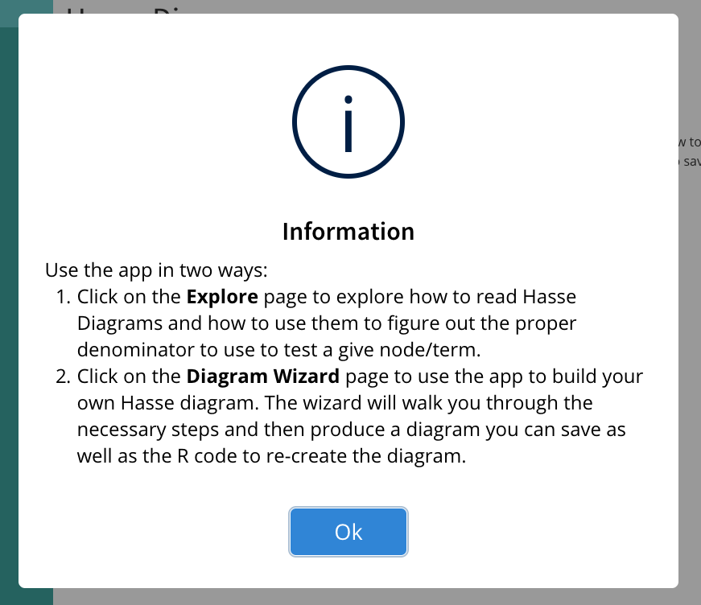

# Common Elements {#commonElements}

This second part of the App Layout deals with the coding and set up of elements that are common across many of the apps in BOAST. We strive to use consistent coding for these elements as this will improve the user experience.

We anticipate that this chapter will be one of the chapters you most heavily reference as you work on developing your apps. Over time, you'll become more proficient at coding and will not need to rely on this chapter as much.

## Fluid Rows and Columns {#rowsCols}

HTML is a linear language, by this we mean that as browsers interpret each line of HTML, the rendered elements appear one after the other vertically, from top to bottom. Since Shiny takes your R code and translate all of it to HTML, our apps also get rendered in this linear format. Thus, the way you order your code should reflect a top-down construction of your page.

This linear flow works well in many cases...until you want to put two (or more) elements side-by-side. To make elements appear next to one another horizontally, we need to make use of two important functions: `fluidRow` and `column`.

The `fluidRow` function tells R/Shiny that you want to put multiple elements into the same row of the page. The "fluid" aspect refers to the fact that this function will automatically adjust the row by wrapping the content to fit the size of the screen. This is important to ensure that your app can respond to being on a mobile device like a phone or a tablet. (Regular elements such as the dashboard environment, paragraphs, etc. will automatically adjust.)

Using `fluidRow` is fairly straightforward. Simply call the function and list all of the elements that you want in the same row as separate (unnamed) arguments. The elements will get listed in the order you code them, left to right, in the displayed row. For example, `fluidRow(objectA, objectB, objectC)`.

Our practice is to be a bit more precise with how we want to divide up the space in a `fluidRow` call. This is where the `column` function comes into play. Each `fluidRow` is internally divided into twelve (12) columns. The `column` function allows us to say how many of those columns to give to a particular element (the `width` argument) as well as how many empty columns we want to put between the left edge or the previous filled column (the `offset` argument).

For example, say that we want to make a row that has two buttons: one at the left edge and one at the right edge. We can use `fluidRow` and `column` calls to achieve this:

```{r rowCol1, echo=TRUE, eval=FALSE}
# In the page layout portion of UI code
fluidRow(
  column(
    width = 2,
    offset = 0,
    bsButton(
      inputId = "button1",
      label = "Left button",
      # code omitted
    )
  ),
  column(
    width = 2,
    offset = 8,
    bsButton(
      inputId = "button2",
      label = "Right button",
      # code omitted
    )
  )
)

```

By using `offset = 8` in the second `column` call, we placed 8 empty columns between the first button and the second button. Further, each button gets to take up two columns of space (i.e., 2/12ths of the row) to appear (`width = 2`).

The most common coding problems to arise with `fluidRow` and `column` are:

+ Forgetting to place `column` inside of the `fluidRow`. This won't be a fatal crash of your app, but your app won't look right.
+ Not setting `width` to an integer between 1 and 12. You must provide a value for `width` in each `column` call.
+ Not checking that all `width` and `offset` totals add to 12 within a single `fluidRow`. Look through your `fluidRow` and add up all of the `width` and `offset` values. You want that sum to be 12 so that you know that everything will be appropriately arranged. If you go over 12, you might get an error and/or your app might scale/wrap elements in strange ways. Similarly for if you are under 12.

Note: the dashboard environment automatically allows for `fluidRow` to be used. Thus, __you do not need to include any `fluidPage` calls in your app.__

### Nesting `fluidRow`

While it is technically possible to nest `fluidRow` calls, we do not recommend doing so. This could look something like `fluidRow(column(width = 3, fluidRow(...)),...)`. This can create serious navigational problems for any users who rely on using their keyboard rather than a mouse to move through and interact with your App. If you find yourself wanting to nest `fluidRow`, stop yourself and reach out to Neil and Bob for alternative ideas.

## Well Panels {#wellPanels}

Well panels are visual styling that we use to help offset user controls (i.e., inputs) from both context and graphs (i.e., outputs). 

To place something inside of a well panel, all you need to do is wrap that object in the `wellPanel` function. However, the placement of the `wellPanel` call matters. 

If you wrap each individual element in `wellPanel` you'll get a separate well panel for each call. If you place `wellPanel` too high up in your code, you'll end up putting everything into the well panel.

```{r wellPanel1b, echo=TRUE, eval=FALSE}
# In the UI Section
# [code omitted]
# Inside a tabItem
fluidRow(
  column(
    width = 4, 
    offset = 0, 
    wellPanel( # Placing the wellPanel call here will wrap around all controls
      h3("Controls"),
      sliderInput(
        inputId = "mtcAlpha",
        label = "Set your threshold level, \\(\\alpha_{UT}\\):",
        min = 0.01,
        max = 0.25,
        value = 0.1,
        step = 0.01,
        animate = animationOptions(interval = 1000, loop = TRUE)
        ),
      br(), # creating vertical space between sliders
      sliderInput(
        inputId = "mtcTests",
        label = "Set the number of hypothesis tests conducted:",
        min = 0,
        max = 500,
        value = 5,
        step = 5
        )
      ) # this closes the wellPanel
    ), # this closes the first column
  column(
    width = 8,
    offset = 0,
    h3("Plot"),
    plotOutput("pplotMTC"),
    bsPopover(
      id = "pplotMTC",
      title = "Investigate!",
      content = "What happens to the number of statistically significant tests when you
      increase the number of tests?",
      placement = "top"
      )
    ) # closes second column
  ), #closes the fluid row
```

The above code highlights using the `wellPanel` to place all of the controls into a well panel as well as placing that well panel into the first column of a fluid row.

## Collapsible Boxes {#collapsible}

One technique that we can make use of to cut down on the amount of visible text on a page is through the use of collapsible boxes. Collapsible boxes are preferred than other methods in that 1) the content remains on the page and thereby accessible, and 2) the user retains control for when to show/hide this information. 

Two great places to consider using collapsible boxes include the Prerequisites Tab and __static__ Context Information across the top of an Activity Tab.

*Note: if the context information changes (e.g., can be switched due to user actions), then collapsible boxes should __NOT__ be used. The context in these cases should __always__ remain visible.*

### Creating Collapsible Boxes

To create a Collapsible Box, you'll need to work in th UI section of your code:

```{r makeCollapsibeb, echo=TRUE, eval=FALSE}
# [code omitted]
box(
  title = strong("Title for the Box"), # Use the strong tag
  # Give either the title of the review concept or "Context"
  status = "primary", # Leave as primary
  collapsible = TRUE, # This allows collapsing
  collapsed = FALSE, # Initial value
  # If the only collapsible item, use FALSE
  # If there are multiple, the first one is FALSE, others can be set to TRUE.
  width = '100%', # use this setting
  "The text that will 'disappear' goes here."
),
# [code omitted]
```

Given the static nature of the information in a collapsible box, you should not need to add anything to the server definition.

The styling of Collapsible Boxes is controlled by the central CSS file. If you use the above code as your template, the coloring will automatically match your App's assigned color theme.

## Buttons {#buttons}

One of the key ways in which users will interact with apps is by clicking on buttons. While there are two different functions for creating buttons, our primary choice is the `shinyBS::bsButton` function. The `shiny::actionButton` option will only be used in certain circumstances (e.g., Tic-Tac-Toe boards).

### Main Type of Button

Let's talk about the particulars of the `bsButton` function which is the call you should use to create buttons.

```{r buttonDemo1, echo=TRUE, eval=FALSE}
# You must have library(shinyBS) loaded in your app
bsButton(
  inputId = "meaningfulName",
  label = "Words to display on button",
  icon = icon("bolt"), # Optional
  style = "default",
  size = "large",
  disabled = FALSE
)
```

Of the listed arguments only three are absolutely required: `inputId` (you must give each button a unique, meaningful name so that you can reference the button in your server definition), `label` (you must put text on the button so your user knows what to click and what the button does), and `size` (we will use "large" in all but the rarest of cases).

### Labels

As we've just mentioned, every button must have something listed for the `label` argument. If you submit an app for review and your buttons have empty values for this argument (i.e., `label = ""`), your code will be rejected. Button labels must be text (you can't rely on a picture/icon alone) to ensure that all users can use the button. This is a critical design and accessibility issue.

Here are some guidelines for the text to use as your label:

+ All buttons must have some text. 
+ Do not include extra spaces (e.g., between letters or words) or extraneous symbols
+ Generally speaking, the text should be relatively brief and clear. 
  - Don't use "Go to the next page" when you could use "Next"
+ The text should make sense with the action of the button; for example,
  - "Reset" if the button resets something (a game, a plot, inputs)
  - "Submit" if the button triggers the app to grab and process input values
  - "Make Graph" if button causes a graph to be generated
  - "Show/Hide Graph" if a button makes a graph object appear/disappear
  - "Next" if a button moves the user along some path.
+ If the button references something like a particular tab (prerequisites, exploration, etc.), the text should reflect this.
  - "Explore!" for a button that takes a user to an Exploration tab.
  - "Prerequisites" for a button that takes a user to a Prerequisites tab.
  - "Challenge Yourself!" for a button takes a user to a Challenge tab.
  - "Play!" for a button that takes a user to Game tab.
+ If a button references an object like an activity packet or a download prompt the text should refer to that
  - "Activity Packet" for a button that would open up and/or download a packet for the user
  - "Download Data" for a button that would download a data file.
+ Clarity is essential. If there are multiple buttons on the page, make sure that you use clear text for what button does and/or references.

### Icons

One option you can include in your button is an icon. The icon will always appear to the left of your `label`. Keep in mind that not all buttons need an icon and you don't want to over-rely on the icon to communicate what the button does to your user. 

If you do decide to use an icon, you will want to make sure that the icon is consistent and supportive of your button's `label` and goal. That is to say, don't use an eraser icon if the button's job is automatically fill in a bunch of fields. Additionally, we have developed the following guidelines for using icons on buttons:

+ Game buttons (e.g., "Submit") generally do not have any icons.
+ Direction Buttons (e.g., "Next" or "Previous") may or may not have icons,
    - "Next" buttons can use `icon("forward")` call, `r fontawesome::fa(name = "forward", height = "25px")`
    - "Back" buttons can use `icon("backward")` call, `r fontawesome::fa(name = "backward", height = "25px")`
    - You should not used text based "icons" such as "<<" or ">>" as part of the `label`
+ A "Prerequisites" button will use the `icon("book")`, `r fontawesome::fa(name = "book", height = "25px")`
+ Buttons that send users to other pages (except Prerequisites) will use `icon("bolt")` , `r fontawesome::fa(name = "bolt", height = "25px")`
+ A reset button that clears just the current page should use `icon("eraser")`, `r fontawesome::fa(name = "eraser", height = "25px")`
+ A button that will clear everything (e.g., Start Over) should use `icon("triangle-exclamation")`, `r fontawesome::fa(name = "triangle-exclamation", height = "25px")`
+ A button to save or store user values should use `icon("floppy-disk")`, `r fontawesome::fa(name = "floppy-disk", height = "25px")`
+ A download button will use `icon("cloud-arrow-down")`, `r fontawesome::fa(name = "cloud-arrow-down", height = "25px")`

### Style (Color)

The `style` argument helps determine the coloring that gets used with your button. To ensure that you buttons' coloration works within the theme of your App, we've already set the colors through the central CSS file. Thus, the vast majority of the time, you may omit the `style` argument entirely OR if you want to write more complete code, use `style = "default"`.

Now, there are some times when we will encourage you to use a different key word with the `style` argument. You'll see these key words in several sections:

+ `warning`: Good for when you want the user to proceed with caution; for example a Reset page button.
+ `danger`: Good for when you want the user to think twice before clicking; for example, a Start over button.
+ `success`: Good for when you want to convey that the user can proceed safely; for example, a button that advances the user from an answer message to the next question in the game
+ `info`: Good for when you want to give some additional information; for example, a button that triggers game instructions popping up, a button that gives a hint, or a button that might filter a question pool.

### Disabled

The `disabled` argument allows you to create a button that users can not click on (`disabled = TRUE`) until certain conditions are met. Check out the next section on how to change aspects of your buttons while the app is running.

### Updating Buttons

One of the things that you can do while the app is running, is to change aspects of buttons based upon certain user actions. This would include changing the label, the icon, the style, and even whether the button is disabled. To update a button you'll need to use the `updateButton` function:

```{r updateButton, echo=TRUE, eval=FALSE}
# In your Server Code,
## Inside the handlerExpr of some observeEvent
updateButton(
  session = session,
  inputId = "buttonName",
  label = "newValue",
  icon = icon("newIcon"),
  style = "newStyle",
  disabled = TRUE # or FALSE
)
```

The first two arguments (`session` and `inputId`) are required. However, the rest are the ones that you might want to change. IMPORTANT: only list the arguments you actually want to change here. Thus, if you only wanted to disable a button, you would ONLY list `session`, `inputId`, and `disabled = TRUE`. If you were to list any of the others, you would also change them.

The `updateButton` function is especially important if you are using the `disabeled` argument of `bsButton`. You need to allow your users to click on buttons, when conditions are met. That is to say, if you have a button that is permanently disabled, then you should get rid of the button.

### Other Issues

There are a few other issues we wish to bring up in relation to buttons.

#### Shape

All of our buttons should have a rectangluar shape with sharp or barely rounded corners. (Tic-Tac-Toe buttons will appear square.) If you come across any buttons that are a different shape (circular, elliptical) flag the app as needing fixing. If you come across any buttons that are rectangular but have heavily rounded corners, also flag the app.

We do not allow for buttons to be any other shape.

#### Animation

Some of the older apps will "animate" the buttons. That is to say, they will look rectangular until you move your cursor/mouse over the button or click on them. At which point in time their shape and/or color will change. These apps should be flagged for fixing.

Any you put your cursor/mouse over a button, you should see only the following:
+ a slight thicking of the outer border,
+ a slight darkening of the button,
+ for a disabled button, the background should flash white

The three allowed are built-in behaviors of the `bsButton`. The other animations, especially the shape changing, are custom coding that we would like to remove (typically through inline CSS).

#### Linking Out

Occasionally, you might need a button to do something that would be external to the app. For example, download an activity file that is not part of the app or open a new browser tab to a particular place. In these cases, you won't code any actions in your server definition for button. Rather, you'll make use the `actionbutton` instead of the `bsButton`.

```{r actionButton1, echo=TRUE, eval=FALSE}
# In the UI Section
actionButton(
  inputId = "ap1",
  label = "Activity Packet",
  icon = icon("cloud-download"),
  onclick = "window.open('../../ActivityPackets/Caveats/')"
)
```

Notice that the `onclick` argument is what creates the action for button and references a relative path to a particular file. In this case a R Markdown file that lives the in directory called. (The actual file name isn't listed to ensure that the processed/rendered version of the RMD is what the users see.)

These cases are extremely rare. Consult with Neil and Bob before you use this type of method.

### Listening to Buttons

Creating buttons in your UI is one thing; setting up portions of your server defintion to listen to buttons is another thing. Whether you're using an `eventReactive` or `observeEvent`, you can use any button as the value of the `eventExpr`. 

All buttons are part of the automatically generated `input` object. To reference a button you'll need to use the character string that you set as the button's `inputId` and call the `input` object. For example, if we had a button with `inputId = "submitGuess"`, we would set `eventExpr = input$submitGuess` in an `observeEvent` call. This would allow us to use the user's click on the submit button to carry out actions such as grading/scoring and displaying feedback.

## Inputs

In addition to buttons, users will often interact with your App through the use of inputs. There are a variety of different kinds of inputs that you can make use of; some will be part of the base Shiny packages, others will come from some additional packages.

Generally speaking, use the simpliest style of input as you can as that will be easier for your users.

No matter what type of input you're using, there are two absolutely required arguments you must include with non-empty, non-null values: `inputId` and `label`. As we've explained, these two arguments are vital to create the input field, reference their values, and make the input accessible.

### Types of Inputs

Here is a listing of the most common inputs in BOAST.

Basic Inputs, part of the `shiny` package:

+ `checkboxInput`: create a single checkbox
+ `checkboxGroupInput`: create a set of related checkboxes (users may select one or more)
+ `radioButtons`: create a set of radio buttons where users may only select ONE of the options at a time
+ `sliderInput`: create a numeric slider bar (can have one or two knobs)
+ `numericInput`: create a field where users can enter a number
+ `textInput`: create a field where users enter text
+ `selectInput`: create a dropdown menu where users select one (or more) options

Inputs from the `shinyWidgets` package:

+ `switchInput`: create a toggle/switch between two options
+ `checkboxGroupButtons`: create a set of buttons that act like a set of checkboxes.
+ `sliderTextInput`: creates a slider with text labels (use sparingly and use this instead of `sliderInput` with extra CSS)

Input from the `shinyMatrix` package:

+ `matrixInput`: creates a matrix of either character or numeric inputs

Each of these inputs have different arguments that you will need to attend to as you code your App.

### Animation of Sliders

One feature of slider inputs is the option to include a Play/Pause button that allows the user to create an animation of your plot. Enabling this option can be quite useful if allowing the user to move through the whole set of slider values is desirable. 

To enable this, you'll need to make use of the `animate` argument:

```{r animateEx1b, echo=TRUE, eval=FALSE}
#[code omitted]
sliderInput(
  inputId = "mtcAlpha",
  label = "Set your threshold level, \\(\\alpha_{UT}\\):",
  min = 0.01,
  max = 0.25,
  value = 0.1,
  step = 0.01,
  animate = animationOptions(
    interval = 1000, loop = TRUE))
#[code omitted]
```

You can set `animate=TRUE`, `animate=FALSE` or invoke the `animationOptions` function as we've done in the example and recommend. This will force you to make some important decisions: namely, how long the slider should wait between each movement (`interval`, in milliseconds) and should the animation start over once the slider reaches the maximum (`loop`). 

The `interval` is going to the most challenging value to figure out. This timer *__ignores__* everything else; that is, it doesn't wait to see whether your plot has updated. Remember, the more complicated the process that generates your plot is, the longer your App will need to render the plot. Thus, you can quickly get into a case where the slider has advanced several times while your App is still trying to render the first update. While `renderCachePlot` can help speed things up, keep in mind that you still might need to play around with the `interval` value to ensure smooth functionality.  

Make sure when you're testing an animated slider to vary all of the parameters involved in the graph. This will help ensure that you test adequately.

The styling of the play/pause button will be controlled by the BOAST CSS file.

### Ordering Inputs

One of the most powerful aspects of Shiny apps is that the user interacts with them. Thus, we need to consider not only the ways in which user interact (e.g., buttons, sliders, text entry, etc.) but also the order in which you want the user to manipulate the inputs. Coming up with a single declaration for how to order inputs in all cases is not necessarily feasible. However, we can set up general guidelines for how to make decisions on ordering your inputs.

Please use the following guidelines for determining the order of inputs in the User Interface (UI):

1. In general, if you want your user to do things in certain order, make your inputs appear in that order.  For example, If you want them to pick a data set, then an unusualness threshold/significance level, what attribute to test, and then set a parameter value, then your inputs should appear in that order.
2. Make use of how we read the English language (i.e., Top-to-Bottom and Left-to-Right) to provide an implicit ordering for your user.
3. If a user needs to carry out steps in particular sequence for your App to run properly, then place your inputs inside of an Ordered List environment with explicit text on what they should do. For example,  
    1. Choose your data set: [dropdown]  
    2. Set your unusualness threshold/significance level  
       [slider]  
    3. Which attribute do you want to test: [dropdown]  
    4. What parameter value do you want to use: [numeric input]
4. If an input is going to reset other inputs you should either:  
    a. Warn the user before hand  
    b. Move the input to the top of the list  
    c. Program the input to not reset other inputs, or  
    d. Some combination of the above  
5. If the inputs are not dynamically linked to the output (e.g., plots automatically update with a change in the input's value), then you should include a button that says "Make Plot" at the end of the inputs.

## Correct/Incorrect Marks

In games, you can give the user a visual cue as to whether they are correct or incorrect through the use of three images:

```{r marksb, fig.align='center', echo=FALSE, fig.cap="Correct, Partially Correct, and Incorrect Marks", fig.show='hold'}
knitr::include_graphics("images/scoringMarks/right-07.png")
knitr::include_graphics("images/scoringMarks/part-right-08.png")
knitr::include_graphics("images/scoringMarks/wrong-09.png")

```

To display these marks you'll use the `renderIcon` funtion from the `boastUtils` package. There are two key arguments to the `renderIcon` fuction:

+ `icon`: you'll need to use either `"correct"`, `"partial"`, or `"incorrect"`
+ `width`: this will be the number of pixels you want the icon to be. The default is 36, which is good in most cases.

To turn off/hide these marks you can use `renderIcon()` without any arguments.

It is important that you only access these marks through `renderIcon` as we've pre-programmed consistent and appropriate alt text for these marks.

Their placement in your App will depend upon what makes the most sense.

## Alerts and Messages

A universal rule to keep in mind when building Apps is that users will do things that you did not intend for them to do. This can cause your App to crash. While we can't anticipate every possible way a user might inadvertently break your App, we can program ways to handle some of those actions. This is where sending alerts comes into play.

The most common type of message revolves around the inclusion of an Information button (the `r fontawesome::fa(name = "fas fa-info", height = "25px")` button in the Dashboard Header). This Information button provides a quick reminder of general instructions for the app. 

For both alerts and messages, we will turn to the `sendSweetAlert` function from the `shinyWidgets` package.

```{r sweetAlert1, echo=TRUE, eval=FALSE}
# In your server definition
observeEvent(
  eventExpr = input$exampleTrigger,
  handlerExpr = {
    sendSweetAlert(
      session = session,
      type = "info",
      title = "Title of Message",
      text = "message to user"
    )
  }
)

```

Notice that we need to place the `sendSweetAlert` function inside of an `observeEvent`. The four arguments we've listed are the four basic aspects you must program any time you want to send an alert or a message to your users.

The `session = session` argument does not need to change and ensures that the correct user gets the message. 

### Alert Types

The `type` argument acts much like the `style` argument for `bsButtons`. You may use any one of the following types:

+ `info`: This is the default type and is used for passing a message to the user.
+ `success`: This is when your message is related to the user reaching some achievement. For example, they have logged in, they have won a game, etc. This is NOT appropriate for getting individual questions correct.
+ `warning`: This is for when the user might have done something that could create a problem later on. Their action isn't necessarily a problem now, but could become one in the future.
+ `error`: This is for when the user has done something that will result in an error or App crash unless they take some other action. 

As you build error checking into your app, using `error` and `warning` for alert types will be important.

### Alert Title and Text

All alerts and messages should include a short `title` that be rendered with the actual message. (Any formatting of the title will automatically be taken care of.)

These titles should not be overly long or complicated. For `info` and `success` types of alerts using `"Information"` and `"Success!"` are often sufficient. 

While you could do something similar for both `warning` and `error` types, you might want to consider including a bit more information. For example, rather than using `title = "Error!"`, you might want to use `title = "Error: Invalid Sample Size"` instead. Notice that the title helps direct the user to what they need to fix. 

You can't put everything into the alert's `title` argument. This is where the `text` argument comes into play. Give more details __AND__ ways in which the user can fix the error with the `text` value.

Your message can be rather simple text (the previous example), or you can use HTML tags to make the message more structured:

```{r sweetAlert2, echo=TRUE, eval=FALSE}
observeEvent(
  eventExpr = input$info,
  handlerExpr = {
    sendSweetAlert(
      session = session,
      type = "info",
      title = "Information",
      text = tags$div(
        "Use the app in two ways:",
        tags$ol(
          tags$li(
            "Click on the ", tags$strong("Explore"), " page to explore how to
              read Hasse Diagrams and how to use them to figure out the proper
              denominator to use to test a give node/term."
          ),
          tags$li(
            "Click on the ", tags$strong("Diagram Wizard"), " page to use the
              app to build your own Hasse diagram. The wizard will walk you through
              the necessary steps and then produce a diagram you can save as well
              as the R code to re-create the diagram."
          )
        )
      ),
      html = TRUE # you must include this new argument
    )
  }
)

```

Notice that we had to include the `html = TRUE` argument to `sendSweetAlert`. You will need to do this any time you include HTML tags in the `text` argument.

```{r sweetAlert3, fig.align='center', fig.width=6, fig.height=4, echo=FALSE, fig.cap="Example of HTML Tagged Message"}

```

## Popovers and Tooltips

Have you ever been on a website and as you move your mouse over different elements on the page, a bubble of text appears? What you've experienced is an example of a Popover or Tooltip. While these can be useful tools, more often than not, they are abused as they lend themselves to the "shiny" problem.

For information about popovers, rollovers, hover text, or tool tips, please see [Section \@ref(popovers)](#popovers).

## Progress Bars

Consider adding a loading bar to show the process for intense computations; this will help the user understand that your App is processing and not frozen/broken.

We will there are a couple of different methods out there for adding a progress bar. 

+ Use the `shinyWidgets` with their `progressBar`, `progressSweetAlert`, and `updateProgressBar` functions.
+ Use the `shinycssloaders` package's `withSpinner` function. 
At this point in time we do not have a strong preference on which method to use. Make sure you discuss your needs with others and get plenty of feedback.
