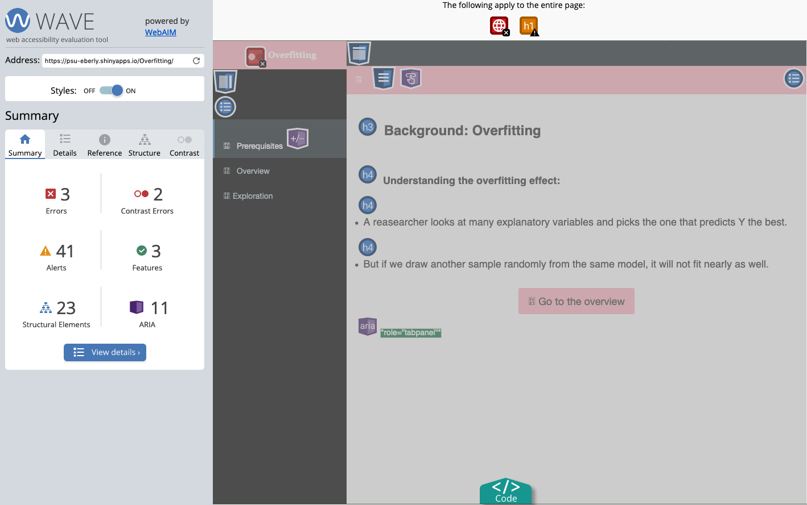

# (PART) Accessibility and Mobile Devices {-}

# Accessibility {#accessibility}

We need to make sure that our Apps are accessible. If you have been adhering to the style guide, your App should be in a decent position. When you're ready to test the accessibility of your App, you'll need to deploy the App to a sever and then use the [WAVE Web Accessibility Evaluation Tool](https://wave.webaim.org/). Enter the URL of your App in the noted box to run an evaluation. See what accessibility issues your App has and then address them.

If you are testing an app you've deployed to the TLT Server, the PSU VPN will block the WAVE tool from scanning. However, you can use the [WAVE Browser Extensions](https://wave.webaim.org/extension/) to test your app. After installing the browser extension (and connecting to the VPN), open your app in a new browser tab and then activate the browser extensions. Look through to see what errors and warnings get listed. Deactivate the extension, and navigate to a different page of your app and then re-activate the WAVE extension. Similarly, you'll want to make sure that any objects that might initially be hidden are actually showing before you activate the WAVE browser extension. The nature of Shiny apps can impede the WAVE tool, thus you'll want to check each page of your app separately.


__See also:__

  - [Accessibility and Usability at Penn State](https://accessibility.psu.edu/)
  - [Accessibility Statement](https://www.psu.edu/accessibilitystatement)
  - [How to Meet Web Content Accessibility Guidelines](https://www.w3.org/WAI/WCAG21/quickref/)
  - [7 Things Every Designer Needs to Know about Accessibility](https://medium.com/salesforce-ux/7-things-every-designer-needs-to-know-about-accessibility-64f105f0881b)

## Making Your App Accessible

The best way that you can make your App accessible is to adhere to this Style Guide as closely as possible. Sadly, the Shiny framework is woefully behind the times for making truly accessible apps. We have tried to strike a balance so that you won't be inundated with significant burdens for accessibility. By following this Style Guide, you'll place your App in the best position possible. 

As we figure out and develop new tools to help you improve the accessibility of your App, we might ask you to return to your App and make updates. 

## Checking Accessibility

There are a couple of different phases to testing an app for Accessibility: Testing, Reading a Report, and Addressing Issues.

### Testing Accessibility

We highly recommend using the [WAVE Web Accessibility Evaluation Tool](https://wave.webaim.org/). If you use Firefox or Chrome, we recommend that you install the [WAVE Browser Extension](https://wave.webaim.org/extension/) as this will give you a quick way to test your App's accessibility.

Depending on whether you're checking an app that is already in BOAST or a revision/new app, you'll need to access the WAVE tool differently.

#### Testing an App in BOAST

To check an App that is currently linked in BOAST:

1. Go to [WAVE Web Accessibility Evaluation Tool](https://wave.webaim.org/)
2. In a new tab, launch the app from BOAST
3. Copy the app's URL from the address bar of your browser
4. Paste the URL in the Web page address field of WAVE

#### Testing a Revision/New App

To check an App that you are currently revising and/or developing (i.e., the App has *not* been formally added to BOAST):

1. Make sure you install the [WAVE Browser Extension](https://wave.webaim.org/extension/) for Firefox or Chrome.
2. Click the Run App button in RStudio
3. In the resulting window, click the Open in Browser button located along the top edge
4. Activate the WAVE Browser Extension

To help make the report more friendly with your browser, we also recommend you install the [Stylus Add-on for Firefox](https://addons.mozilla.org/en-US/firefox/addon/styl-us/) or the [Stylus Add-on for Chrome](https://chrome.google.com/webstore/detail/stylus/clngdbkpkpeebahjckkjfobafhncgmne?hl=en). Once you've installed Stylus, you'll want to 

1. Create a new Style in Stylus
2. Add the following code:
    ```{css stylusCode, echo=TRUE, eval=FALSE}
    body.ng-scope {
      position: relative
    }
    ```
3. Save and close the Stylus tab

This will move the the WAVE summary bar further to the left. If you have questions, please reach out to Neil and Bob.

### Reading a WAVE Report

```{r waveDescStat, fig.align='center', echo=FALSE, fig.cap="WAVE Report for Descriptive Statistics App"}
knitr::include_graphics("images/descStatOverview.png")
```

[Figure \@ref(fig:waveDescStat)](#fig:waveDescStat) shows the WAVE report for the Descriptive Statistics App. There are 54 errors including missing alternative text, empty headings. There are also 8 contrast errors, 14 alerts (skipping heading levels),

```{r waveOverfit, fig.align='center', echo=FALSE, fig.cap="WAVE Report for Overfitting App"}

```

While there are fewer errors for the Overfitting App ([Figure \@ref(fig:waveOverfit)](#waveOverfit)), there are a lot of alerts on this app including skipping heading levels and small text.

The six categories of items in the WAVE report reflect the areas in which you're going to work on identifying issues. The two most critical issues are Errors and Contrast Errors. While the goal would be to have 0 for both, we do anticipate a few issues that we will have to leave unresolved. The third category that you need to attend to is the Alerts group. Again, we would like this number to be 0. The Features, Structural Elements, and ARIA categories are informational and you don't necessarily need to worry about them (they don't signify problems).

After running WAVE and getting the report, click on the View details button to see the list of all items found to see details. Additionally, you'll be able to click on items in the Details to see which things in your App are being flagged.

### Addressing Issues

By looking at the details you'll be able to identify what issues you need to address. We fully expect that some issues (e.g., Error: missing alt text, Alert: missing first level heading) are things that you can directly fix. However, we also anticipate that there are some issues that you might not be able to fix (e.g., Error: Document language missing) without assistance. 

We recommend that you document all errors and alerts that you've yet to resolve with you make your Pull Request. The decision about whether to leave an Accessibility Error or Alert alone/un-addressed has to be made by a faculty member (e.g., Neil, Dennis, Matt, or Bob), not any student.

By using the `boastApp` function and adhering to this Style Guide, your App should be in a good initial position. After running your App through WAVE, we can work with you address any changes that might be necessary.
