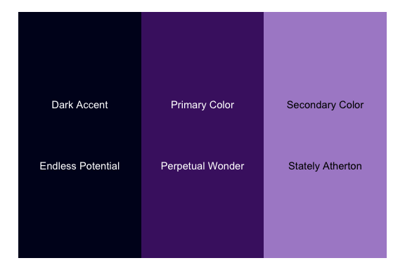

Background
----------

Within BOAST, we use color themes to help provide consistency for the
elements of each app and to denote different chapters. Part of the
standardization process with the Style Guide seeks to bring this many
fractured color themes together into a cohesive, centrally managed set.
This helps reduce the programming burden from the students, who should
focus on the R side of the programming, not the CSS side.

Implementing a Color Theme
--------------------------

For a student to activate a color theme is a simple process, especially
if you are following the Style Guide and using the `boastUtils` package.
(If you are in an App using ui.R and server.R, make sure that the
boast.css call is in the ui.R file.)

In your App’s code, go to where you first call the function
`dashboardPage`. Then, as the first argument you’ll type
`skin = "[theme]"` before moving on the next argument,
`dashboardHeader`.

You will replace `[theme]` with one of the following: `blue`, `green`,
`purple`, `yellow`, `red` or `black`. The choice will be determined by
the color assigned to that chapter. This is all you have to do.

If you are unsure what color to put, use `blue` as the default.

The Themes
----------

There are six color themes that we’ve currently made. The names of the
themes are a general indication of coloring, with one exception. The
`black` theme is not black but rather an aqua/teal set. The themes are
typically three colors (four for `blue`) and based upon the Penn State
Palettes. Non-Penn State colors will be denoted with asterisks.

All of the themes have been checked against 8 different form of color
blindness.

### Blue

The Blue Palette is our central palette and should be used by default.
The Blue Palette looks like the following:

The Blue Palette

### Green

The Green Palette looks like the following:

The Green Palette

### Purple

The Purple Palette looks like the following:

The Purple Palette

### Black

The “Black” Palette is not pegged to the color black, but rather
teal/aqua colors. However, to call the theme in the Shiny dashboard, the
user must use the value `black` for the the `skin` argument. Here’s what
the “Black” Palette looks like:

The ‘Black’ Palette

### Yellow

The Yellow Palette is still under consideration. The current set looks
like the following:

The Yellow Palette

### Red

The Red Palette is still under construction. Here’s the current set:

The Red Palette

